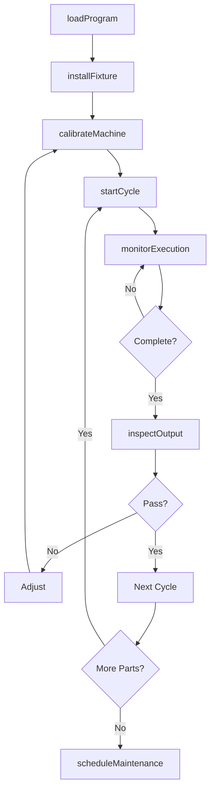
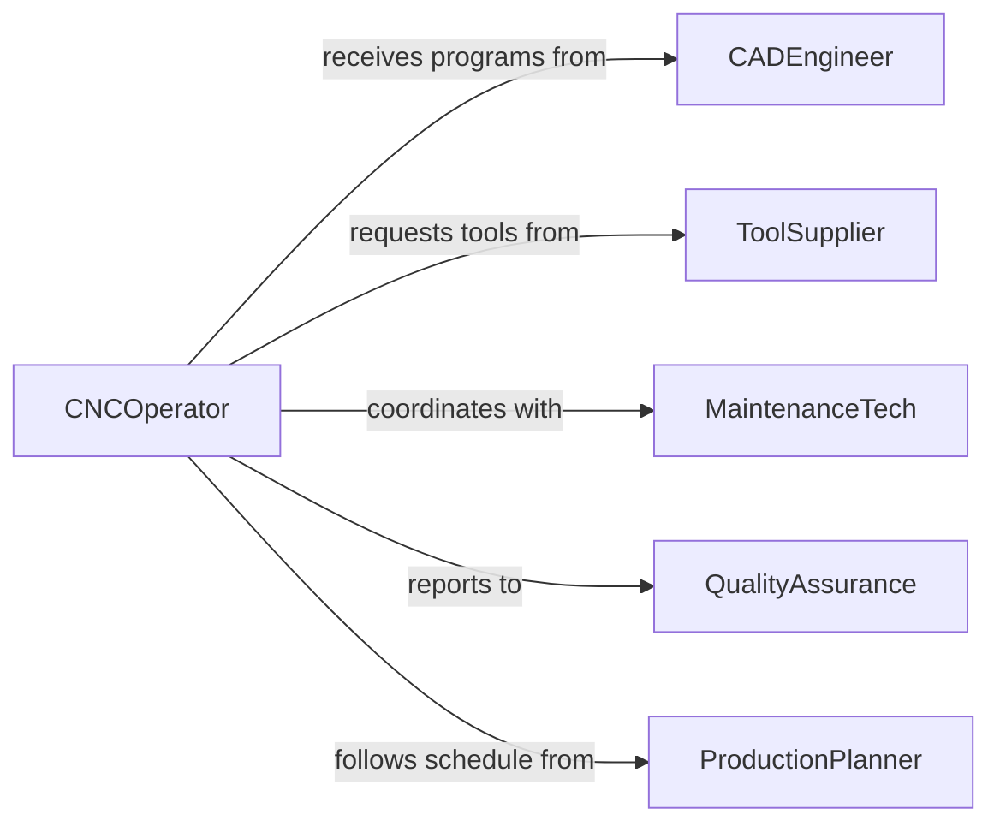

# Fabricate Products Components Using Machine

> Business-as-Code definition for machine-based product and component fabrication. Models automated manufacturing operations from machine setup through production monitoring.

## Overview

Machine tool fabrication involves the use of CNC mills, lathes, grinders, and other automated equipment to produce components and products. This definition exposes actions for machine configuration, program execution, real-time monitoring, and predictive maintenance across high-volume production environments.

## Actors

| Actor | Description |
|-------|-------------|
| CADEngineer | Provides digital models for machine programming |
| ToolSupplier | Delivers cutting tools and consumables |
| MaintenanceTech | Performs machine calibration and repair |
| QualityAssurance | Validates output against specifications |
| ProductionPlanner | Schedules machine time and capacity |
| SafetyOfficer | Ensures compliance with safety protocols |

## Roles

| Role | Description |
|------|-------------|
| CNCOperator | Loads programs and monitors machine operations |
| SetupTechnician | Configures fixtures and tooling for production |
| ProcessEngineer | Optimizes machine parameters for efficiency |
| QualityController | Inspects output and adjusts processes |

## Entities

| Entity | Description |
|--------|-------------|
| Machine | CNC equipment with specific capabilities |
| Program | G-code instructions for machine operation |
| Fixture | Workholding device for part positioning |
| Tool | Cutting implement with specific geometry |
| Cycle | Single execution of machine program |
| Output | Product or component produced by machine |

## Actions

| Action | Description |
|--------|-------------|
| loadProgram | Transfer G-code to machine controller |
| installFixture | Mount workholding device on machine table |
| calibrateMachine | Verify machine accuracy and alignment |
| startCycle | Begin automated fabrication process |
| monitorExecution | Track real-time machine performance |
| inspectOutput | Verify produced component against specifications |
| scheduleMaintenance | Plan downtime for machine service |

## Events

| Event | Description |
|-------|-------------|
| programLoaded | G-code transferred to machine controller |
| fixtureInstalled | Workholding device mounted and verified |
| machineCalibrated | Accuracy check completed successfully |
| cycleStarted | Automated fabrication process initiated |
| executionMonitored | Real-time performance data captured |
| outputInspected | Component quality verification completed |
| maintenanceScheduled | Service interval planned for machine |

## Searches

| Search | Description |
|--------|-------------|
| findMachines | List available equipment by capability or status |
| getPrograms | Retrieve G-code by part number or version |
| getCycles | List production runs by machine or date |
| getOutput | Retrieve completed components by specification |
| getPerformance | Find machine utilization and cycle times |

## Workflow



## Actor Relationships



## Usage

### Calling Actions

```typescript
import { fabricateProductsComponentsUsingMachine } from '@headlessly/fabricate-products-components-using-machine'

const machining = fabricateProductsComponentsUsingMachine()

// Setup machine for production run
const program = await machining.loadProgram({
  machineId: 'CNC-MILL-08',
  partNumber: 'PN-67294',
  programFile: 'pn67294-v12.nc'
})

await machining.installFixture({
  machineId: 'CNC-MILL-08',
  fixtureId: 'FX-4892',
  orientation: 'horizontal'
})

await machining.calibrateMachine({
  machineId: 'CNC-MILL-08',
  probePoints: ['X0Y0Z0', 'X100Y100Z50']
})

// Run production cycle with monitoring
const cycle = await machining.startCycle({
  machineId: 'CNC-MILL-08',
  programId: program.id,
  quantity: 50
})

// Monitor execution in real-time
const monitoring = await machining.monitorExecution({
  cycleId: cycle.id,
  metrics: ['spindleSpeed', 'feedRate', 'toolWear', 'temperature']
})
```

### Event-Driven Automation

```typescript
// Auto-inspect first piece after cycle start
machining.cycleStarted(async ({ cycleId, machineId }) => {
  await waitForFirstPiece(cycleId)
  const output = await getOutput(cycleId, 1)
  await machining.inspectOutput({
    outputId: output.id,
    fullInspection: true
  })
})

// Alert operator on tool wear threshold
machining.executionMonitored(async ({ machineId, metrics }) => {
  if (metrics.toolWear > 80) {
    await notify({
      to: 'cnc-operator',
      message: `Machine ${machineId} tool wear at ${metrics.toolWear}% - replacement recommended`
    })
    await machining.scheduleMaintenance({
      machineId,
      reason: 'tool-replacement',
      urgency: 'medium'
    })
  }
})
```
