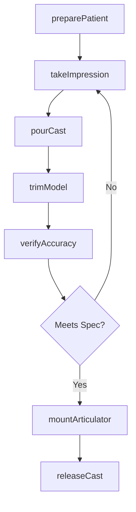
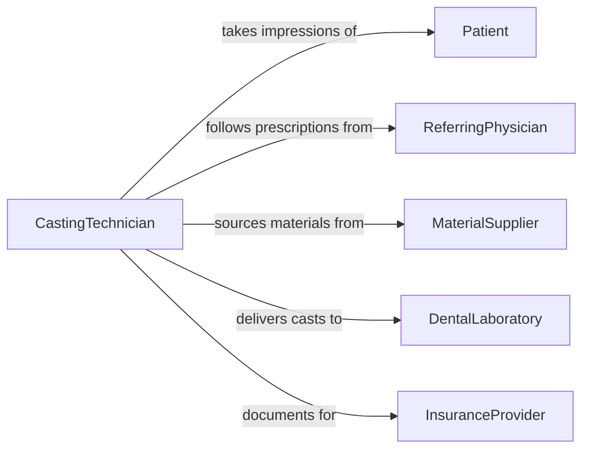

# Cast Molds of Patient Anatomies to Create Medical or Dental Devices

> Business-as-Code definition for anatomical mold casting. Models the impression-taking, mold preparation, material pouring, and finishing of patient-specific casts used to fabricate medical and dental devices such as prosthetics, orthotics, crowns, and dentures.

## Overview

Casting molds of patient anatomies involves taking precise impressions of body structures, preparing casting materials, pouring molds, and finishing the resulting models for device fabrication. This definition covers dental impression casting for crowns, bridges, and dentures, orthopedic casting for prosthetic limbs and custom orthotics, and surgical planning models produced from patient anatomy data.

## Actors

| Actor | Description |
|-------|-------------|
| Patient | The individual whose anatomy is being cast for a custom device |
| ReferringPhysician | Prescribes the medical or dental device requiring anatomical casting |
| MaterialSupplier | Provides impression materials, casting plaster, and modeling compounds |
| DentalLaboratory | Receives casts and fabricates dental prosthetics from mold data |
| InsuranceProvider | Authorizes coverage for prescribed medical or dental devices |
| RegulatoryBody | Enforces FDA and ISO standards for medical device fabrication |

## Roles

| Role | Description |
|------|-------------|
| CastingTechnician | Takes impressions and pours molds of patient anatomies |
| Prosthodontist | Designs dental prosthetics based on cast models |
| Orthotist | Designs orthotic devices from anatomical casts |
| QualitySpecialist | Verifies cast accuracy and dimensional compliance |

## Entities

| Entity | Description |
|--------|-------------|
| Impression | A negative imprint of patient anatomy captured in impression material |
| CastModel | A positive reproduction of patient anatomy poured from an impression |
| ImpressionMaterial | Alginate, silicone, or polyether compound used to capture anatomy |
| CastingStone | Dental stone or plaster used to create positive models |
| DevicePrescription | A physician order specifying the device to be fabricated |
| DimensionalReport | Measurements and tolerances recorded from the finished cast |
| ArticulatorMount | A mechanical device holding dental casts in simulated jaw positions |

## Actions

| Action | Description |
|--------|-------------|
| preparePatient | Position the patient and apply release agents or barriers |
| takeImpression | Capture a negative imprint of the target anatomy |
| pourCast | Fill the impression with casting stone or plaster to create a positive model |
| trimModel | Remove excess material and refine the cast to working dimensions |
| verifyAccuracy | Measure the cast against patient anatomy or digital reference data |
| mountArticulator | Secure dental casts in an articulator for occlusal analysis |
| releaseCast | Deliver the finished cast model to the fabrication team |

## Events

| Event | Description |
|-------|-------------|
| patientPrepared | Patient has been positioned and anatomy is ready for impression |
| impressionTaken | Negative imprint of patient anatomy has been captured |
| castPoured | Positive model has been created from the impression |
| modelTrimmed | Excess material has been removed and model refined |
| accuracyVerified | Cast dimensions have been confirmed against specifications |
| articulatorMounted | Dental casts have been secured in proper occlusal alignment |
| castReleased | Finished cast model has been delivered for device fabrication |

## Searches

| Search | Description |
|--------|-------------|
| findCastOrders | Locate casting jobs by patient, device type, or status |
| getImpressionData | Retrieve impression material and technique details for a case |
| getDimensionalData | Look up measurement reports for completed cast models |
| findPendingCasts | List impressions awaiting pouring or models awaiting trimming |
| getCaseHistory | Retrieve previous casts and devices for a patient |

## Workflow



## Actor Relationships



## Usage

### Calling Actions

```typescript
import { castMoldsPatientAnatomiesCreate } from '@headlessly/cast-molds-patient-anatomies-create'

const casting = castMoldsPatientAnatomiesCreate()

// Take an impression of patient anatomy
const impression = await casting.takeImpression({
  patientId: 'PT-2024-0831',
  anatomyRegion: 'maxillary-arch',
  material: 'polyvinyl-siloxane',
  technique: 'two-stage-putty-wash'
})

// Pour the cast model
const cast = await casting.pourCast({
  impressionId: impression.id,
  stone: 'type-IV-dental-stone',
  pourTime: '8min',
  settingTime: '45min'
})

// Verify cast accuracy
const report = await casting.verifyAccuracy({
  castId: cast.id,
  referenceSource: 'intraoral-scan',
  toleranceMm: 0.1
})
```

### Event-Driven Automation

```typescript
// Route verified cast to fabrication lab
casting.accuracyVerified(async ({ castId, patientId, deviceType }) => {
  await fabrication.createWorkOrder({
    castId,
    patientId,
    deviceType,
    priority: 'standard'
  })
})

// Alert on impression retake needed
casting.accuracyVerified(async ({ castId, passed, deviationMm }) => {
  if (!passed) {
    await notify({
      to: 'casting-technician',
      message: `Cast ${castId} failed accuracy check (${deviationMm}mm deviation). Retake impression required.`
    })
  }
})
```
