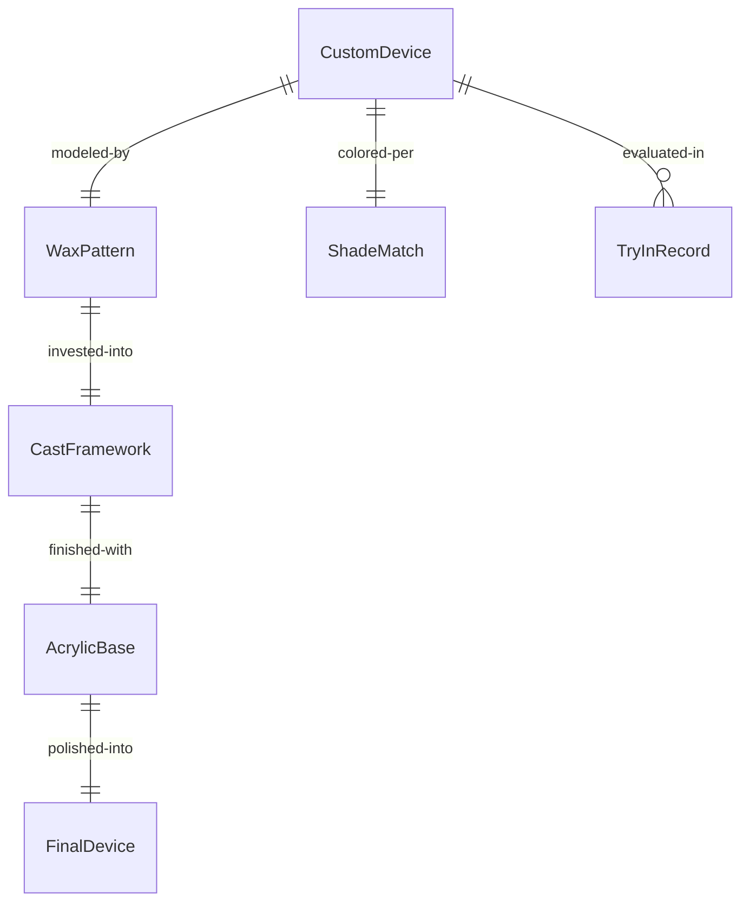
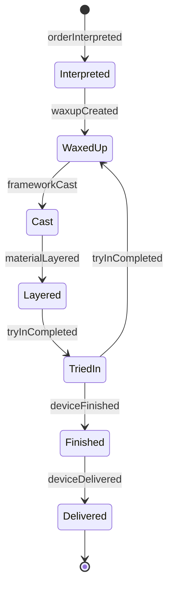
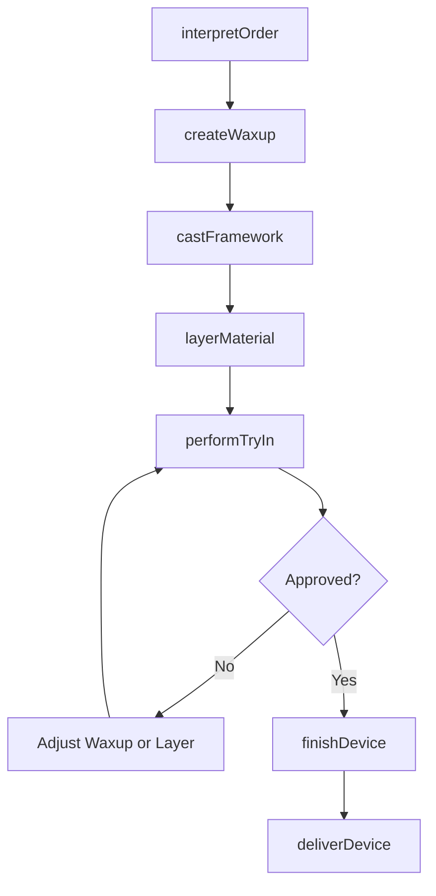
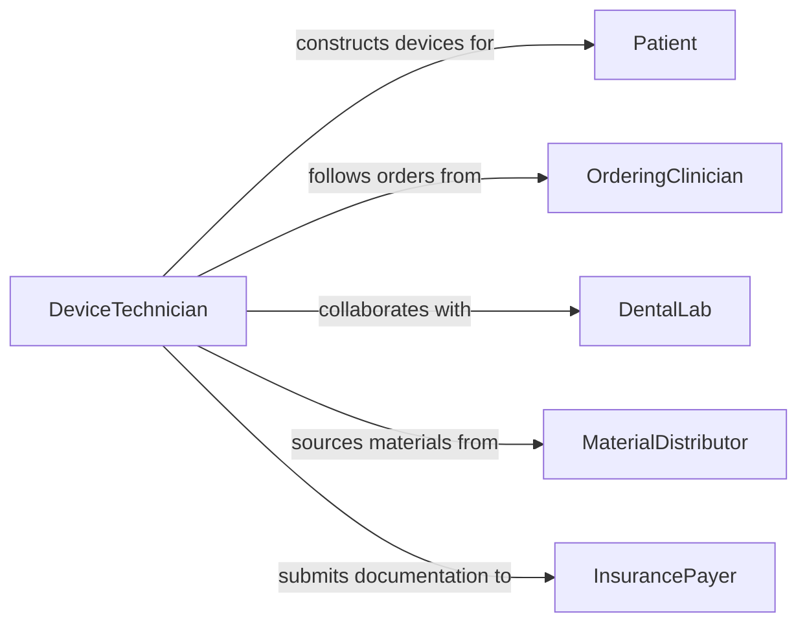

# Construct Customized Assistive Medical or Dental Devices

> Business-as-Code definition for customized assistive device construction. Models the patient-specific design, material shaping, component assembly, and clinical fitting of bespoke medical and dental devices including dentures, partial plates, custom knee braces, cranial helmets, and ocular prostheses.

## Overview

Constructing customized assistive medical or dental devices involves translating patient anatomy data and clinical requirements into a one-of-a-kind device through wax-up, investment casting, thermoforming, hand layup, or additive manufacturing. This definition covers complete and partial denture construction, custom knee and spinal braces, cranial remolding orthoses, and prosthetic eyes and ears fabricated to match patient appearance and functional needs.

## Actors

| Actor | Description |
|-------|-------------|
| Patient | The individual receiving a custom-fitted device |
| OrderingClinician | Prescribes the device and provides clinical specifications |
| DentalLab | Provides wax-up, porcelain layering, and denture finishing services |
| MaterialDistributor | Supplies acrylics, alloys, ceramics, and biocompatible polymers |
| InsurancePayer | Processes prior authorization and reimbursement for custom devices |
| AccreditationBody | Certifies laboratory compliance with quality and safety standards |

## Roles

| Role | Description |
|------|-------------|
| DeviceTechnician | Constructs the device through handwork, machining, and finishing |
| DesignSpecialist | Translates clinical prescriptions into fabrication blueprints or CAD files |
| FittingClinician | Performs try-in appointments and adjusts the device on the patient |
| LabManager | Schedules production, manages materials, and oversees quality control |

## Entities

| Entity | Description |
|--------|-------------|
| CustomDevice | A patient-specific medical or dental device built to individual anatomy |
| WaxPattern | A wax model of the device used for try-in or investment casting |
| CastFramework | A metal substructure cast from the wax pattern |
| AcrylicBase | A polymer base forming the tissue-contacting surface of a dental device |
| TryInRecord | Notes from a patient try-in session documenting fit and aesthetics |
| ShadeMatch | A color and translucency specification matching patient tissue or teeth |
| FinalDevice | The completed, polished, and adjusted device ready for delivery |

## Actions

| Action | Description |
|--------|-------------|
| interpretOrder | Review the clinical prescription and confirm device specifications |
| createWaxup | Build a wax model of the device for evaluation and casting |
| castFramework | Invest and cast the metal substructure from the wax pattern |
| layerMaterial | Apply porcelain, acrylic, or composite material to build the device form |
| performTryIn | Evaluate the device on the patient for fit, function, and aesthetics |
| finishDevice | Polish, adjust occlusion, and complete surface treatment |
| deliverDevice | Hand off the final device to the clinician for patient insertion |

## Events

| Event | Description |
|-------|-------------|
| orderInterpreted | Prescription has been reviewed and fabrication plan established |
| waxupCreated | Wax pattern has been completed for evaluation |
| frameworkCast | Metal substructure has been cast and cleaned |
| materialLayered | Ceramic or acrylic material has been applied and cured |
| tryInCompleted | Patient evaluation has been documented with adjustment notes |
| deviceFinished | Final polishing and adjustments have been completed |
| deviceDelivered | Finished device has been released to the ordering clinician |

## Searches

| Search | Description |
|--------|-------------|
| findCaseOrders | Locate custom device orders by patient, clinician, or status |
| getTryInNotes | Retrieve adjustment and fit notes from patient try-in sessions |
| getShadeRecords | Look up shade matching data for a patient case |
| findProductionQueue | List cases in fabrication sorted by due date or priority |
| getCaseTimeline | View the complete history of fabrication steps for a case |


## Entity Relationships



## State Diagram


## Workflow



## Actor Relationships



## Usage

### Calling Actions

```typescript
import { constructCustomizedAssistiveMedicalDental } from '@headlessly/construct-customized-assistive-medical-dental'

const custom = constructCustomizedAssistiveMedicalDental()

// Interpret the clinical order
await custom.interpretOrder({
  caseId: 'CASE-2024-0718',
  deviceType: 'complete-upper-denture',
  patientId: 'PT-2024-0718',
  shade: 'A2',
  toothMold: 'ovoid-medium'
})

// Create wax try-in
await custom.createWaxup({
  caseId: 'CASE-2024-0718',
  baseplate: 'shellac',
  waxRim: true,
  toothArrangement: 'balanced-occlusion'
})

// Finish the device after approved try-in
await custom.finishDevice({
  caseId: 'CASE-2024-0718',
  processing: 'heat-cure-acrylic',
  polishing: 'high-gloss',
  occlusionAdjustment: true
})
```

### Event-Driven Automation

```typescript
// Schedule try-in appointment when waxup is ready
custom.waxupCreated(async ({ caseId, patientId }) => {
  await scheduling.bookAppointment({
    patientId,
    type: 'wax-try-in',
    reference: caseId,
    duration: 30
  })
})

// Generate invoice on device delivery
custom.deviceDelivered(async ({ caseId, patientId, deviceType }) => {
  await billing.generateInvoice({
    caseId,
    patientId,
    deviceType,
    cptCode: 'D5110'
  })
})
```
