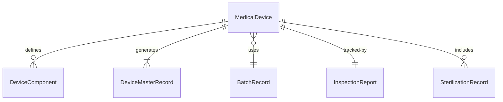
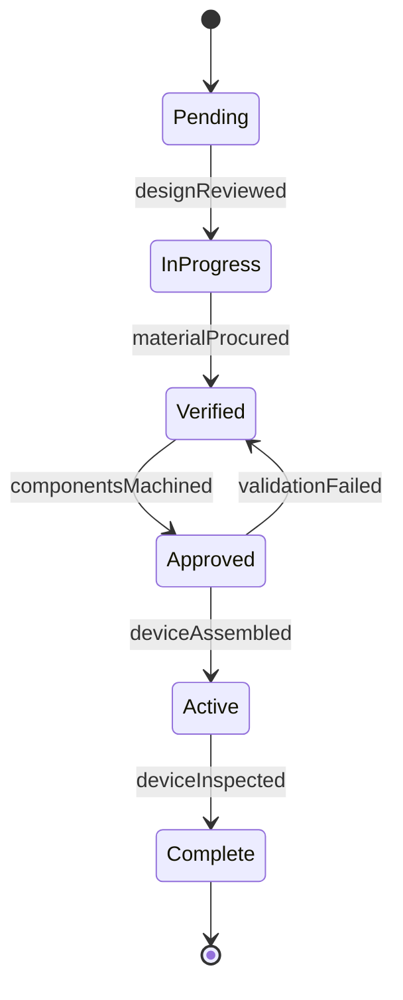
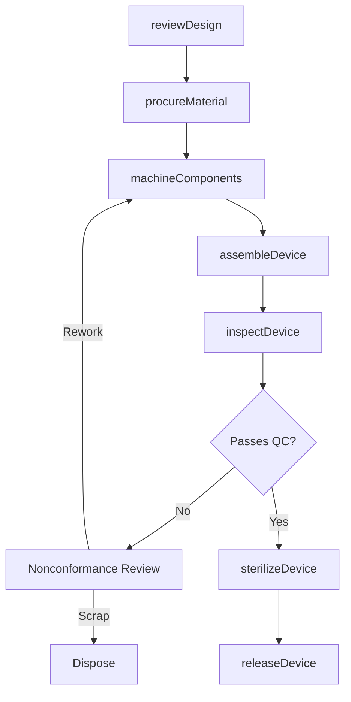
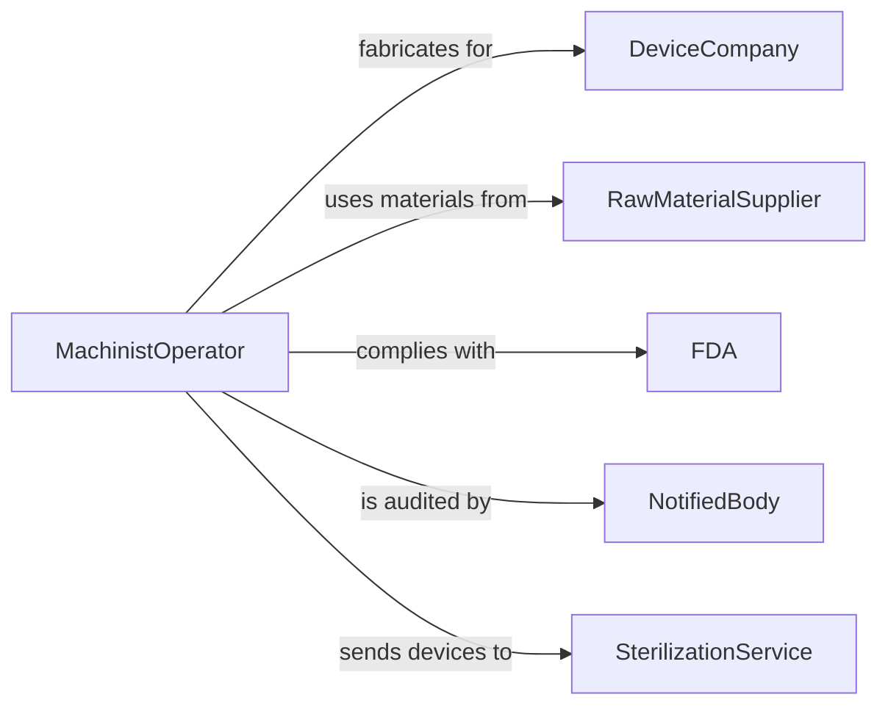

# Fabricate Medical Devices

> Business-as-Code definition for medical device fabrication. Models the material selection, machining, assembly, sterilization, and quality validation of surgical instruments, implantable devices, and diagnostic equipment components manufactured under FDA and ISO 13485 standards.

## Overview

Fabricating medical devices involves converting raw materials into finished devices through precision machining, injection molding, welding, polishing, and assembly in controlled cleanroom environments. This definition covers surgical instrument manufacturing, implantable joint and spinal components, catheter and tubing assemblies, and diagnostic device housings produced under strict quality management systems.

## Actors

| Actor | Description |
|-------|-------------|
| DeviceCompany | Commissions fabrication of medical devices to design specifications |
| RawMaterialSupplier | Provides medical-grade metals, polymers, and ceramics |
| FDA | Regulates device classification, manufacturing, and post-market surveillance |
| NotifiedBody | Conducts ISO 13485 audits and CE marking certification |
| SterilizationService | Provides ethylene oxide, gamma, or e-beam sterilization |
| DistributionPartner | Warehouses and delivers finished devices to healthcare facilities |

## Roles

| Role | Description |
|------|-------------|
| MachinistOperator | Operates CNC, EDM, and grinding equipment to produce device components |
| CleanroomAssembler | Assembles device components in ISO-classified cleanroom environments |
| QualityEngineer | Validates processes, inspects devices, and manages nonconformances |
| ProcessEngineer | Develops and optimizes manufacturing methods and tooling |

## Entities

| Entity | Description |
|--------|-------------|
| MedicalDevice | A finished instrument, implant, or diagnostic component |
| DeviceComponent | An individual part machined or molded for device assembly |
| DeviceMasterRecord | The complete set of design, manufacturing, and labeling documents |
| BatchRecord | Production documentation for a specific manufacturing lot |
| InspectionReport | Dimensional and functional test results for fabricated devices |
| SterilizationRecord | Documentation of sterilization cycle parameters and biological indicators |
| NonconformanceReport | A record of deviations from specification requiring disposition |

## Actions

| Action | Description |
|--------|-------------|
| reviewDesign | Analyze device master record and confirm fabrication feasibility |
| procureMaterial | Source medical-grade raw materials with certificates of conformance |
| machineComponents | Produce device parts using CNC, laser cutting, or injection molding |
| assembleDevice | Join components in a cleanroom under controlled conditions |
| inspectDevice | Perform dimensional, visual, and functional quality checks |
| sterilizeDevice | Process finished devices through validated sterilization cycles |
| releaseDevice | Approve the lot for distribution after final quality review |

## Events

| Event | Description |
|-------|-------------|
| designReviewed | Device master record has been confirmed for fabrication |
| materialProcured | Raw materials with conformance certificates have been received |
| componentsMachined | All device parts have been produced to specification |
| deviceAssembled | Components have been joined into a finished device |
| deviceInspected | Quality checks have been completed and documented |
| deviceSterilized | Sterilization cycle has been validated and completed |
| deviceReleased | Lot has been approved for distribution |

## Searches

| Search | Description |
|--------|-------------|
| findProductionOrders | Locate fabrication orders by device type, lot number, or status |
| getBatchRecords | Retrieve manufacturing documentation for a specific production lot |
| getInspectionResults | Look up quality test data by device serial number or batch |
| findNonconformances | List open nonconformance reports by severity or product line |
| getMaterialCertificates | Retrieve certificates of conformance for incoming raw materials |


## Entity Relationships



## State Diagram


## Workflow



## Actor Relationships



## Usage

### Calling Actions

```typescript
import { fabricateMedicalDevices } from '@headlessly/fabricate-medical-devices'

const fabrication = fabricateMedicalDevices()

// Machine components for a surgical instrument
await fabrication.machineComponents({
  orderId: 'MFG-2024-0293',
  deviceType: 'arthroscopic-shaver-blade',
  material: '17-4PH-stainless',
  operations: ['cnc-turning', 'edm-wire', 'electropolish'],
  quantity: 500
})

// Inspect the fabricated devices
const inspection = await fabrication.inspectDevice({
  batchId: 'BATCH-2024-0293-A',
  checks: ['dimensional-cmm', 'surface-roughness', 'visual-10x', 'sharpness-test'],
  sampleSize: 32,
  aqlLevel: 'II'
})

// Release approved lot
await fabrication.releaseDevice({
  batchId: 'BATCH-2024-0293-A',
  inspectionId: inspection.id,
  labelingVerified: true,
  expirationDate: '2027-06-30'
})
```

### Event-Driven Automation

```typescript
// Initiate sterilization when inspection passes
fabrication.deviceInspected(async ({ batchId, passed }) => {
  if (passed) {
    await fabrication.sterilizeDevice({
      batchId,
      method: 'ethylene-oxide',
      cycleProfile: 'standard-eto-12hr'
    })
  }
})

// Alert quality team on nonconformance
fabrication.deviceInspected(async ({ batchId, passed, failures }) => {
  if (!passed) {
    await notify({
      to: 'quality-engineering',
      message: `Batch ${batchId} failed inspection: ${failures.join(', ')}. NCR required.`
    })
  }
})
```
