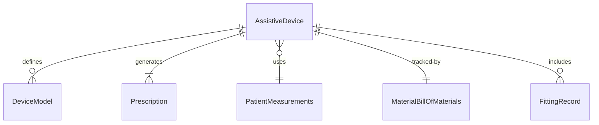
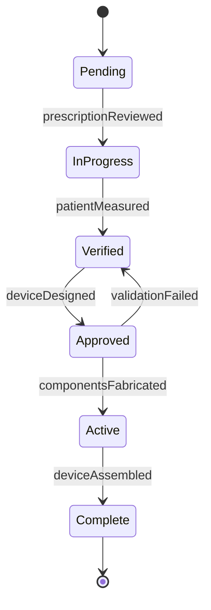
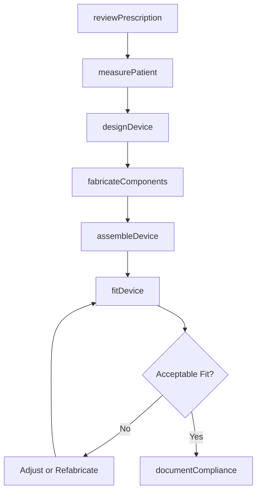
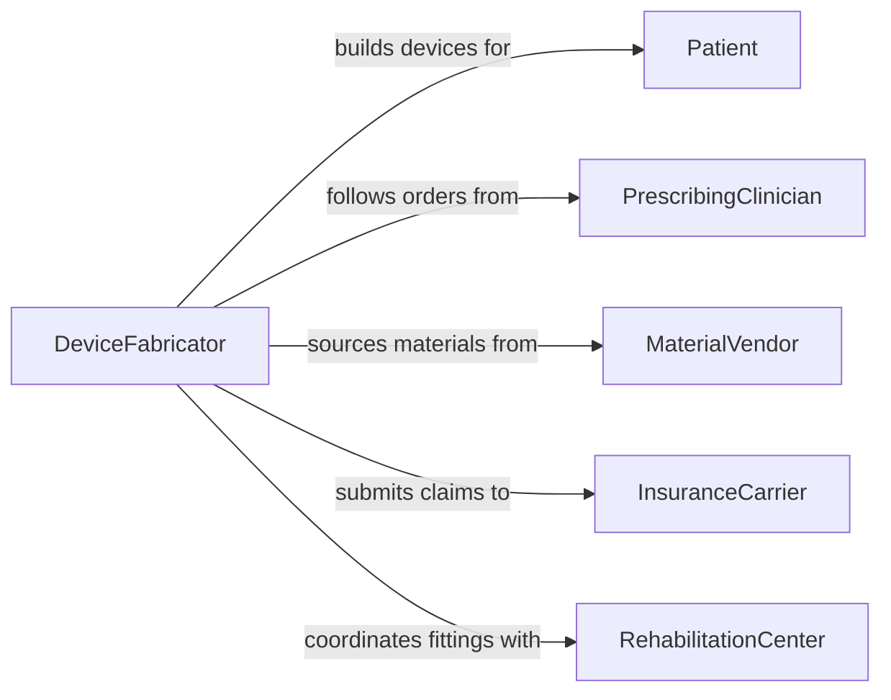

# Make Patient-Assistive Devices or Device Models

> Business-as-Code definition for patient-assistive device fabrication. Models the design, prototyping, construction, fitting, and refinement of assistive devices and device models such as splints, braces, hearing aids, and mobility aids customized to individual patient needs.

## Overview

Making patient-assistive devices or device models involves interpreting clinical prescriptions, selecting materials, fabricating components through molding, machining, or 3D printing, assembling the device, and fitting it to the patient for comfort and function. This definition covers orthotic braces and splints, hearing aid shells, wheelchair seating systems, and prototype models used for surgical planning or patient education.

## Actors

| Actor | Description |
|-------|-------------|
| Patient | The individual who will use the assistive device |
| PrescribingClinician | Orders the assistive device based on clinical assessment |
| MaterialVendor | Supplies thermoplastics, metals, foams, and fastening hardware |
| InsuranceCarrier | Authorizes reimbursement for prescribed assistive devices |
| RehabilitationCenter | Provides fitting space and follow-up care for device users |
| RegulatoryAgency | Enforces medical device safety and labeling requirements |

## Roles

| Role | Description |
|------|-------------|
| DeviceFabricator | Constructs assistive devices from raw materials and components |
| ClinicalEngineer | Designs device specifications based on patient biomechanics |
| FittingSpecialist | Adjusts and fits the device to the patient for optimal function |
| QualityTechnician | Inspects finished devices for safety and dimensional compliance |

## Entities

| Entity | Description |
|--------|-------------|
| AssistiveDevice | A custom-built device supporting patient mobility, function, or comfort |
| DeviceModel | A prototype or planning model used before final fabrication |
| Prescription | A clinical order specifying the device type, features, and patient requirements |
| PatientMeasurements | Anthropometric data used to size and shape the device |
| MaterialBillOfMaterials | A list of components and materials required for device construction |
| FittingRecord | Documentation of adjustments made during patient fitting sessions |
| ComplianceCertificate | A document confirming the device meets applicable safety standards |

## Actions

| Action | Description |
|--------|-------------|
| reviewPrescription | Interpret the clinical order and determine fabrication requirements |
| measurePatient | Take body measurements and range-of-motion data for device sizing |
| designDevice | Create specifications, patterns, or CAD models for the device |
| fabricateComponents | Cut, mold, machine, or print device parts from selected materials |
| assembleDevice | Join components into the complete assistive device |
| fitDevice | Adjust the device on the patient for comfort, alignment, and function |
| documentCompliance | Record inspection results and generate compliance documentation |

## Events

| Event | Description |
|-------|-------------|
| prescriptionReviewed | Clinical order has been interpreted and fabrication plan confirmed |
| patientMeasured | Body dimensions and functional data have been recorded |
| deviceDesigned | Specifications and patterns for the device have been finalized |
| componentsFabricated | All device parts have been produced from raw materials |
| deviceAssembled | Components have been joined into the complete device |
| deviceFitted | Device has been adjusted and confirmed functional on the patient |
| complianceDocumented | Inspection and safety records have been completed |

## Searches

| Search | Description |
|--------|-------------|
| findDeviceOrders | Locate assistive device work orders by patient, type, or status |
| getPatientMeasurements | Retrieve anthropometric data for a specific patient |
| getFittingHistory | Look up previous fitting records and adjustment notes |
| findPendingFabrication | List devices awaiting component fabrication or assembly |
| getComplianceRecords | Retrieve safety and inspection documentation for a device |


## Entity Relationships



## State Diagram


## Workflow



## Actor Relationships



## Usage

### Calling Actions

```typescript
import { makePatientAssistiveDevicesDeviceModels } from '@headlessly/make-patient-assistive-devices-device-models'

const assistive = makePatientAssistiveDevicesDeviceModels()

// Review prescription and measure patient
await assistive.reviewPrescription({
  prescriptionId: 'RX-2024-1102',
  deviceType: 'ankle-foot-orthosis',
  diagnosisCode: 'G81.1'
})

const measurements = await assistive.measurePatient({
  patientId: 'PT-2024-0556',
  region: 'lower-leg',
  dataPoints: ['calf-circumference', 'ankle-width', 'foot-length', 'range-of-motion']
})

// Fabricate and assemble the device
await assistive.fabricateComponents({
  orderId: 'AFO-2024-0556',
  material: 'polypropylene',
  thickness: '3mm',
  reinforcement: 'carbon-fiber-strut'
})
```

### Event-Driven Automation

```typescript
// Schedule fitting appointment when device is assembled
assistive.deviceAssembled(async ({ orderId, patientId }) => {
  await scheduling.bookAppointment({
    patientId,
    type: 'device-fitting',
    reference: orderId,
    duration: 60
  })
})

// Submit insurance claim after compliance documentation
assistive.complianceDocumented(async ({ orderId, patientId, deviceType }) => {
  await billing.submitClaim({
    patientId,
    orderId,
    deviceType,
    hcpcsCode: 'L1960'
  })
})
```
