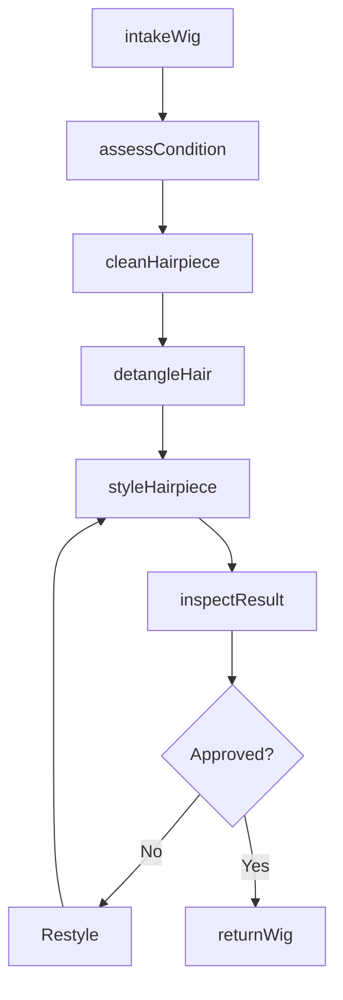
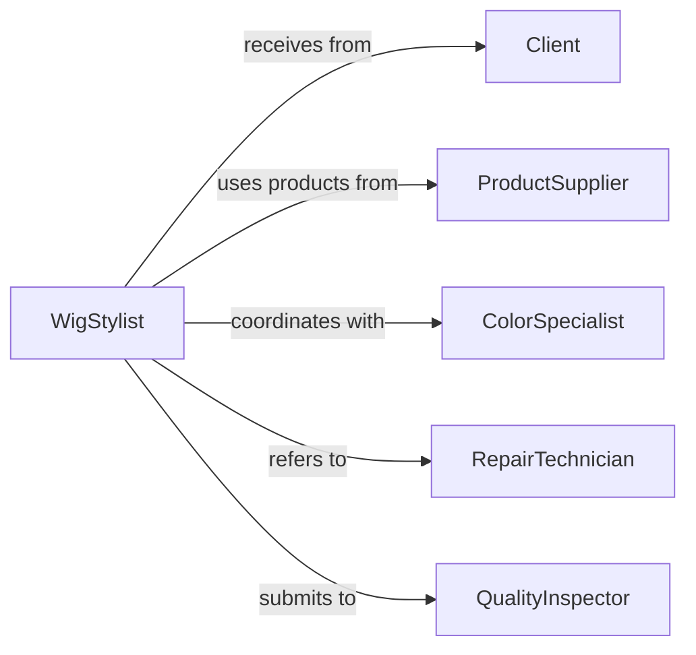

# Groom Wigs Hairpieces

> Business-as-Code definition for wig and hairpiece grooming services. Models the complete maintenance process from intake through styling and quality assurance.

## Overview

Wig and hairpiece grooming encompasses cleaning, styling, maintenance, and restoration of synthetic and natural hair products. This definition exposes actions for each service stage, events for workflow automation, and searches for client history and inventory tracking.

## Actors

| Actor | Description |
|-------|-------------|
| Client | Brings wig or hairpiece for grooming services |
| Manufacturer | Produces wigs and hairpieces requiring maintenance |
| ProductSupplier | Provides cleaning agents and styling products |
| ColorSpecialist | Performs tinting and color correction services |
| RepairTechnician | Handles structural repairs and modifications |
| QualityInspector | Verifies grooming meets service standards |

## Roles

| Role | Description |
|------|-------------|
| WigStylist | Executes grooming and styling services |
| ServiceCoordinator | Schedules appointments and manages workflow |
| MaintenanceSpecialist | Performs deep cleaning and restoration |
| InventoryManager | Tracks client wigs and service supplies |

## Entities

| Entity | Description |
|--------|-------------|
| Wig | Full head covering hairpiece |
| Hairpiece | Partial coverage hair system |
| ServiceOrder | Request for grooming and maintenance |
| CleaningProtocol | Procedures for specific hair types |
| StyleSpecification | Client preferences for appearance |
| MaintenanceRecord | History of services performed |

## Actions

| Action | Description |
|--------|-------------|
| intakeWig | Register hairpiece and document condition |
| assessCondition | Evaluate cleaning and repair requirements |
| cleanHairpiece | Wash and sanitize wig or hairpiece |
| detangleHair | Remove knots and smooth hair fibers |
| styleHairpiece | Shape and set according to specifications |
| inspectResult | Verify grooming meets quality standards |
| returnWig | Release hairpiece to client with care instructions |

## Events

| Event | Description |
|-------|-------------|
| wigIntaken | Hairpiece registered in service system |
| conditionAssessed | Cleaning and repair needs documented |
| hairpieceCleaned | Washing and sanitization completed |
| hairDetangled | Knots removed and hair smoothed |
| hairpieceStyled | Shaping and setting completed |
| resultInspected | Quality verification performed |
| wigReturned | Hairpiece released to client |

## Searches

| Search | Description |
|--------|-------------|
| findServiceOrders | List grooming requests by status or client |
| getMaintenanceRecords | Retrieve service history for hairpiece |
| getProtocols | Find cleaning procedures by hair type |
| getStyles | Retrieve styling specifications by client |
| getInventory | List hairpieces currently in service |

## Workflow



## Actor Relationships



## Usage

### Calling Actions

```typescript
import { groomWigsHairpieces } from '@headlessly/groom-wigs-hairpieces'

const grooming = groomWigsHairpieces()

// Register wig for service
const serviceOrder = await grooming.intakeWig({
  clientId: 'CL-8472',
  hairpieceType: 'full-wig',
  hairType: 'human-hair',
  currentStyle: 'long-wavy'
})

// Assess condition and plan service
const assessment = await grooming.assessCondition({
  serviceOrderId: serviceOrder.id,
  checkpoints: ['tangling', 'cleanliness', 'styling', 'structure']
})

// Execute grooming workflow
await grooming.cleanHairpiece({
  serviceOrderId: serviceOrder.id,
  protocol: assessment.recommendedProtocol,
  products: ['gentle-shampoo', 'conditioning-treatment']
})

await grooming.detangleHair({
  serviceOrderId: serviceOrder.id,
  method: 'wide-tooth-comb',
  sections: 4
})

await grooming.styleHairpiece({
  serviceOrderId: serviceOrder.id,
  styleSpec: { length: 'shoulder', texture: 'wavy', volume: 'medium' }
})
```

### Event-Driven Automation

```typescript
// Auto-assign specialist based on condition assessment
grooming.conditionAssessed(async ({ serviceOrderId, assessment }) => {
  if (assessment.colorCorrectionNeeded) {
    await assignSpecialist({
      serviceOrderId,
      specialist: 'color-specialist'
    })
  }
  if (assessment.structuralRepairNeeded) {
    await assignSpecialist({
      serviceOrderId,
      specialist: 'repair-technician'
    })
  }
})

// Notify client when wig is ready for pickup
grooming.wigReturned(async ({ serviceOrderId, clientId }) => {
  await notify({
    to: clientId,
    channel: 'sms',
    message: 'Your wig grooming is complete and ready for pickup. Care instructions included.'
  })
})
```
