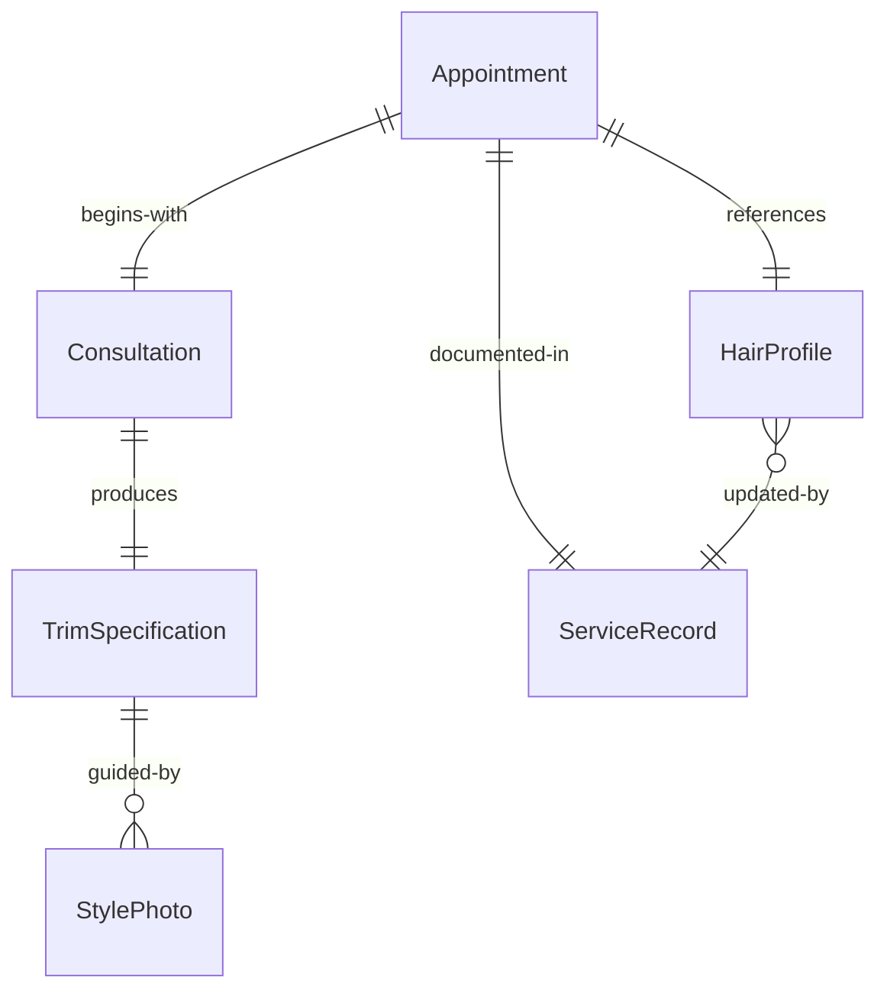
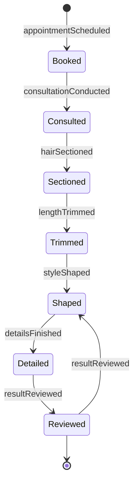
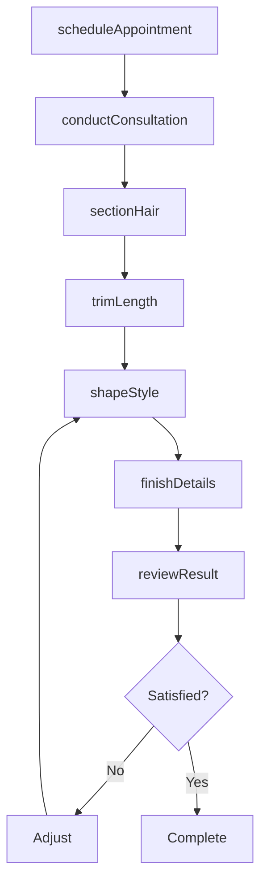
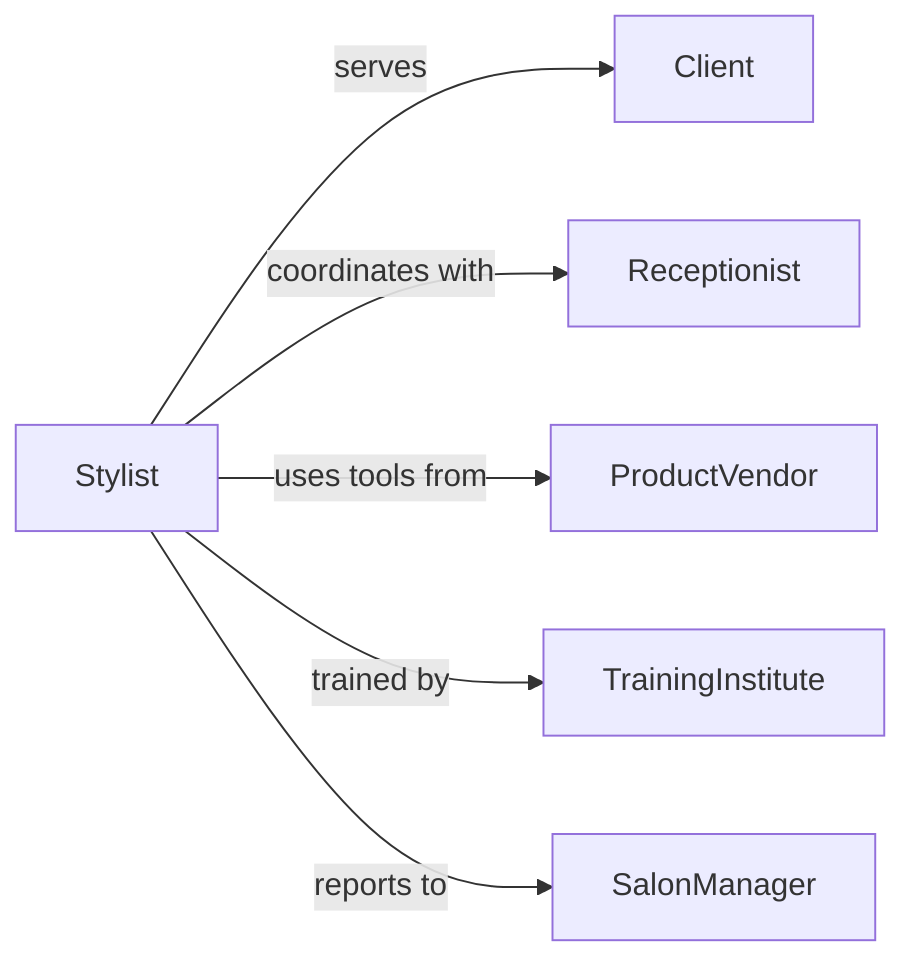

# Trim Client Hair

> Business-as-Code definition for client hair trimming services. Models the complete service workflow from consultation through finishing touches.

## Overview

Client hair trimming involves cutting and shaping hair to achieve desired length, style, and appearance. This definition exposes actions for consultation, sectioning, cutting techniques, and quality verification across diverse hair types and style preferences.

## Actors

| Actor | Description |
|-------|-------------|
| Client | Receives hair trimming service |
| Receptionist | Schedules appointments and manages bookings |
| ProductVendor | Supplies scissors, clippers, and styling tools |
| TrainingInstitute | Certifies stylists in cutting techniques |
| Photographer | Captures before and after images |
| PaymentProcessor | Handles service payment transactions |

## Roles

| Role | Description |
|------|-------------|
| Stylist | Executes hair trimming and shaping |
| SalonManager | Oversees service quality and scheduling |
| Assistant | Prepares client and workspace for service |
| ColoristConsultant | Advises on complementary color services |

## Entities

| Entity | Description |
|--------|-------------|
| Appointment | Scheduled time slot for hair service |
| Consultation | Discussion of style preferences and needs |
| HairProfile | Record of client hair type and history |
| TrimSpecification | Desired length, style, and technique details |
| ServiceRecord | Documentation of service performed |
| StylePhoto | Visual reference for desired outcome |

## Actions

| Action | Description |
|--------|-------------|
| scheduleAppointment | Reserve time slot for hair trimming service |
| conductConsultation | Discuss client preferences and assess hair |
| sectionHair | Divide hair into manageable working areas |
| trimLength | Cut hair to achieve desired length |
| shapeStyle | Refine cut to create intended appearance |
| finishDetails | Execute edge work and final touches |
| reviewResult | Verify client satisfaction with outcome |

## Events

| Event | Description |
|-------|-------------|
| appointmentScheduled | Time slot reserved for client |
| consultationConducted | Style preferences discussed and documented |
| hairSectioned | Working areas prepared for cutting |
| lengthTrimmed | Hair cut to specified length |
| styleShaped | Cutting refined for desired appearance |
| detailsFinished | Edge work and finishing completed |
| resultReviewed | Client satisfaction verified |

## Searches

| Search | Description |
|--------|-------------|
| findAppointments | List scheduled services by date or stylist |
| getHairProfiles | Retrieve client hair history and preferences |
| getSpecifications | Find trim details by appointment or client |
| getServiceRecords | List completed services by client or date |
| getStylePhotos | Retrieve reference images by style category |


## Entity Relationships



## State Diagram


## Workflow



## Actor Relationships



## Usage

### Calling Actions

```typescript
import { trimClientHair } from '@headlessly/trim-client-hair'

const hairService = trimClientHair()

// Schedule and prepare for service
const appointment = await hairService.scheduleAppointment({
  clientId: 'CL-5829',
  stylistId: 'ST-12',
  dateTime: '2026-02-15T14:00:00Z',
  serviceType: 'trim'
})

// Conduct consultation and plan trim
const consultation = await hairService.conductConsultation({
  appointmentId: appointment.id,
  desiredLength: 'shoulder-length',
  desiredStyle: 'layered-cut',
  concerns: ['split-ends', 'volume'],
  referencePhotos: ['ref-img-001.jpg']
})

// Execute trimming workflow
await hairService.sectionHair({
  appointmentId: appointment.id,
  sections: ['top', 'sides', 'back'],
  technique: 'horizontal-partings'
})

await hairService.trimLength({
  appointmentId: appointment.id,
  target: consultation.desiredLength,
  method: 'point-cutting'
})

await hairService.shapeStyle({
  appointmentId: appointment.id,
  layers: true,
  texturizing: 'moderate'
})
```

### Event-Driven Automation

```typescript
// Auto-capture service photos for portfolio
hairService.resultReviewed(async ({ appointmentId, satisfied }) => {
  if (satisfied) {
    await capturePhotos({
      appointmentId,
      angles: ['front', 'side', 'back'],
      consent: true
    })
  }
})

// Suggest rebooking after service completion
hairService.resultReviewed(async ({ appointmentId, clientId }) => {
  await notify({
    to: clientId,
    channel: 'email',
    message: 'Thank you for visiting! Book your next trim in 6-8 weeks to maintain your style.',
    actions: ['schedule-appointment']
  })
})
```
