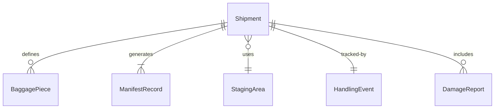
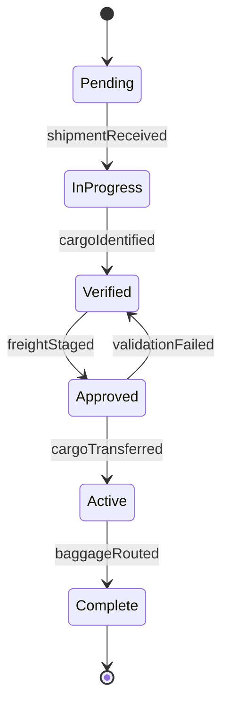
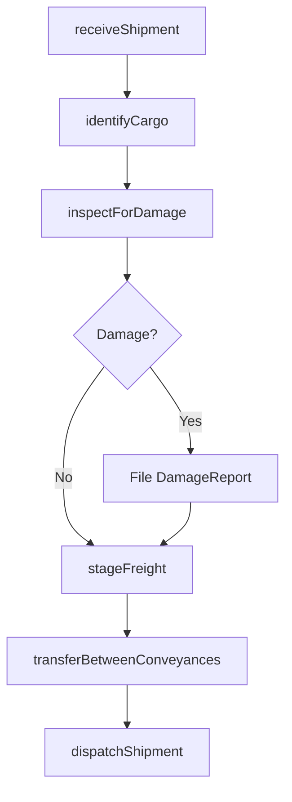
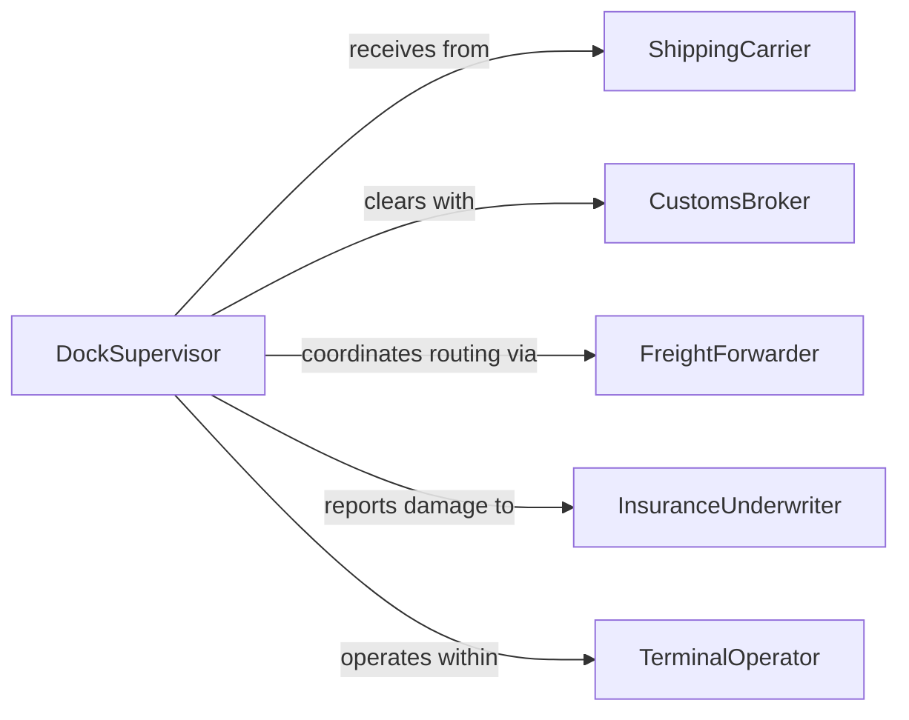

# Handle Cargo, Freight, and Baggage

> Business-as-Code definition for handling cargo, freight, and baggage. Models the physical processes of receiving, moving, staging, and dispatching shipments across transportation hubs, warehouses, and distribution centers.

## Overview

Handling cargo, freight, and baggage encompasses the physical movement, staging, and management of goods and personal belongings through transportation networks. This includes receiving inbound shipments at docks and terminals, transferring items between conveyances, staging freight in marshaling yards, processing passenger baggage at airports, and routing parcels through distribution centers. Workers use hand trucks, conveyor systems, pallet jacks, and powered material handling equipment to move items safely and efficiently while maintaining tracking and accountability throughout the process.

## Actors

| Actor | Description |
|-------|-------------|
| ShippingCarrier | Delivers and picks up freight at the facility |
| AirlineOperator | Manages passenger baggage flow through terminal systems |
| CustomsBroker | Clears international cargo through regulatory checkpoints |
| InsuranceUnderwriter | Covers loss or damage claims for handled goods |
| FreightForwarder | Coordinates multi-modal shipment routing and documentation |
| TerminalOperator | Manages the physical infrastructure where cargo is processed |

## Roles

| Role | Description |
|------|-------------|
| CargoHandler | Physically moves, stages, and loads freight and baggage |
| DockSupervisor | Oversees receiving and dispatching operations at loading docks |
| BaggageAgent | Processes and routes passenger luggage through terminal systems |
| WarehouseCoordinator | Manages staging areas, assigns dock doors, and schedules transfers |

## Entities

| Entity | Description |
|--------|-------------|
| Shipment | A consignment of goods moving through the facility |
| BaggagePiece | An individual item of passenger luggage |
| ManifestRecord | A document listing all items in a shipment or flight load |
| StagingArea | A designated zone where cargo is temporarily held between moves |
| HandlingEvent | A logged occurrence of cargo being touched or moved |
| DamageReport | A record of observed damage to freight or baggage during handling |

## Actions

| Action | Description |
|--------|-------------|
| receiveShipment | Accept inbound cargo at the dock or terminal gate |
| identifyCargo | Scan or visually verify item identity against the manifest |
| stageFreight | Move items to the appropriate staging or marshaling area |
| transferBetweenConveyances | Move cargo from one vehicle or system to another |
| routeBaggage | Direct passenger luggage to the correct flight or claim area |
| inspectForDamage | Check items for visible damage and record findings |
| dispatchShipment | Release cargo for outbound transport |

## Events

| Event | Description |
|-------|-------------|
| shipmentReceived | Inbound cargo has been accepted at the facility |
| cargoIdentified | An item has been scanned and matched to the manifest |
| freightStaged | Cargo has been placed in the designated staging area |
| cargoTransferred | Items have been moved between vehicles or conveyances |
| baggageRouted | Passenger luggage has been directed to its destination |
| damageDetected | Visible damage has been observed during handling |
| shipmentDispatched | Cargo has been released for outbound transport |

## Searches

| Search | Description |
|--------|-------------|
| findShipments | List shipments by carrier, destination, or status |
| getBaggageStatus | Track passenger luggage by tag number or flight |
| getHandlingEvents | Retrieve the handling history for a specific item |
| findDamageReports | Locate damage records by date, shipment, or severity |


## Entity Relationships



## State Diagram


## Workflow



## Actor Relationships



## Usage

### Calling Actions

```typescript
import { handleCargoFreightBaggage } from '@headlessly/handle-cargo-freight-baggage'

const cargo = handleCargoFreightBaggage()

// Receive an inbound shipment
const shipment = await cargo.receiveShipment({
  carrier: 'TransGlobal Logistics',
  trackingNumber: 'TGL-2026-887412',
  itemCount: 24,
  dock: 'Bay 14',
  manifestId: 'MAN-2026-04-15-014'
})

// Identify and stage each item
for (const item of shipment.items) {
  await cargo.identifyCargo({ itemId: item.id, scanType: 'barcode' })
  await cargo.stageFreight({ itemId: item.id, stagingArea: 'Zone C-3' })
}

// Dispatch for outbound transport
await cargo.dispatchShipment({
  shipmentId: shipment.id,
  outboundCarrier: 'Regional Express',
  destination: 'Distribution Center East'
})
```

### Event-Driven Automation

```typescript
// Alert operations on damage detection
cargo.damageDetected(async ({ shipmentId, itemId, severity, description }) => {
  await notify({
    to: 'claims-department',
    message: `Damage (${severity}) on item ${itemId} in shipment ${shipmentId}: ${description}`
  })
})

// Auto-route baggage when flight gate changes
cargo.baggageRouted(async ({ baggageTag, flightNumber, newGate }) => {
  await updateSortationSystem({
    baggageTag,
    destination: newGate,
    priority: 'high'
  })
})
```
