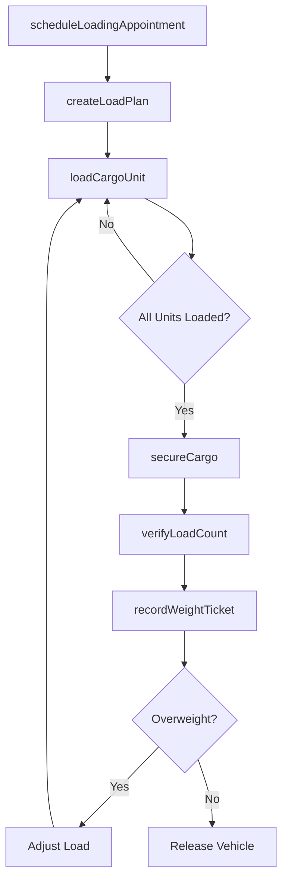
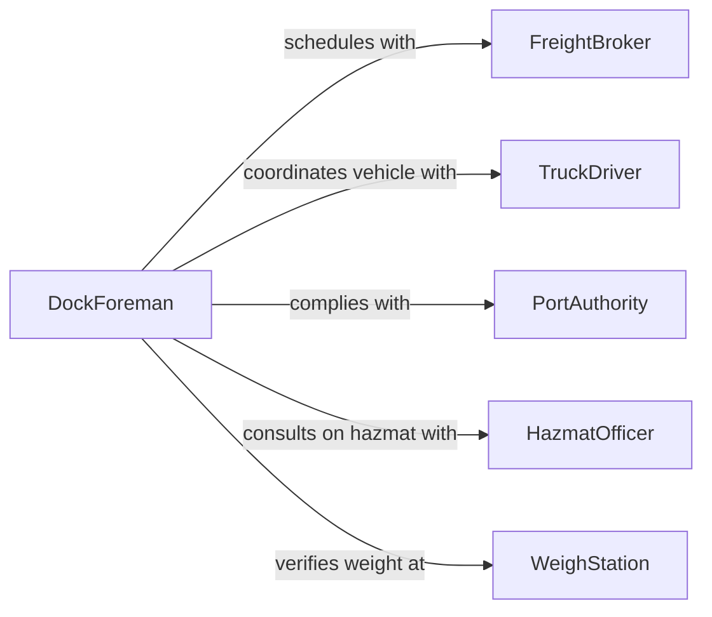

# Load and Unload Cargo

> Business-as-Code definition for loading and unloading cargo. Models the physical processes of placing goods onto and removing goods from transport vehicles, vessels, and aircraft, including weight distribution, securement, and verification.

## Overview

Loading and unloading cargo involves the systematic placement and removal of freight from trucks, railcars, shipping containers, aircraft holds, and marine vessels. Workers must account for weight distribution, load sequencing, securement requirements, hazardous materials handling, and vehicle capacity constraints. This activity is central to warehousing, port operations, trucking, air freight, and railroad logistics, requiring coordination between dock crews, vehicle operators, and dispatch personnel.

## Actors

| Actor | Description |
|-------|-------------|
| TruckDriver | Operates the vehicle being loaded or unloaded and verifies cargo counts |
| ShipAgent | Coordinates vessel loading plans and stowage assignments |
| PortAuthority | Enforces weight limits, safety regulations, and dock access |
| FreightBroker | Arranges cargo space and schedules loading appointments |
| HazmatOfficer | Ensures compliance with dangerous goods handling regulations |
| WeighStation | Verifies vehicle weight compliance before departure |

## Roles

| Role | Description |
|------|-------------|
| LoaderOperator | Physically places cargo onto or removes it from conveyances |
| DockForeman | Supervises loading crews and assigns dock doors |
| LoadPlanner | Determines optimal cargo placement for weight and balance |
| TallyClerk | Counts and records items loaded or unloaded against the manifest |

## Entities

| Entity | Description |
|--------|-------------|
| LoadPlan | A diagram specifying where each item should be placed in the conveyance |
| CargoUnit | A single item, pallet, or container being loaded or unloaded |
| BillOfLading | A legal document detailing the cargo, origin, and destination |
| WeightTicket | A certified record of vehicle weight before and after loading |
| SecurementDevice | Straps, chains, dunnage, or blocking used to stabilize cargo |
| DockAppointment | A scheduled time slot for a vehicle to be loaded or unloaded |

## Actions

| Action | Description |
|--------|-------------|
| scheduleLoadingAppointment | Reserve a dock door and time slot for the operation |
| createLoadPlan | Design the optimal placement of cargo units in the conveyance |
| loadCargoUnit | Physically place a cargo unit onto the transport vehicle |
| unloadCargoUnit | Physically remove a cargo unit from the transport vehicle |
| secureCargo | Apply restraints, blocking, and bracing to prevent shifting |
| verifyLoadCount | Confirm item counts match the bill of lading |
| recordWeightTicket | Capture pre-departure and post-loading vehicle weights |

## Events

| Event | Description |
|-------|-------------|
| appointmentScheduled | A dock loading appointment has been confirmed |
| loadPlanCreated | An optimized cargo placement plan has been generated |
| cargoLoaded | A cargo unit has been placed onto the conveyance |
| cargoUnloaded | A cargo unit has been removed from the conveyance |
| cargoSecured | Restraints and blocking have been applied and verified |
| loadCountVerified | Item counts match the shipping documentation |
| weightRecorded | Vehicle weight has been captured and recorded |
| overweightDetected | Vehicle weight exceeds legal or structural limits |

## Searches

| Search | Description |
|--------|-------------|
| findLoadPlans | List load plans by vehicle, destination, or date |
| getLoadStatus | Retrieve current loading progress for a specific dock |
| getWeightTickets | Look up weight records by vehicle or shipment |
| findAppointments | View scheduled dock appointments by date or carrier |

## Workflow



## Actor Relationships



## Usage

### Calling Actions

```typescript
import { loadUnloadCargo } from '@headlessly/load-unload-cargo'

const loading = loadUnloadCargo()

// Schedule a dock appointment
const appointment = await loading.scheduleLoadingAppointment({
  carrier: 'Midwest Freight Lines',
  vehicleId: 'MFL-4872',
  dock: 'Door 7',
  scheduledTime: '2026-04-16T06:00:00Z',
  estimatedDuration: 90
})

// Create load plan and execute loading
const plan = await loading.createLoadPlan({
  appointmentId: appointment.id,
  vehicleType: '53ft-dry-van',
  maxWeight: 20400,
  units: [
    { id: 'PLT-001', weight: 850, dimensions: { l: 48, w: 40, h: 60 } },
    { id: 'PLT-002', weight: 1200, dimensions: { l: 48, w: 40, h: 72 } }
  ]
})

// Load each unit per the plan
for (const position of plan.positions) {
  await loading.loadCargoUnit({
    unitId: position.unitId,
    placement: position.location,
    vehicleId: 'MFL-4872'
  })
}

await loading.secureCargo({ vehicleId: 'MFL-4872', method: 'load-bars-and-straps' })
```

### Event-Driven Automation

```typescript
// Alert dispatch when overweight detected
loading.overweightDetected(async ({ vehicleId, actualWeight, maxWeight }) => {
  await notify({
    to: 'dock-foreman',
    message: `Vehicle ${vehicleId} at ${actualWeight}kg exceeds limit of ${maxWeight}kg. Adjust load.`
  })
})

// Trigger departure workflow when load is verified
loading.loadCountVerified(async ({ vehicleId, shipmentId }) => {
  await initiateDeparture({ vehicleId, shipmentId })
})
```
