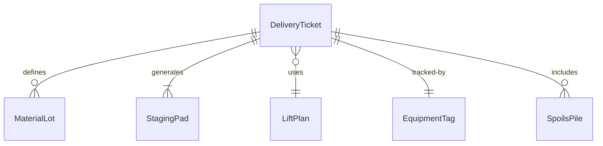
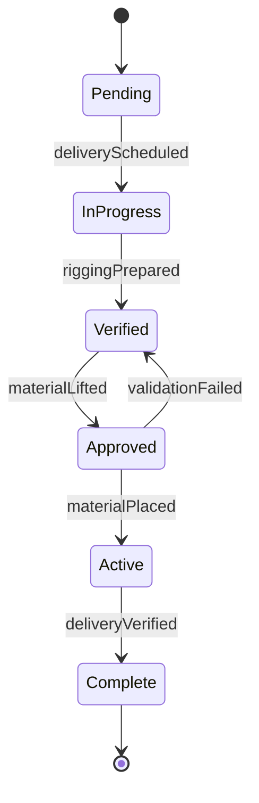
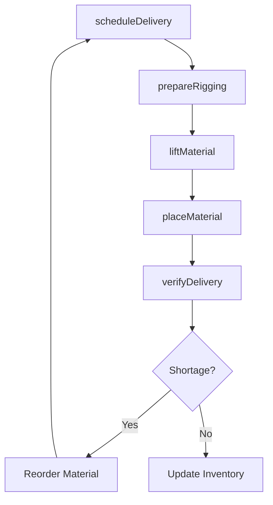
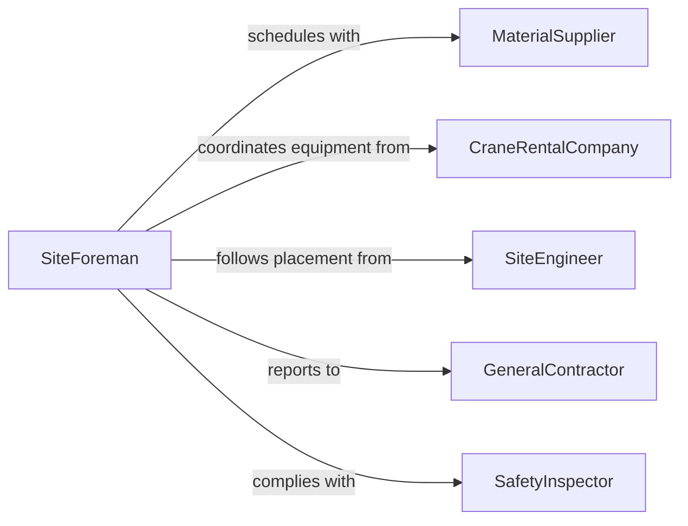

# Load and Unload Materials

> Business-as-Code definition for loading and unloading construction and extraction materials. Models the movement of lumber, aggregate, steel, pipe, earthen materials, and heavy equipment onto and off transport vehicles and at job sites.

## Overview

Loading and unloading materials used in construction or extraction involves the physical handling of bulk and heavy items such as lumber, concrete, rebar, piping, aggregate, drilling supplies, and excavation spoils. Workers use cranes, forklifts, front-end loaders, conveyors, and manual techniques to move materials between delivery vehicles and job site staging areas. Proper execution requires understanding load limits, rigging safety, material fragility, and site layout constraints to prevent injury, damage, and project delays.

## Actors

| Actor | Description |
|-------|-------------|
| MaterialSupplier | Delivers construction or extraction materials to the job site |
| GeneralContractor | Manages the overall project and coordinates material delivery schedules |
| CraneRentalCompany | Provides lifting equipment and certified operators for heavy loads |
| SiteEngineer | Specifies material placement locations and structural requirements |
| SafetyInspector | Monitors material handling compliance with OSHA and site safety plans |
| WasteHauler | Removes excavation spoils and construction debris from the site |

## Roles

| Role | Description |
|------|-------------|
| MaterialHandler | Physically loads and unloads construction materials |
| CraneOperator | Operates lifting equipment to move heavy or oversized items |
| SiteForeman | Coordinates delivery schedules and directs material placement |
| Rigger | Attaches slings, chains, and rigging hardware to loads for lifting |

## Entities

| Entity | Description |
|--------|-------------|
| DeliveryTicket | A document listing materials, quantities, and delivery destination |
| MaterialLot | A batch of construction materials delivered as a unit |
| StagingPad | A prepared area on site designated for material storage |
| LiftPlan | A safety document specifying rigging methods, load weights, and crane configuration |
| EquipmentTag | An identification label on material handling equipment showing inspection status |
| SpoilsPile | Accumulated excavation material awaiting removal or reuse |

## Actions

| Action | Description |
|--------|-------------|
| scheduleDelivery | Coordinate material arrival with the site work schedule |
| prepareRigging | Select and attach appropriate slings, shackles, and spreader bars |
| liftMaterial | Use crane or equipment to raise and move a load |
| placeMaterial | Set materials down in the designated staging or installation area |
| unloadByHand | Manually offload lighter materials from the delivery vehicle |
| verifyDelivery | Confirm delivered quantities and conditions match the delivery ticket |
| removeDebris | Load waste material or spoils onto hauling vehicles for disposal |

## Events

| Event | Description |
|-------|-------------|
| deliveryScheduled | A material delivery has been confirmed on the site calendar |
| riggingPrepared | Slings and hardware have been inspected and attached to the load |
| materialLifted | A load has been raised off the transport vehicle |
| materialPlaced | Materials have been set in the designated location |
| deliveryVerified | Quantity and condition checks have been completed |
| shortageDetected | Delivered quantities are less than what was ordered |
| debrisRemoved | Waste material has been loaded for off-site disposal |

## Searches

| Search | Description |
|--------|-------------|
| findDeliveries | List deliveries by date, supplier, or material type |
| getMaterialInventory | Query on-site material quantities by type and staging pad |
| getShortages | Identify deliveries with quantity discrepancies |
| getLiftPlans | Retrieve lift plans by crane, date, or load weight |


## Entity Relationships



## State Diagram


## Workflow



## Actor Relationships



## Usage

### Calling Actions

```typescript
import { loadUnloadMaterials } from '@headlessly/load-unload-materials'

const materials = loadUnloadMaterials()

// Schedule a steel delivery
const delivery = await materials.scheduleDelivery({
  supplier: 'Pacific Steel Distributors',
  materialType: 'W14x30 structural beam',
  quantity: 48,
  deliveryDate: '2026-04-18T07:00:00Z',
  stagingPad: 'Pad B-North'
})

// Prepare rigging and execute lift
await materials.prepareRigging({
  deliveryId: delivery.id,
  loadWeight: 9600,
  riggingType: 'two-point-chain-sling',
  craneId: 'CR-220T-03'
})

await materials.liftMaterial({
  deliveryId: delivery.id,
  loadId: 'BEAM-LOT-048',
  craneId: 'CR-220T-03',
  destination: 'Pad B-North'
})

// Verify delivery counts
await materials.verifyDelivery({
  deliveryId: delivery.id,
  expectedQuantity: 48
})
```

### Event-Driven Automation

```typescript
// Notify project manager on shortage
materials.shortageDetected(async ({ deliveryId, materialType, expected, received }) => {
  await notify({
    to: 'project-manager',
    message: `Shortage: received ${received} of ${expected} ${materialType} (Delivery ${deliveryId})`
  })
})

// Update site inventory after verified delivery
materials.deliveryVerified(async ({ deliveryId, materialType, quantity, stagingPad }) => {
  await updateSiteInventory({
    materialType,
    quantity,
    location: stagingPad
  })
})
```
