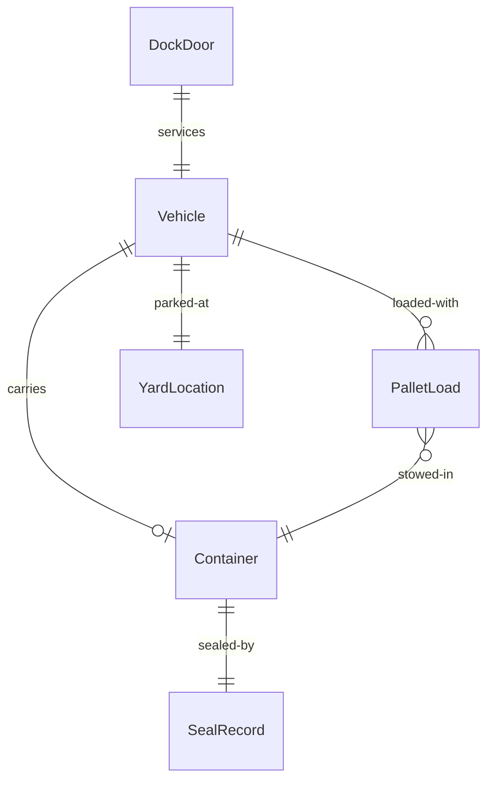
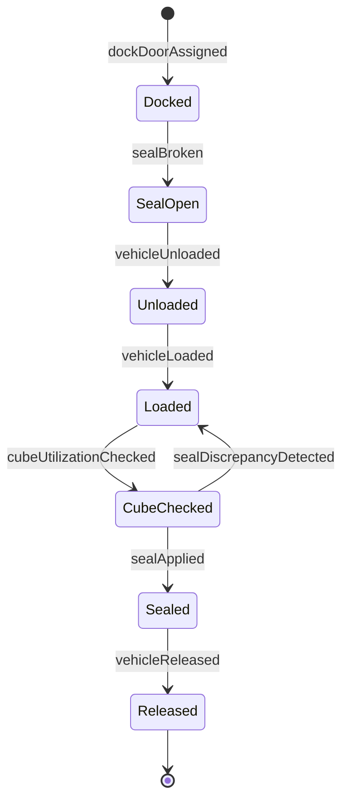
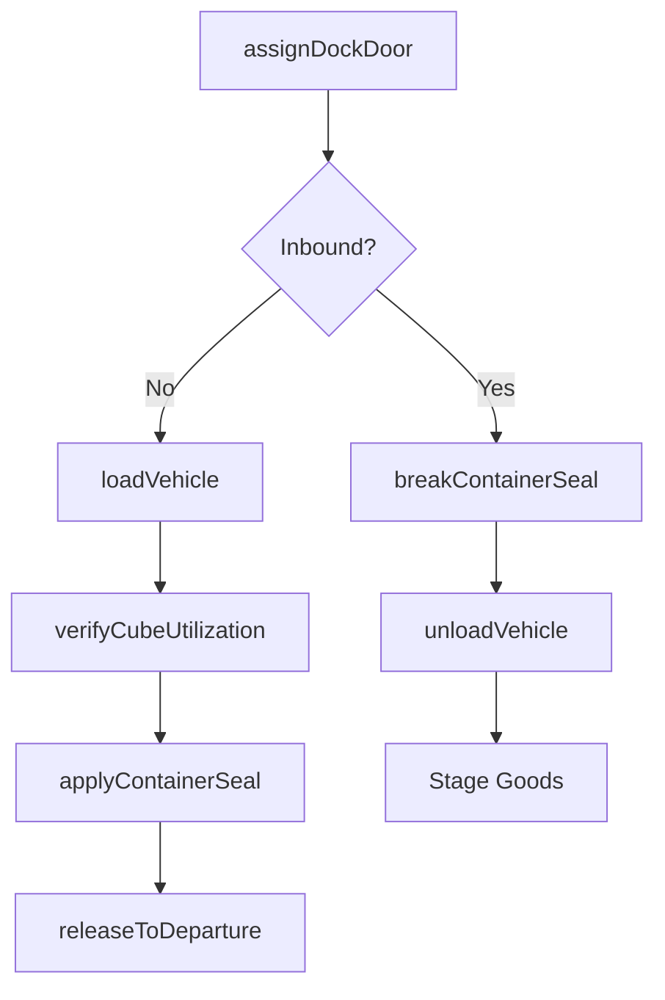
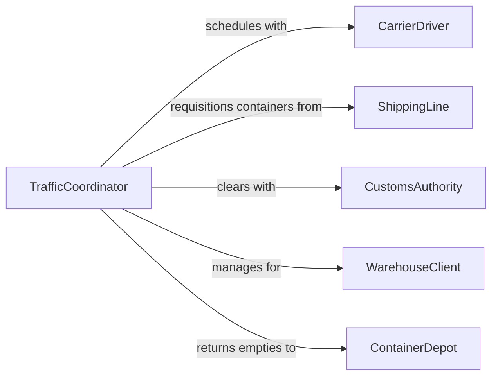

# Load and Unload Vehicles and Containers

> Business-as-Code definition for loading and unloading vehicles and intermodal containers. Models the operations of filling and emptying trailers, shipping containers, railcars, and delivery vehicles at warehouses, ports, and distribution centers.

## Overview

Loading and unloading vehicles and containers is the foundational physical activity of distribution and logistics operations. This encompasses filling outbound trailers with palletized goods, emptying inbound shipping containers at port facilities, cross-docking freight between vehicles, and loading delivery vans for last-mile routes. Workers use forklifts, pallet jacks, roller conveyors, and manual stacking to move goods efficiently while maximizing cube utilization and maintaining load integrity during transit.

## Actors

| Actor | Description |
|-------|-------------|
| CarrierDriver | Delivers and receives vehicles at the loading dock |
| ShippingLine | Provides intermodal containers for ocean and rail transport |
| WarehouseClient | Commissions storage and distribution of goods through the facility |
| ContainerDepot | Issues, receives, and maintains empty containers |
| CustomsAuthority | Inspects and clears container contents for import or export |
| InsuranceProvider | Covers goods against damage or loss during loading operations |

## Roles

| Role | Description |
|------|-------------|
| ForkliftOperator | Drives powered equipment to move pallets into and out of vehicles |
| LoadingDockWorker | Manually handles cases, parcels, and irregularly shaped items |
| TrafficCoordinator | Schedules vehicle arrivals, assigns dock doors, and manages yard flow |
| ContainerInspector | Examines containers for structural integrity and seal compliance |

## Entities

| Entity | Description |
|--------|-------------|
| Vehicle | A truck, trailer, railcar, or van being loaded or unloaded |
| Container | A standard intermodal unit (20ft or 40ft) used for shipping |
| PalletLoad | A unit of goods stacked on a pallet for forklift handling |
| DockDoor | A numbered bay at the warehouse where vehicles interface |
| SealRecord | Documentation of container seal numbers applied at loading |
| YardLocation | A designated parking position for vehicles in the facility yard |

## Actions

| Action | Description |
|--------|-------------|
| assignDockDoor | Allocate a loading bay to an arriving or departing vehicle |
| breakContainerSeal | Open and document the existing seal on an inbound container |
| unloadVehicle | Remove all cargo from a vehicle or container |
| loadVehicle | Place cargo into a vehicle or container per the load plan |
| applyContainerSeal | Attach and record a tamper-evident seal after loading |
| verifyCubeUtilization | Confirm that vehicle capacity is optimally used |
| releaseToDeparture | Clear the loaded vehicle for yard exit and road departure |

## Events

| Event | Description |
|-------|-------------|
| dockDoorAssigned | A vehicle has been assigned to a specific loading bay |
| sealBroken | An inbound container seal has been opened and documented |
| vehicleUnloaded | All cargo has been removed from the vehicle or container |
| vehicleLoaded | All cargo has been placed and the vehicle is fully loaded |
| sealApplied | A new tamper-evident seal has been attached and recorded |
| cubeUtilizationChecked | Vehicle capacity usage has been measured and logged |
| vehicleReleased | The loaded vehicle has been cleared for departure |
| sealDiscrepancyDetected | Container seal number does not match shipping documentation |

## Searches

| Search | Description |
|--------|-------------|
| findVehiclesAtDock | List vehicles currently assigned to dock doors |
| getContainerStatus | Track container loading or unloading progress |
| getSealRecords | Retrieve seal numbers and break/apply history for a container |
| findYardPositions | Locate vehicles in the facility yard by carrier or status |


## Entity Relationships



## State Diagram


## Workflow



## Actor Relationships



## Usage

### Calling Actions

```typescript
import { loadUnloadVehiclesContainers } from '@headlessly/load-unload-vehicles-containers'

const dock = loadUnloadVehiclesContainers()

// Assign dock door and unload inbound container
const assignment = await dock.assignDockDoor({
  vehicleId: 'TRLR-9924',
  containerNumber: 'MAEU-4472810',
  dockDoor: 12,
  direction: 'inbound'
})

await dock.breakContainerSeal({
  containerId: assignment.containerNumber,
  expectedSeal: 'SL-2026-443821',
  inspector: 'J. Torres'
})

const unloadResult = await dock.unloadVehicle({
  vehicleId: assignment.vehicleId,
  dockDoor: assignment.dockDoor,
  expectedPallets: 22
})

// Load outbound trailer
await dock.loadVehicle({
  vehicleId: 'VAN-1184',
  dockDoor: 8,
  pallets: ['PLT-4401', 'PLT-4402', 'PLT-4403'],
  loadSequence: 'last-in-first-out'
})
```

### Event-Driven Automation

```typescript
// Alert security on seal discrepancy
dock.sealDiscrepancyDetected(async ({ containerId, expected, actual }) => {
  await notify({
    to: 'security-team',
    message: `Seal mismatch on ${containerId}: expected ${expected}, found ${actual}`
  })
  await holdContainer({ containerId, reason: 'seal-discrepancy' })
})

// Notify dispatch when vehicle is released
dock.vehicleReleased(async ({ vehicleId, destination, sealNumber }) => {
  await updateDispatch({
    vehicleId,
    status: 'en-route',
    destination,
    sealNumber
  })
})
```
