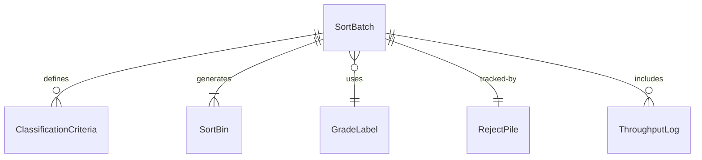
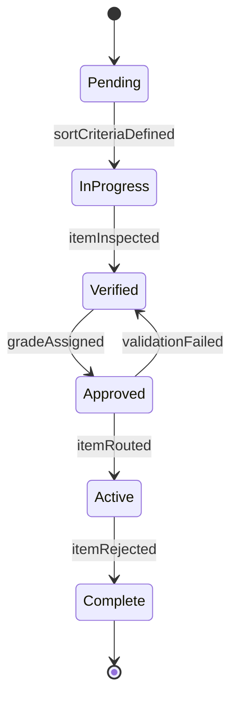
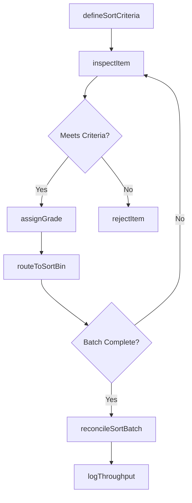
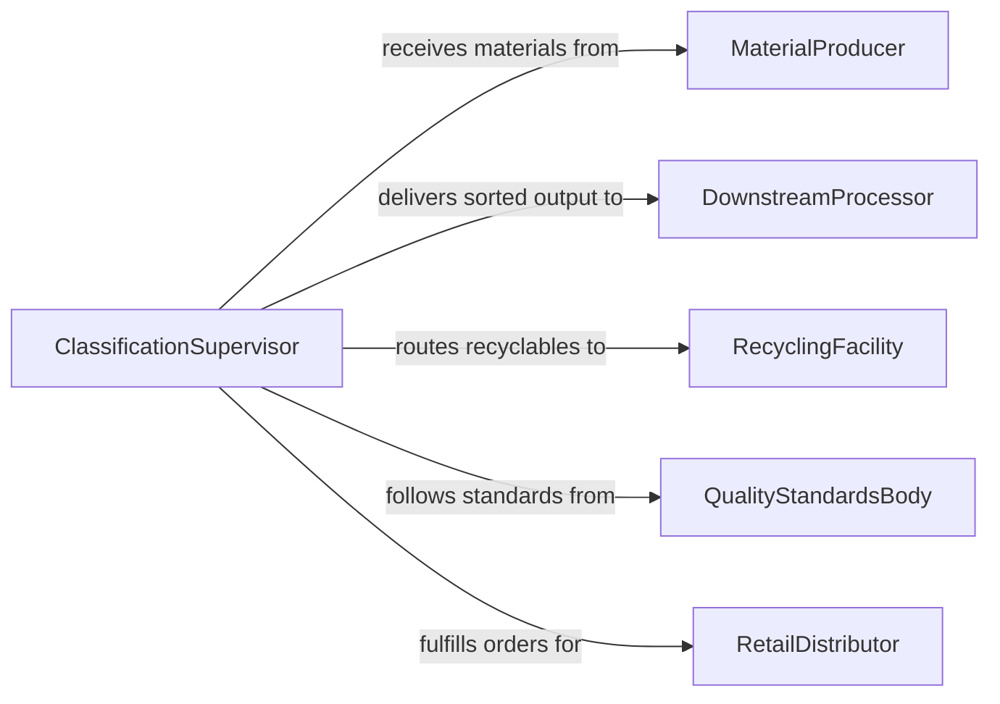

# Sort and Classify Materials and Products

> Business-as-Code definition for sorting and classifying materials and products. Models the physical processes of separating, grading, categorizing, and routing items based on type, quality, destination, or other criteria.

## Overview

Sorting and classifying materials and products involves the physical separation and categorization of items based on predetermined criteria such as size, weight, grade, destination, material type, or quality level. This activity occurs in mail processing facilities, recycling centers, agricultural packing houses, manufacturing quality lines, distribution centers, and parcel sorting hubs. Workers visually inspect items, use automated sortation conveyors, and apply classification labels to route materials to the correct downstream process or destination.

## Actors

| Actor | Description |
|-------|-------------|
| MaterialProducer | Supplies unsorted raw materials or products for processing |
| DownstreamProcessor | Receives sorted materials for further manufacturing or assembly |
| RecyclingFacility | Accepts classified waste streams for material recovery |
| QualityStandardsBody | Defines grading criteria and classification standards |
| RetailDistributor | Receives sorted products categorized by SKU and destination |
| PostalService | Routes sorted mail and parcels to delivery networks |

## Roles

| Role | Description |
|------|-------------|
| Sorter | Physically separates items into designated categories or bins |
| Grader | Evaluates item quality and assigns a classification grade |
| SortationOperator | Manages automated conveyor and diverter systems |
| ClassificationSupervisor | Oversees sorting accuracy and throughput targets |

## Entities

| Entity | Description |
|--------|-------------|
| SortBatch | A group of items queued for classification |
| ClassificationCriteria | The rules and standards used to assign categories |
| SortBin | A physical or logical destination for a specific category |
| GradeLabel | A designation indicating the quality or class of an item |
| RejectPile | Items that do not meet any acceptable classification |
| ThroughputLog | A record of sorting volumes and rates over time |

## Actions

| Action | Description |
|--------|-------------|
| defineSortCriteria | Establish the rules and categories for classification |
| inspectItem | Visually or mechanically evaluate an item against criteria |
| assignGrade | Apply a quality or classification designation to an item |
| routeToSortBin | Direct the item to the appropriate bin or downstream lane |
| rejectItem | Remove items that do not meet any classification standard |
| reconcileSortBatch | Verify that all items in a batch have been classified and routed |
| logThroughput | Record sorting volumes, rates, and accuracy metrics |

## Events

| Event | Description |
|-------|-------------|
| sortCriteriaDefined | Classification rules have been established for the operation |
| itemInspected | An item has been evaluated against sorting criteria |
| gradeAssigned | A quality or category designation has been applied |
| itemRouted | An item has been directed to its classification bin |
| itemRejected | An item has been removed from the sort stream |
| batchReconciled | All items in a batch have been accounted for and classified |
| throughputLogged | Sorting performance metrics have been recorded |

## Searches

| Search | Description |
|--------|-------------|
| findSortBatches | List batches by date, source, or classification status |
| getGradeDistribution | View the breakdown of items by grade within a batch |
| getRejects | Retrieve rejected items by batch, reason, or date |
| getThroughputMetrics | Query sorting volumes and accuracy rates over time |


## Entity Relationships



## State Diagram


## Workflow



## Actor Relationships



## Usage

### Calling Actions

```typescript
import { sortClassifyMaterialsProducts } from '@headlessly/sort-classify-materials-products'

const sorting = sortClassifyMaterialsProducts()

// Define sort criteria for apple grading
const criteria = await sorting.defineSortCriteria({
  product: 'Gala Apple',
  categories: [
    { grade: 'Extra Fancy', minDiameter: 73, maxBlemish: 0, colorCoverage: 66 },
    { grade: 'Fancy', minDiameter: 64, maxBlemish: 5, colorCoverage: 50 },
    { grade: 'Utility', minDiameter: 57, maxBlemish: 15, colorCoverage: 33 }
  ],
  rejectThreshold: { maxBlemish: 30 }
})

// Inspect and classify items in a batch
const batch = await sorting.inspectItem({
  batchId: 'HARVEST-2026-0412',
  itemId: 'APL-00441',
  diameter: 78,
  blemishPercent: 2,
  colorCoverage: 72
})

await sorting.assignGrade({ itemId: 'APL-00441', grade: 'Extra Fancy' })
await sorting.routeToSortBin({ itemId: 'APL-00441', bin: 'Lane-EF-1' })
```

### Event-Driven Automation

```typescript
// Alert quality team on high reject rate
sorting.batchReconciled(async ({ batchId, totalItems, rejectCount }) => {
  const rejectRate = rejectCount / totalItems
  if (rejectRate > 0.10) {
    await notify({
      to: 'quality-manager',
      message: `Batch ${batchId} reject rate ${(rejectRate * 100).toFixed(1)}% exceeds 10% threshold`
    })
  }
})

// Update inventory after batch is sorted
sorting.gradeAssigned(async ({ itemId, grade, batchId }) => {
  await updateInventory({ sku: grade, quantity: 1, source: batchId })
})
```
