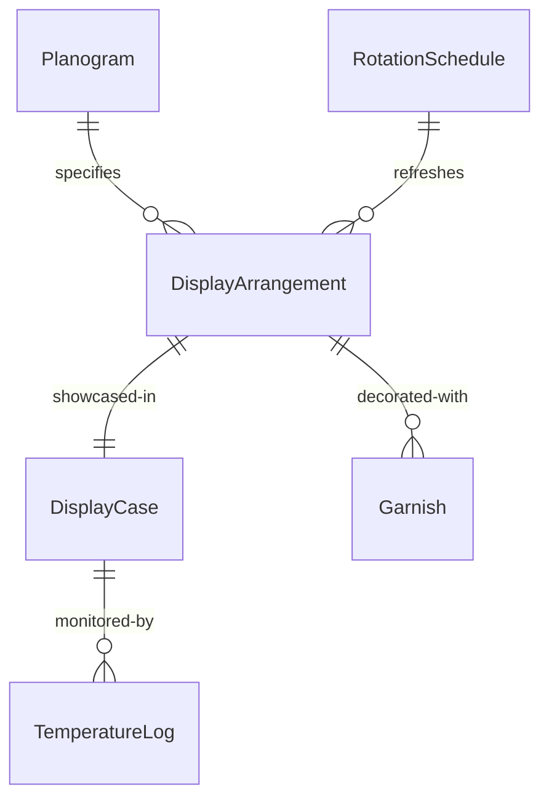
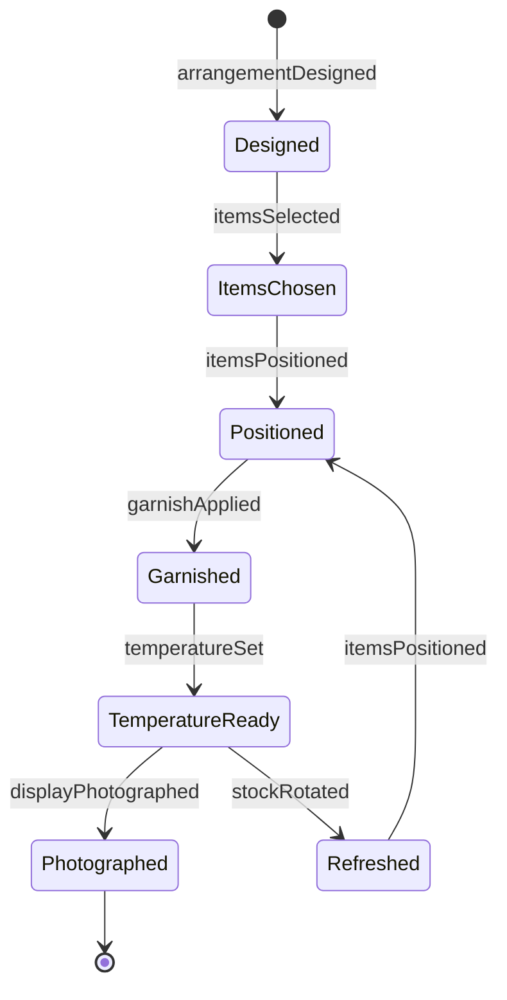
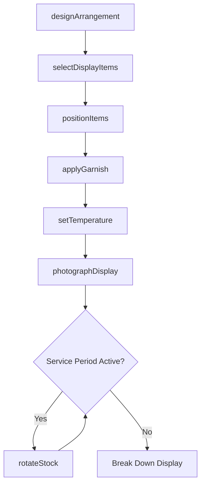
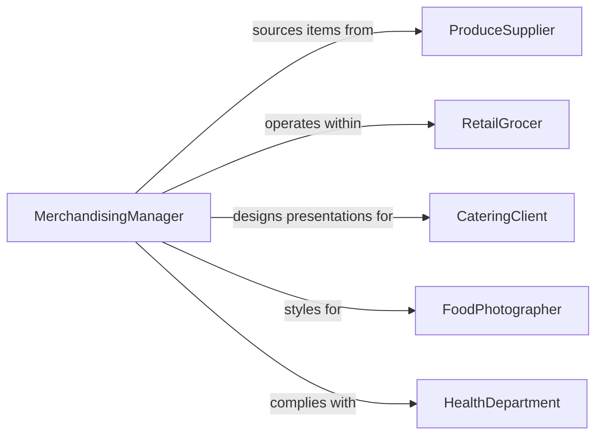

# Arrange Food for Display Purposes

> Business-as-Code definition for arranging food for display purposes. Models the process of selecting, positioning, garnishing, and presenting food items to create visually appealing displays for retail cases, buffet stations, catering events, and food photography.

## Overview

Arranging food for display purposes involves the artistic and practical placement of food items to maximize visual appeal, freshness perception, and customer interest. This activity spans grocery deli counters, bakery showcases, buffet lines, catering presentations, farmers market booths, and food photography sets. Workers select items by size, color, and condition, arrange them using established merchandising principles, apply garnishes and props, and maintain displays throughout service periods by rotating stock and refreshing arrangements.

## Actors

| Actor | Description |
|-------|-------------|
| RetailGrocer | Operates display cases and merchandising areas in the store |
| CateringClient | Specifies presentation requirements for events and functions |
| FoodPhotographer | Directs food styling for commercial photography and media |
| HealthDepartment | Enforces food safety regulations for displayed items |
| ProduceSupplier | Delivers fresh items meeting appearance and quality standards |
| EventVenueManager | Provides the physical space and equipment for food displays |

## Roles

| Role | Description |
|------|-------------|
| FoodStylist | Creates artistic arrangements of food for maximum visual impact |
| DeliClerk | Maintains and refreshes retail deli and bakery display cases |
| BanquetSetupCrew | Arranges food stations and buffet lines for events |
| MerchandisingManager | Defines display standards, planograms, and rotation schedules |

## Entities

| Entity | Description |
|--------|-------------|
| DisplayArrangement | A planned layout of food items in a specific presentation area |
| DisplayCase | A refrigerated or ambient unit used to showcase food products |
| Garnish | A decorative element added to enhance visual presentation |
| Planogram | A diagram specifying product placement within a display area |
| RotationSchedule | A timetable for refreshing items to maintain freshness and appeal |
| TemperatureLog | A record of display case temperatures for food safety compliance |

## Actions

| Action | Description |
|--------|-------------|
| designArrangement | Plan the layout, color scheme, and item positioning for a display |
| selectDisplayItems | Choose items based on appearance, size, ripeness, and uniformity |
| positionItems | Place food in the display according to the planogram |
| applyGarnish | Add decorative touches such as herbs, edible flowers, or props |
| setTemperature | Configure display case temperature for food safety and quality |
| rotateStock | Replace aging items with fresh product to maintain appearance |
| photographDisplay | Capture images of the finished arrangement for records or marketing |

## Events

| Event | Description |
|-------|-------------|
| arrangementDesigned | A display layout plan has been created |
| itemsSelected | Food items meeting display criteria have been chosen |
| itemsPositioned | Food has been placed in the display area |
| garnishApplied | Decorative elements have been added to the arrangement |
| temperatureSet | Display case has been configured to the required temperature |
| stockRotated | Aging items have been replaced with fresh product |
| displayPhotographed | Images of the arrangement have been captured |

## Searches

| Search | Description |
|--------|-------------|
| findArrangements | List display arrangements by area, event, or date |
| getRotationSchedule | View upcoming stock rotation times by display case |
| getTemperatureLogs | Retrieve temperature history for a specific display unit |
| findExpiringItems | Locate displayed items approaching their freshness threshold |


## Entity Relationships



## State Diagram


## Workflow



## Actor Relationships



## Usage

### Calling Actions

```typescript
import { arrangeFoodDisplayPurposes } from '@headlessly/arrange-food-display-purposes'

const display = arrangeFoodDisplayPurposes()

// Design a bakery showcase arrangement
const arrangement = await display.designArrangement({
  area: 'Main Bakery Case',
  theme: 'Spring Collection',
  sections: [
    { position: 'top-shelf', category: 'decorated-cakes', maxItems: 6 },
    { position: 'middle-shelf', category: 'pastries', maxItems: 18 },
    { position: 'bottom-shelf', category: 'artisan-breads', maxItems: 12 }
  ],
  colorScheme: ['pastel-pink', 'cream', 'sage-green']
})

// Select and position items
const items = await display.selectDisplayItems({
  arrangementId: arrangement.id,
  criteria: { freshness: 'baked-today', appearance: 'no-visible-damage' }
})

for (const item of items) {
  await display.positionItems({
    arrangementId: arrangement.id,
    itemId: item.id,
    position: item.assignedPosition
  })
}

await display.applyGarnish({
  arrangementId: arrangement.id,
  garnishes: ['fresh-mint-sprigs', 'edible-flowers', 'powdered-sugar-dusting']
})
```

### Event-Driven Automation

```typescript
// Alert staff when rotation is due
display.stockRotated(async ({ displayCase, itemsReplaced }) => {
  await log({
    area: displayCase,
    action: 'rotation-complete',
    count: itemsReplaced.length
  })
})

// Flag temperature compliance issues
display.temperatureSet(async ({ displayCase, temperature, requiredRange }) => {
  if (temperature > requiredRange.max) {
    await notify({
      to: 'food-safety-manager',
      message: `Display case ${displayCase} at ${temperature}F exceeds max of ${requiredRange.max}F`
    })
  }
})
```
