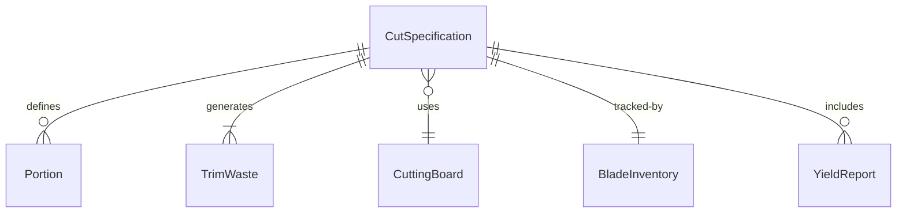
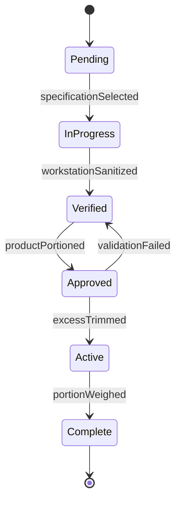
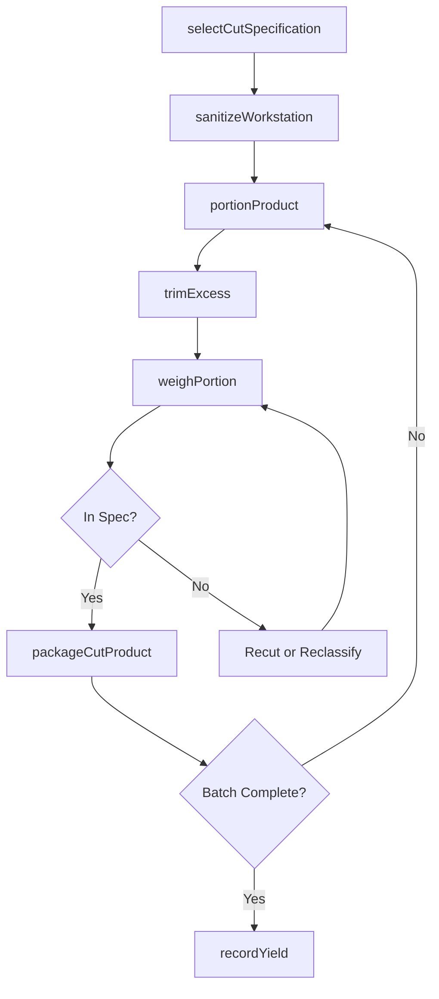
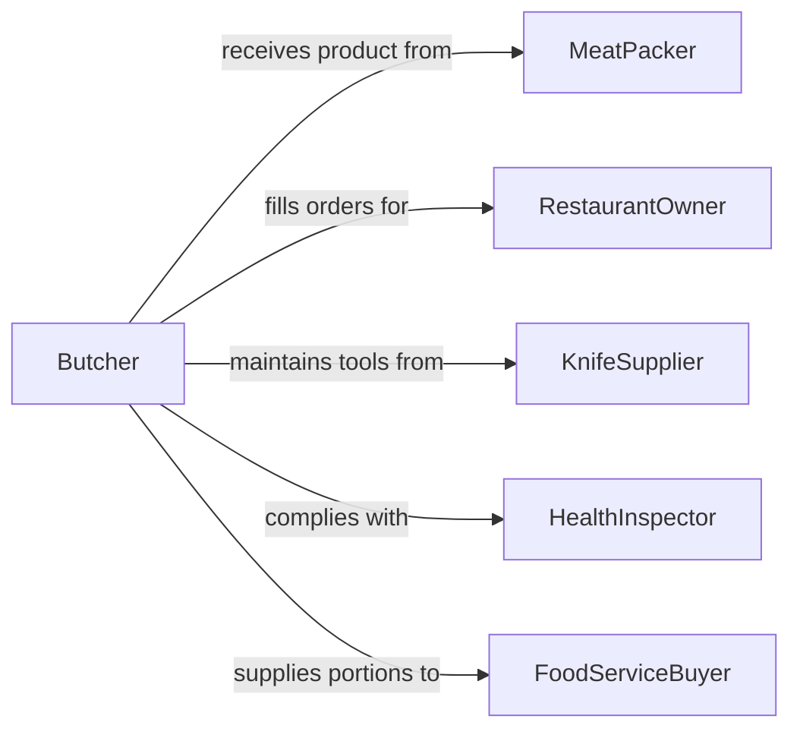

# Cut Food Products

> Business-as-Code definition for cutting food products. Models the processes of portioning, slicing, dicing, filleting, and trimming food items in commercial kitchens, butcher shops, food processing plants, and catering operations.

## Overview

Cutting food products encompasses the skilled use of knives, slicers, saws, and other cutting implements to portion, trim, fillet, dice, julienne, and otherwise prepare food items for cooking, packaging, or service. This activity is central to commercial kitchens, meat processing facilities, fish markets, delicatessens, produce preparation areas, and industrial food manufacturing lines. Workers must maintain blade sharpness, follow portion control standards, observe food safety protocols, and minimize waste while achieving consistent cut dimensions and presentation quality.

## Actors

| Actor | Description |
|-------|-------------|
| MeatPacker | Supplies primal cuts and carcasses for further processing |
| SeafoodDistributor | Delivers whole fish and shellfish requiring filleting and portioning |
| RestaurantOwner | Specifies portion sizes, cut styles, and waste reduction targets |
| HealthInspector | Enforces sanitation, temperature, and cross-contamination standards |
| KnifeSupplier | Provides and services professional cutting tools and equipment |
| FoodServiceBuyer | Orders specific cut specifications for institutional meal programs |

## Roles

| Role | Description |
|------|-------------|
| Butcher | Breaks down primal cuts into retail portions and custom orders |
| PrepCook | Cuts vegetables, fruits, and other ingredients for kitchen production |
| FishMonger | Fillets, portions, and trims seafood products |
| MeatCutter | Operates band saws and slicers in processing environments |

## Entities

| Entity | Description |
|--------|-------------|
| CutSpecification | A standard defining the target size, weight, and style of a cut |
| Portion | A measured piece of food product ready for cooking or packaging |
| TrimWaste | Usable or unusable material removed during the cutting process |
| CuttingBoard | A sanitized surface designated for specific food categories |
| BladeInventory | A tracked set of knives and cutting implements |
| YieldReport | A record comparing input weight to usable portions and waste |

## Actions

| Action | Description |
|--------|-------------|
| selectCutSpecification | Choose the target cut style, size, and weight for the product |
| sanitizeWorkstation | Clean and sanitize cutting surfaces, tools, and hands |
| portionProduct | Cut the food item into pieces meeting the specification |
| trimExcess | Remove fat, sinew, bones, skin, or other non-portion material |
| weighPortion | Verify that each cut meets the target weight range |
| packageCutProduct | Wrap or tray-pack the finished portions for storage or sale |
| recordYield | Document the ratio of usable portions to total input weight |

## Events

| Event | Description |
|-------|-------------|
| specificationSelected | The target cut parameters have been chosen for the session |
| workstationSanitized | Cutting area has been cleaned and approved for use |
| productPortioned | A food item has been cut to specification |
| excessTrimmed | Non-portion material has been separated from the product |
| portionWeighed | A cut has been verified against the target weight |
| productPackaged | Finished portions have been wrapped or tray-packed |
| yieldRecorded | Input-to-output ratios have been documented |
| portionOutOfSpec | A cut deviates from the target weight or dimension range |

## Searches

| Search | Description |
|--------|-------------|
| findCutSpecifications | List specifications by product type, cut style, or customer |
| getYieldReports | Retrieve yield data by product, cutter, or date range |
| getPortionCounts | Query the number of portions produced by specification |
| findOutOfSpecPortions | Locate portions flagged for weight or dimension deviation |


## Entity Relationships



## State Diagram


## Workflow



## Actor Relationships



## Usage

### Calling Actions

```typescript
import { cutFoodProducts } from '@headlessly/cut-food-products'

const cutting = cutFoodProducts()

// Select specification for salmon fillets
const spec = await cutting.selectCutSpecification({
  product: 'Atlantic Salmon',
  cutStyle: 'skin-on-fillet',
  targetWeight: { min: 170, max: 200, unit: 'grams' },
  thickness: { target: 25, unit: 'mm' }
})

// Process a batch
await cutting.sanitizeWorkstation({ station: 'Seafood Prep 2', category: 'raw-fish' })

const portion = await cutting.portionProduct({
  specId: spec.id,
  sourceItem: 'SALM-WHOLE-0884',
  cutNumber: 1
})

await cutting.trimExcess({
  portionId: portion.id,
  removed: ['pin-bones', 'belly-flap'],
  wasteWeight: 45
})

await cutting.weighPortion({ portionId: portion.id })
await cutting.packageCutProduct({
  portionId: portion.id,
  packaging: 'vacuum-sealed-tray',
  label: 'Atlantic Salmon Fillet 180g'
})
```

### Event-Driven Automation

```typescript
// Flag low yield for cost review
cutting.yieldRecorded(async ({ product, yieldPercent, benchmark }) => {
  if (yieldPercent < benchmark - 5) {
    await notify({
      to: 'production-manager',
      message: `${product} yield at ${yieldPercent}% is ${benchmark - yieldPercent}% below benchmark`
    })
  }
})

// Track out-of-spec portions for training
cutting.portionOutOfSpec(async ({ portionId, cutterId, deviation }) => {
  await logQualityEvent({
    type: 'portion-deviation',
    portionId,
    operator: cutterId,
    deviation
  })
})
```
