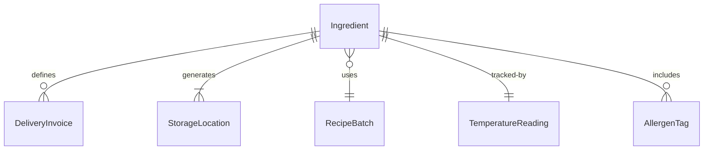
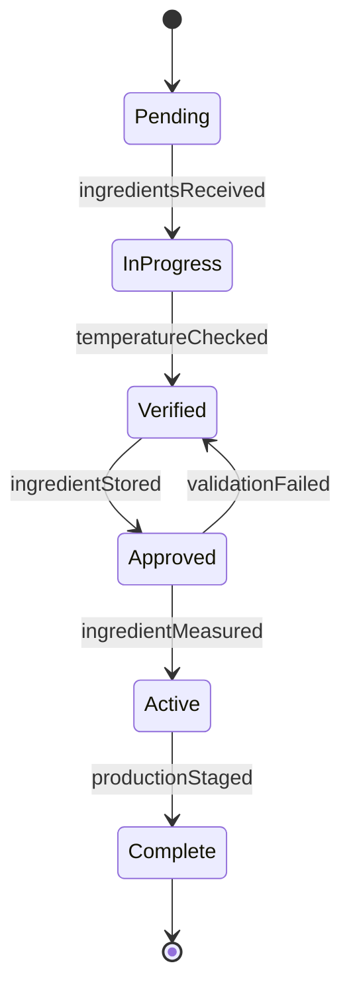
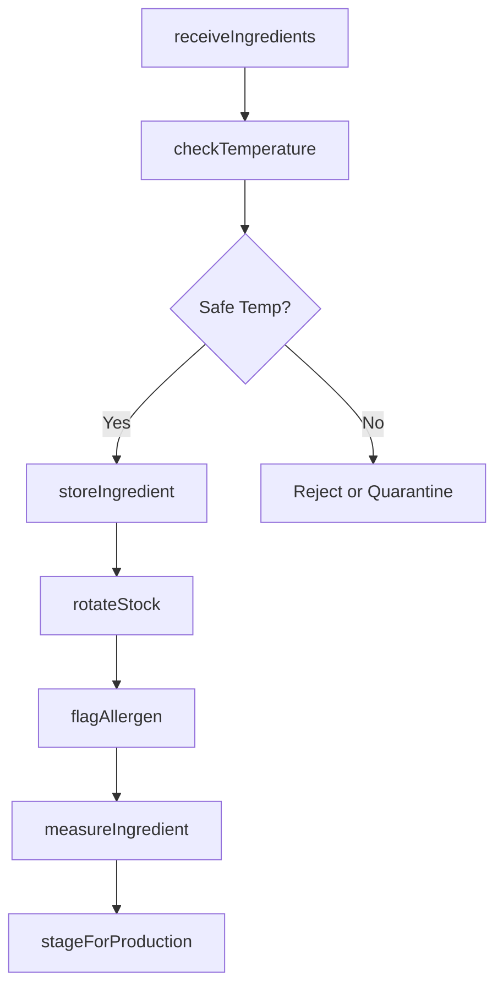
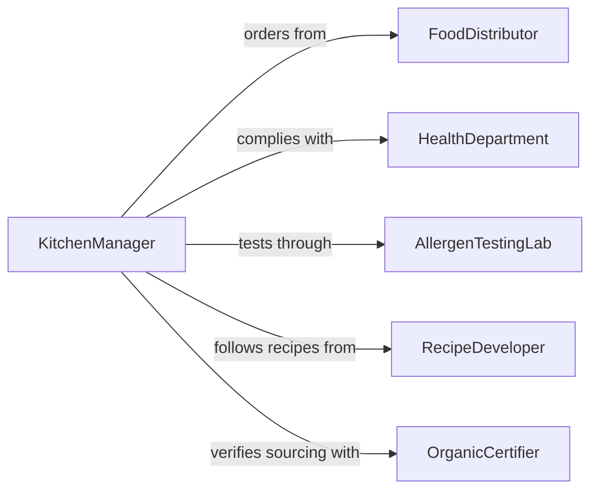

# Handle Food Preparation Ingredients

> Business-as-Code definition for handling food preparation ingredients. Models the receiving, storing, measuring, staging, and distributing of raw ingredients in commercial kitchens, food manufacturing facilities, bakeries, and catering operations.

## Overview

Handling food preparation ingredients involves the physical activities of receiving deliveries, inspecting incoming goods, storing ingredients at appropriate temperatures, measuring and weighing portions according to recipes, staging mise en place for production lines, and distributing ingredients to cooking stations. This work requires knowledge of food safety standards including FIFO rotation, allergen segregation, temperature control, and cross-contamination prevention. Proper ingredient handling directly impacts food quality, consistency, safety, and cost control.

## Actors

| Actor | Description |
|-------|-------------|
| FoodDistributor | Delivers bulk ingredients and specialty items to the facility |
| HealthDepartment | Inspects ingredient handling practices and storage conditions |
| AllergenTestingLab | Verifies allergen-free status of sensitive ingredients |
| EquipmentSupplier | Provides scales, thermometers, and storage equipment |
| RecipeDeveloper | Specifies ingredient quantities, preparations, and substitutions |
| OrganicCertifier | Validates organic ingredient sourcing and handling compliance |

## Roles

| Role | Description |
|------|-------------|
| ReceivingClerk | Inspects and accepts incoming ingredient deliveries |
| PantryCook | Measures, portions, and stages ingredients for production |
| StoreroomAttendant | Manages ingredient inventory, rotation, and storage conditions |
| KitchenManager | Oversees ingredient usage, waste, and ordering decisions |

## Entities

| Entity | Description |
|--------|-------------|
| Ingredient | A raw food material used in recipe preparation |
| DeliveryInvoice | A document listing items, quantities, and prices in a shipment |
| StorageLocation | A designated shelf, cooler, or freezer position for an ingredient |
| RecipeBatch | A set of measured ingredients assembled for a specific recipe |
| TemperatureReading | A recorded measurement of storage or ingredient temperature |
| AllergenTag | A label identifying the presence of a major food allergen |

## Actions

| Action | Description |
|--------|-------------|
| receiveIngredients | Accept and inspect incoming ingredient deliveries |
| checkTemperature | Verify that perishable items are within safe temperature ranges |
| storeIngredient | Place items in the correct storage location with proper labeling |
| measureIngredient | Weigh or measure a specific quantity for a recipe batch |
| stageForProduction | Assemble measured ingredients at the appropriate workstation |
| rotateStock | Move older inventory forward and place new stock behind |
| flagAllergen | Identify and label ingredients containing major allergens |

## Events

| Event | Description |
|-------|-------------|
| ingredientsReceived | A delivery of ingredients has been accepted and inspected |
| temperatureChecked | A perishable item's temperature has been verified |
| ingredientStored | An ingredient has been placed in its designated storage location |
| ingredientMeasured | A specific quantity has been weighed or measured for production |
| productionStaged | All ingredients for a recipe batch are assembled at the station |
| stockRotated | Inventory has been reorganized following FIFO principles |
| allergenFlagged | An allergen-containing ingredient has been identified and labeled |
| temperatureViolation | An ingredient or storage area is outside the safe range |

## Searches

| Search | Description |
|--------|-------------|
| findIngredients | List ingredients by category, supplier, or storage location |
| getExpiringStock | Locate ingredients approaching their use-by date |
| getTemperatureHistory | Retrieve temperature logs for a storage area or ingredient |
| findAllergenItems | List all ingredients tagged with a specific allergen |


## Entity Relationships



## State Diagram


## Workflow



## Actor Relationships



## Usage

### Calling Actions

```typescript
import { handleFoodPreparationIngredients } from '@headlessly/handle-food-preparation-ingredients'

const ingredients = handleFoodPreparationIngredients()

// Receive a dairy delivery
const delivery = await ingredients.receiveIngredients({
  supplier: 'Valley Fresh Dairy',
  invoiceNumber: 'VFD-2026-11482',
  items: [
    { name: 'Heavy Cream', quantity: 24, unit: 'quarts', lotNumber: 'HC-0415-A' },
    { name: 'Butter, Unsalted', quantity: 40, unit: 'lbs', lotNumber: 'BU-0415-B' }
  ]
})

// Check temperatures and store
for (const item of delivery.items) {
  await ingredients.checkTemperature({
    itemId: item.id,
    reading: 3.2,
    unit: 'celsius',
    maxAllowed: 4.4
  })
  await ingredients.storeIngredient({
    itemId: item.id,
    location: 'Walk-In Cooler 1, Shelf B-3',
    expirationDate: '2026-04-29'
  })
}

// Stage for morning production
await ingredients.measureIngredient({
  ingredientId: 'HC-0415-A',
  quantity: 2,
  unit: 'quarts',
  recipeBatch: 'Cream-Sauce-AM-Batch'
})
```

### Event-Driven Automation

```typescript
// Alert on temperature violation
ingredients.temperatureViolation(async ({ location, reading, maxAllowed }) => {
  await notify({
    to: 'kitchen-manager',
    message: `Temperature violation in ${location}: ${reading}C exceeds max ${maxAllowed}C`
  })
  await lockStorage({ location, reason: 'temperature-hold' })
})

// Notify purchasing of expiring stock
ingredients.ingredientStored(async ({ itemId, expirationDate }) => {
  const daysUntilExpiry = daysBetween(new Date(), new Date(expirationDate))
  if (daysUntilExpiry <= 3) {
    await notify({
      to: 'purchasing',
      message: `Item ${itemId} expires in ${daysUntilExpiry} days - prioritize usage`
    })
  }
})
```
