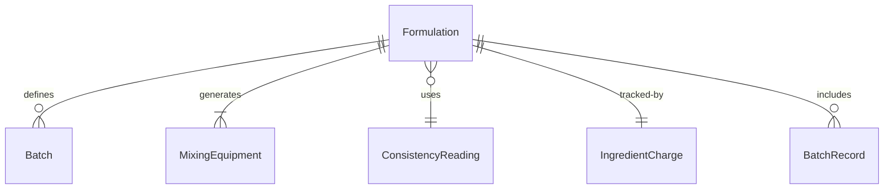
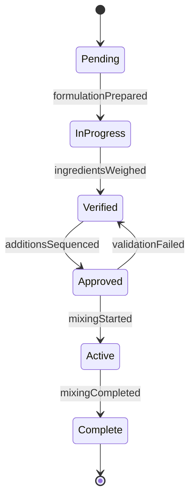
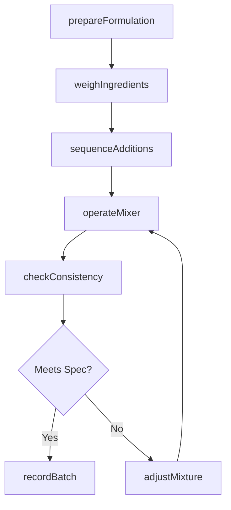
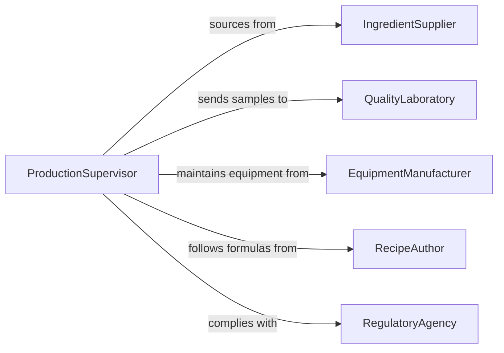

# Mix Ingredients

> Business-as-Code definition for mixing ingredients. Models the processes of combining, blending, folding, kneading, and emulsifying food and non-food components to produce batters, doughs, sauces, compounds, and other mixed preparations.

## Overview

Mixing ingredients encompasses the physical activities of combining two or more components to achieve a uniform or specified consistency, texture, or chemical composition. In food production, this includes whisking batters, kneading bread dough, blending smoothies, emulsifying sauces, and folding delicate mixtures. In industrial contexts, it extends to mixing paints, concrete, adhesives, and pharmaceutical compounds. Workers operate stand mixers, industrial blenders, paddle mixers, and hand tools while following formulations that specify ingredient order, mixing speed, duration, and temperature requirements.

## Actors

| Actor | Description |
|-------|-------------|
| IngredientSupplier | Provides raw components that go into the mixture |
| QualityLaboratory | Tests mixed batches for consistency, viscosity, and compliance |
| EquipmentManufacturer | Supplies and services mixing equipment and attachments |
| RegulatoryAgency | Sets standards for ingredient ratios and labeling requirements |
| RecipeAuthor | Develops and specifies formulations and mixing procedures |
| PackagingPartner | Receives finished mixtures for filling and packaging |

## Roles

| Role | Description |
|------|-------------|
| MixerOperator | Operates mixing equipment and follows formulation procedures |
| Baker | Combines and kneads dough and batter ingredients by hand or machine |
| BatchCompounder | Weighs and sequences ingredients for industrial compound mixing |
| ProductionSupervisor | Oversees batch consistency, timing, and throughput |

## Entities

| Entity | Description |
|--------|-------------|
| Formulation | A recipe specifying ingredients, quantities, and mixing parameters |
| Batch | A single production run of a mixed product |
| MixingEquipment | A machine or tool used to combine ingredients |
| ConsistencyReading | A measurement of texture, viscosity, or density of the mixture |
| IngredientCharge | A pre-measured quantity of a single component ready for addition |
| BatchRecord | Documentation of all parameters and observations during mixing |

## Actions

| Action | Description |
|--------|-------------|
| prepareFormulation | Select and review the recipe or compound specification |
| weighIngredients | Measure each component to the specified quantity |
| sequenceAdditions | Determine the order in which ingredients are introduced |
| operateMixer | Run the mixing equipment at the specified speed and duration |
| checkConsistency | Evaluate the mixture for proper texture, viscosity, or homogeneity |
| adjustMixture | Add ingredients or modify parameters to correct the batch |
| recordBatch | Document all mixing parameters, observations, and test results |

## Events

| Event | Description |
|-------|-------------|
| formulationPrepared | The mixing recipe or specification has been selected and reviewed |
| ingredientsWeighed | All components have been measured to specification |
| additionsSequenced | The ingredient addition order has been established |
| mixingStarted | The mixer has begun operating on the batch |
| mixingCompleted | The mixing cycle has finished |
| consistencyChecked | The mixture has been tested for quality parameters |
| batchApproved | The mixed batch meets all specifications |
| batchRejected | The mixed batch does not meet quality standards |

## Searches

| Search | Description |
|--------|-------------|
| findFormulations | List formulations by product type, ingredient, or version |
| getBatchHistory | Retrieve mixing records by date, product, or operator |
| getConsistencyTrends | Query consistency readings across batches over time |
| findRejectedBatches | Locate batches that failed quality checks |


## Entity Relationships



## State Diagram


## Workflow



## Actor Relationships



## Usage

### Calling Actions

```typescript
import { mixIngredients } from '@headlessly/mix-ingredients'

const mixing = mixIngredients()

// Prepare a sourdough bread formulation
const formulation = await mixing.prepareFormulation({
  product: 'Rustic Sourdough Loaf',
  version: '3.1',
  targetBatchSize: { value: 25, unit: 'kg' }
})

// Weigh ingredients
await mixing.weighIngredients({
  formulationId: formulation.id,
  charges: [
    { ingredient: 'Bread Flour', quantity: 15, unit: 'kg' },
    { ingredient: 'Water', quantity: 7.5, unit: 'kg', temperature: 24 },
    { ingredient: 'Sourdough Starter', quantity: 1.875, unit: 'kg' },
    { ingredient: 'Sea Salt', quantity: 0.375, unit: 'kg' }
  ]
})

// Run the mixer
await mixing.operateMixer({
  formulationId: formulation.id,
  equipment: 'Spiral Mixer SM-60',
  phases: [
    { speed: 'low', duration: 4, unit: 'minutes' },
    { speed: 'high', duration: 8, unit: 'minutes' }
  ]
})

// Check consistency
const reading = await mixing.checkConsistency({
  formulationId: formulation.id,
  tests: ['gluten-window', 'dough-temperature', 'hydration-feel']
})
```

### Event-Driven Automation

```typescript
// Alert on batch rejection
mixing.batchRejected(async ({ batchId, product, reason, operator }) => {
  await notify({
    to: 'production-supervisor',
    message: `Batch ${batchId} (${product}) rejected: ${reason}. Operator: ${operator}`
  })
  await createReworkTicket({ batchId, reason })
})

// Log consistency trends for quality analysis
mixing.consistencyChecked(async ({ batchId, product, readings }) => {
  await appendToQualityTrend({
    product,
    batchId,
    readings,
    timestamp: new Date().toISOString()
  })
})
```
