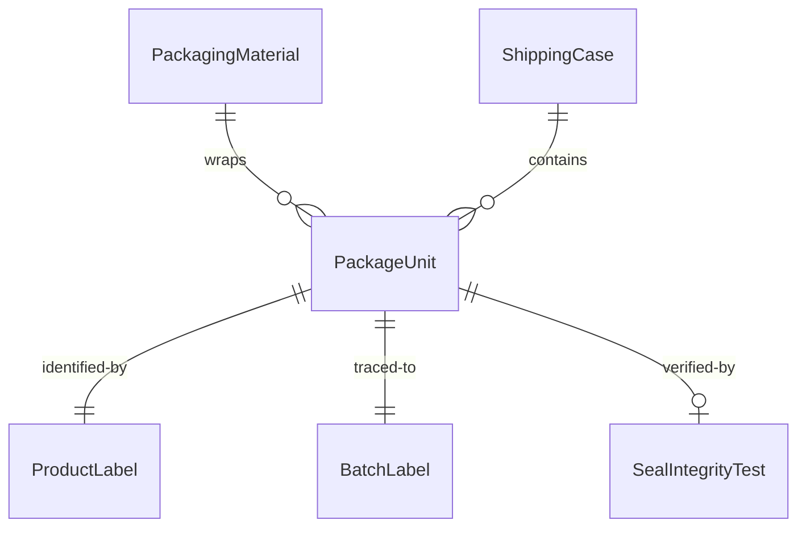
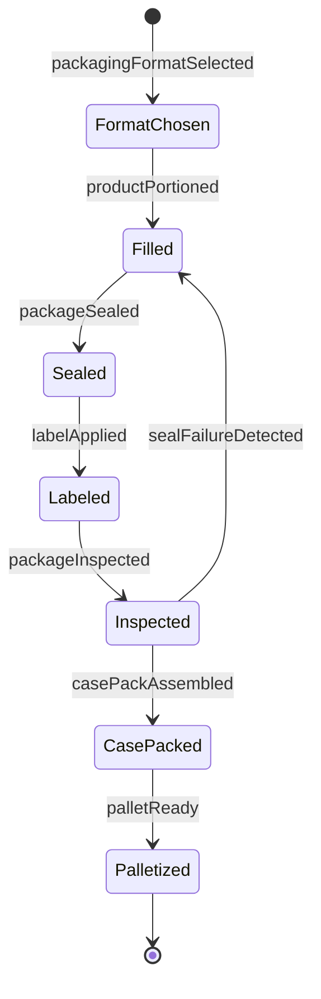
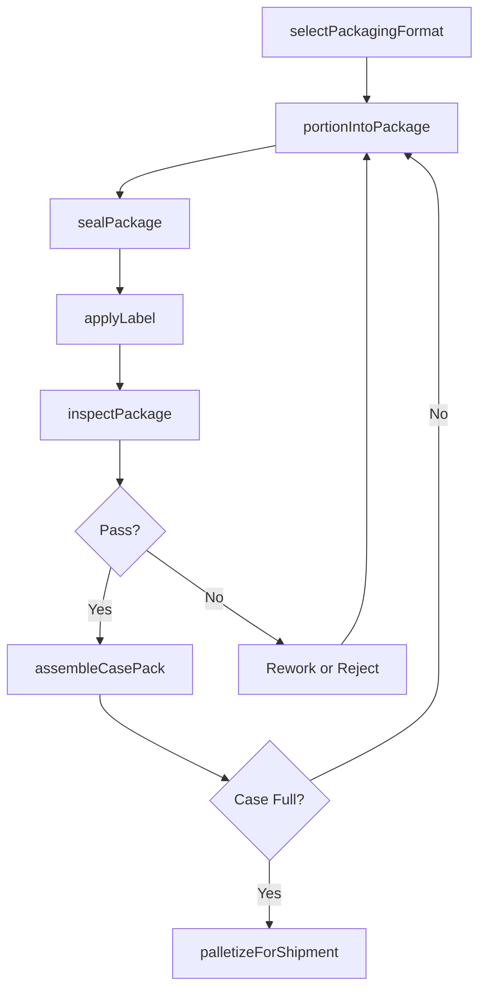
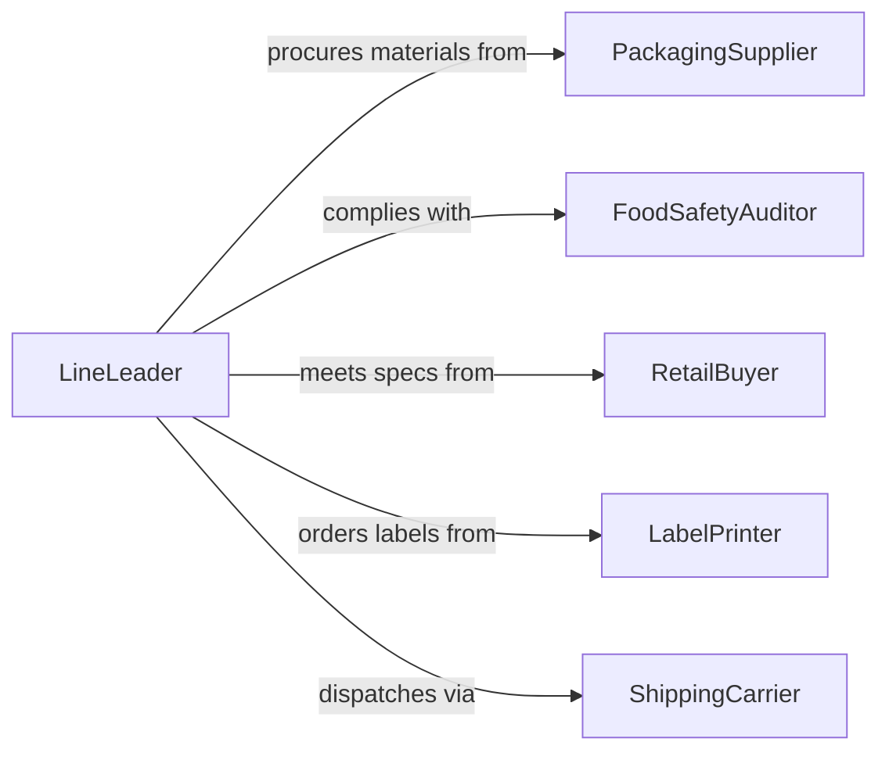

# Package Food Products and Merchandise

> Business-as-Code definition for packaging food products and merchandise. Models the processes of wrapping, sealing, labeling, boxing, and preparing food items and related merchandise for retail sale, distribution, or direct delivery.

## Overview

Packaging food products and merchandise involves the physical activities of portioning finished food items into consumer-ready containers, applying wraps, seals, and tamper-evident closures, affixing labels with nutritional information and dates, assembling multi-item packs, and boxing products for shipment. This activity spans bakeries, meat departments, food manufacturing lines, meal kit assembly operations, and gift merchandise packaging. Workers operate shrink-wrap machines, vacuum sealers, tray sealers, labeling equipment, and case packers while maintaining food safety, presentation quality, and regulatory compliance.

## Actors

| Actor | Description |
|-------|-------------|
| PackagingSupplier | Provides containers, films, labels, and sealing materials |
| FoodSafetyAuditor | Inspects packaging practices for compliance with regulations |
| RetailBuyer | Specifies package sizes, labeling requirements, and shelf-life targets |
| LabelPrinter | Produces printed labels with nutritional data and barcodes |
| ShippingCarrier | Collects packaged goods for distribution |
| ConsumerProtectionAgency | Enforces accurate labeling, weights, and allergen declarations |

## Roles

| Role | Description |
|------|-------------|
| PackagingOperator | Runs packaging equipment and manually wraps items |
| LabelingTechnician | Applies product labels and verifies accuracy of printed information |
| LineLeader | Supervises packaging line throughput and quality standards |
| QualityChecker | Inspects finished packages for seal integrity, weight, and appearance |

## Entities

| Entity | Description |
|--------|-------------|
| PackageUnit | A single consumer-ready container of food product |
| PackagingMaterial | Films, trays, boxes, and seals used in the packaging process |
| ProductLabel | A printed label containing product name, ingredients, dates, and barcodes |
| SealIntegrityTest | A verification that the package closure is airtight and tamper-evident |
| BatchLabel | A code linking the package back to the production batch |
| ShippingCase | A corrugated box containing multiple package units for distribution |

## Actions

| Action | Description |
|--------|-------------|
| selectPackagingFormat | Choose the container type and material for the product |
| portionIntoPackage | Place the correct quantity of product into the container |
| sealPackage | Apply heat seal, vacuum seal, or adhesive closure |
| applyLabel | Affix the product label with all required information |
| inspectPackage | Check seal integrity, label accuracy, weight, and appearance |
| assembleCasePack | Box individual packages into shipping cases |
| palletizeForShipment | Stack cases onto pallets for warehouse storage or transport |

## Events

| Event | Description |
|-------|-------------|
| packagingFormatSelected | The container type and material have been chosen |
| productPortioned | Food product has been placed into the package |
| packageSealed | The container closure has been applied |
| labelApplied | The product label has been affixed to the package |
| packageInspected | Quality checks on the finished package are complete |
| casePackAssembled | Individual packages have been boxed into a shipping case |
| palletReady | A full pallet of cases is staged for shipment |
| sealFailureDetected | A package has failed the seal integrity test |

## Searches

| Search | Description |
|--------|-------------|
| findPackages | List packages by product, batch, date, or packaging line |
| getSealTestResults | Retrieve seal integrity test outcomes by package or batch |
| getLabelVerifications | View label accuracy check results by date or product |
| findShippingCases | Locate cases by pallet, destination, or shipment date |


## Entity Relationships



## State Diagram


## Workflow



## Actor Relationships



## Usage

### Calling Actions

```typescript
import { packageFoodProductsMerchandise } from '@headlessly/package-food-products-merchandise'

const packaging = packageFoodProductsMerchandise()

// Select packaging for artisan granola
const format = await packaging.selectPackagingFormat({
  product: 'Maple Pecan Granola',
  containerType: 'stand-up-pouch',
  material: 'kraft-with-window',
  size: '340g',
  sealType: 'heat-seal-with-zipper'
})

// Package individual units
const pkg = await packaging.portionIntoPackage({
  formatId: format.id,
  batchId: 'GRN-2026-0415-B2',
  targetWeight: 340,
  tolerance: { min: 338, max: 345, unit: 'grams' }
})

await packaging.sealPackage({ packageId: pkg.id, method: 'heat-seal', temperature: 165 })

await packaging.applyLabel({
  packageId: pkg.id,
  label: {
    productName: 'Maple Pecan Granola',
    netWeight: '340g',
    ingredients: 'Oats, Maple Syrup, Pecans, Coconut Oil, Sea Salt',
    allergens: ['Tree Nuts'],
    bestBefore: '2026-10-15',
    barcode: '0-12345-67890-4'
  }
})

// Inspect and case-pack
await packaging.inspectPackage({ packageId: pkg.id })
```

### Event-Driven Automation

```typescript
// Halt line on seal failure
packaging.sealFailureDetected(async ({ packageId, lineId, failureType }) => {
  await pauseLine({ lineId })
  await notify({
    to: 'maintenance-team',
    message: `Seal failure (${failureType}) on line ${lineId}. Package ${packageId} rejected.`
  })
})

// Notify warehouse when pallet is ready
packaging.palletReady(async ({ palletId, caseCount, product, destination }) => {
  await schedulePickup({
    palletId,
    cases: caseCount,
    product,
    destination,
    priority: 'standard'
  })
})
```
