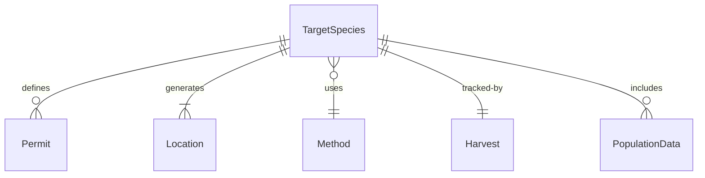
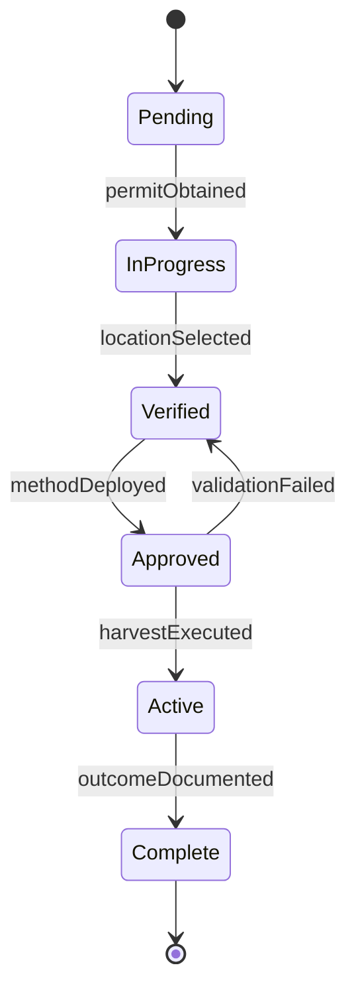
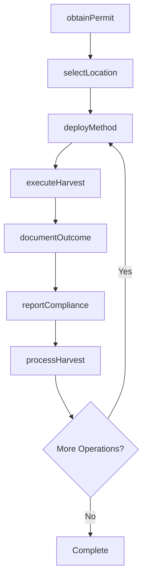
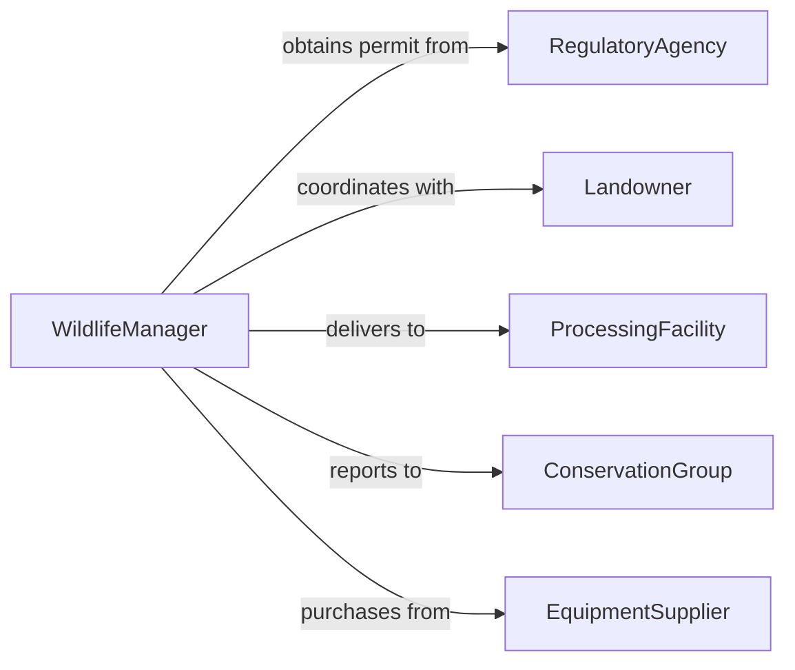

# Capture Kill Animals

> Business-as-Code definition for animal capture and harvest operations. Models wildlife management, pest control, and sustainable hunting activities from planning through documentation.

## Overview

Animal capture and harvesting encompasses wildlife management, population control, commercial hunting, and pest elimination activities. This definition exposes actions for planning operations, executing capture or harvest, documentation, and regulatory compliance across conservation, agriculture, and resource management contexts.

## Actors

| Actor | Description |
|-------|-------------|
| RegulatoryAgency | Issues permits and enforces wildlife regulations |
| Landowner | Grants access to property for operations |
| ProcessingFacility | Receives harvested animals for processing |
| ConservationGroup | Monitors population health and sustainability |
| EquipmentSupplier | Provides traps, firearms, and capture tools |
| VeterinaryService | Provides medical care for captured animals |

## Roles

| Role | Description |
|------|-------------|
| WildlifeManager | Plans and oversees operations |
| TrapperHunter | Executes capture or harvest activities |
| FieldTechnician | Documents operations and collects data |
| ComplianceOfficer | Ensures regulatory adherence |

## Entities

| Entity | Description |
|--------|-------------|
| TargetSpecies | Animal type for capture or harvest |
| Permit | Legal authorization for operation |
| Location | Geographic area for activity |
| Method | Technique used for capture or harvest |
| Harvest | Record of animal captured or killed |
| PopulationData | Statistics on species numbers and health |

## Actions

| Action | Description |
|--------|-------------|
| obtainPermit | Secure legal authorization for operation |
| selectLocation | Identify area for capture or harvest activity |
| deployMethod | Implement capture or harvest technique |
| executeHarvest | Perform capture or kill of target animal |
| documentOutcome | Record details of operation and harvest |
| reportCompliance | Submit required information to authorities |
| processHarvest | Transport animal to facility or field process |

## Events

| Event | Description |
|-------|-------------|
| permitObtained | Legal authorization secured |
| locationSelected | Operation area identified |
| methodDeployed | Technique implemented in field |
| harvestExecuted | Animal captured or killed |
| outcomeDocumented | Operation details recorded |
| complianceReported | Regulatory submission completed |
| harvestProcessed | Animal transported or field dressed |

## Searches

| Search | Description |
|--------|-------------|
| findPermits | List authorizations by species or location |
| getHarvests | Retrieve records by date, species, or operator |
| getLocations | Find areas by species population or access |
| getMethods | List techniques by species or regulation |
| getPopulationData | Retrieve species statistics by area or year |


## Entity Relationships



## State Diagram


## Workflow



## Actor Relationships



## Usage

### Calling Actions

```typescript
import { captureKillAnimals } from '@headlessly/capture-kill-animals'

const wildlife = captureKillAnimals()

// Obtain authorization and plan operation
const permit = await wildlife.obtainPermit({
  species: 'white-tailed-deer',
  season: 'fall-2026',
  quantity: 5,
  purpose: 'population-management'
})

const location = await wildlife.selectLocation({
  permitId: permit.id,
  criteria: { terrain: 'forested', access: 'vehicle', density: 'high' }
})

// Execute harvest operation
const method = await wildlife.deployMethod({
  locationId: location.id,
  technique: 'rifle-hunting',
  equipment: ['centerfire-rifle', 'optics', 'safety-gear']
})

const harvest = await wildlife.executeHarvest({
  permitId: permit.id,
  locationId: location.id,
  methodId: method.id,
  targetCount: 1
})

// Document and report
await wildlife.documentOutcome({
  harvestId: harvest.id,
  details: {
    species: 'white-tailed-deer',
    sex: 'male',
    age: 'adult',
    weight: 180,
    timestamp: new Date().toISOString()
  }
})

await wildlife.reportCompliance({
  permitId: permit.id,
  harvestId: harvest.id,
  regulatoryAgency: 'state-wildlife-department'
})
```

### Event-Driven Automation

```typescript
// Auto-report harvest to regulatory agency
wildlife.harvestExecuted(async ({ harvestId, permitId }) => {
  await wildlife.documentOutcome({ harvestId })
  await wildlife.reportCompliance({ permitId, harvestId })
})

// Alert when permit quota is reached
wildlife.outcomeDocumented(async ({ permitId, details }) => {
  const permit = await wildlife.findPermits({ id: permitId })
  const harvests = await wildlife.getHarvests({ permitId })

  if (harvests.length >= permit.quantity) {
    await notify({
      to: 'wildlife-manager',
      message: `Permit ${permitId} quota reached: ${harvests.length}/${permit.quantity}`
    })
  }
})
```
