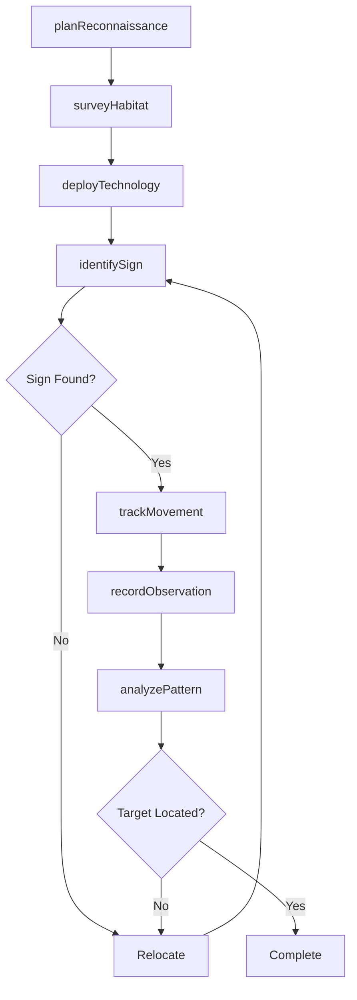
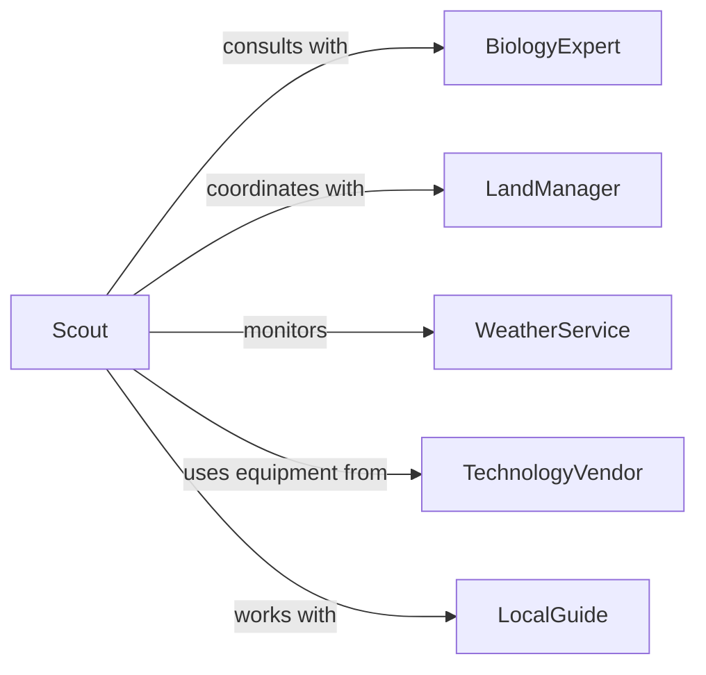

# Locate Animals Fishing Hunting Purposes

> Business-as-Code definition for animal location and tracking operations. Models scouting, habitat analysis, and tracking activities from preparation through target identification.

## Overview

Animal location for fishing and hunting involves reconnaissance, habitat analysis, sign reading, and tracking to identify target species presence and movement patterns. This definition exposes actions for pre-season scouting, real-time tracking, technology-assisted location, and data collection across terrestrial and aquatic environments.

## Actors

| Actor | Description |
|-------|-------------|
| BiologyExpert | Provides species behavior and habitat insights |
| LandManager | Grants access and shares property information |
| WeatherService | Supplies meteorological data affecting animal behavior |
| TechnologyVendor | Provides GPS, cameras, and tracking equipment |
| LocalGuide | Shares area knowledge and traditional scouting methods |
| ConservationOfficer | Monitors scouting activities for compliance |

## Roles

| Role | Description |
|------|-------------|
| Scout | Conducts reconnaissance to locate animals |
| Tracker | Follows sign and movement patterns |
| DataAnalyst | Interprets scouting data and patterns |
| FieldCoordinator | Plans and organizes scouting operations |

## Entities

| Entity | Description |
|--------|-------------|
| TargetSpecies | Animal type being located |
| ScoutingArea | Geographic region for reconnaissance |
| Sign | Physical evidence of animal presence |
| Pattern | Observed movement or behavior trend |
| Location | Specific site where animals are found |
| Observation | Record of sighting or sign discovery |

## Actions

| Action | Description |
|--------|-------------|
| planReconnaissance | Design scouting operation for target area |
| surveyHabitat | Evaluate environment for species suitability |
| identifySign | Recognize physical evidence of animal presence |
| trackMovement | Follow trails and patterns to locate animals |
| deployTechnology | Install cameras or sensors for monitoring |
| recordObservation | Document sighting or sign details |
| analyzePatter | Interpret data to predict animal location |

## Events

| Event | Description |
|-------|-------------|
| reconnaissancePlanned | Scouting operation designed |
| habitatSurveyed | Environment evaluated for species |
| signIdentified | Physical evidence of presence found |
| movementTracked | Trail or pattern followed |
| technologyDeployed | Monitoring equipment installed |
| observationRecorded | Sighting or sign documented |
| patternAnalyzed | Data interpreted for prediction |

## Searches

| Search | Description |
|--------|-------------|
| findScoutingAreas | List regions by species or habitat type |
| getObservations | Retrieve sightings by date, species, or location |
| getSigns | Find physical evidence records by type |
| getPatterns | Retrieve movement trends by species or area |
| getLocations | List confirmed animal presence sites |

## Workflow



## Actor Relationships



## Usage

### Calling Actions

```typescript
import { locateAnimalsFishingHuntingPurposes } from '@headlessly/locate-animals-fishing-hunting-purposes'

const locator = locateAnimalsFishingHuntingPurposes()

// Plan and execute scouting operation
const recon = await locator.planReconnaissance({
  targetSpecies: 'elk',
  season: 'pre-season-fall-2026',
  area: { lat: 45.123, lon: -110.456, radius: 5000 },
  objectives: ['identify-bedding', 'map-trails', 'locate-feeding']
})

// Survey habitat and deploy monitoring
const habitat = await locator.surveyHabitat({
  reconId: recon.id,
  features: ['water-sources', 'food-availability', 'cover-density', 'terrain']
})

await locator.deployTechnology({
  reconId: recon.id,
  equipment: [
    { type: 'trail-camera', location: { lat: 45.125, lon: -110.460 } },
    { type: 'trail-camera', location: { lat: 45.120, lon: -110.450 } }
  ]
})

// Identify sign and track movement
const sign = await locator.identifySign({
  reconId: recon.id,
  type: 'tracks',
  details: { age: 'fresh', size: 'large', direction: 'northeast' }
})

const tracking = await locator.trackMovement({
  signId: sign.id,
  method: 'ground-following',
  distance: 800
})

// Record observations and analyze
await locator.recordObservation({
  reconId: recon.id,
  type: 'visual-sighting',
  details: { count: 6, sex: 'mixed', behavior: 'feeding', timestamp: new Date().toISOString() }
})
```

### Event-Driven Automation

```typescript
// Auto-analyze patterns when new observations recorded
locator.observationRecorded(async ({ reconId, observation }) => {
  const allObservations = await locator.getObservations({ reconId })
  await locator.analyzePattern({
    reconId,
    observations: allObservations
  })
})

// Alert scout when trail camera captures target species
locator.technologyDeployed(async ({ equipmentId, type }) => {
  if (type === 'trail-camera') {
    await monitorCamera(equipmentId, async (capture) => {
      if (capture.speciesDetected === 'elk') {
        await notify({
          to: 'scout',
          message: `Trail camera ${equipmentId} detected elk at ${capture.timestamp}`
        })
        await locator.recordObservation({
          type: 'camera-capture',
          equipmentId,
          details: capture
        })
      }
    })
  }
})
```
