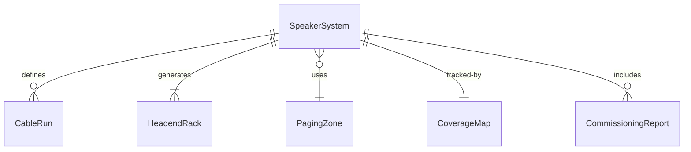
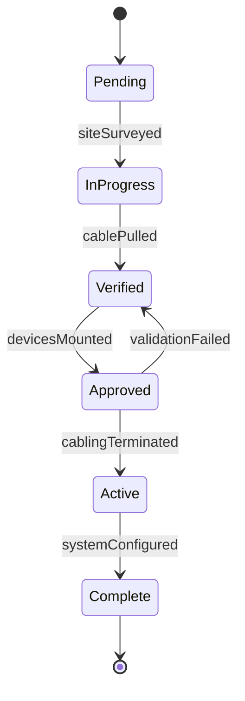
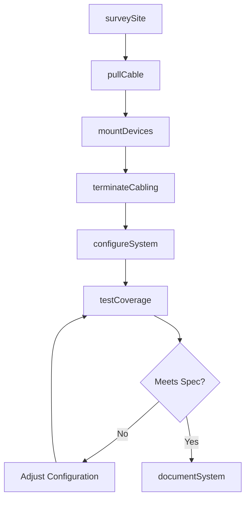
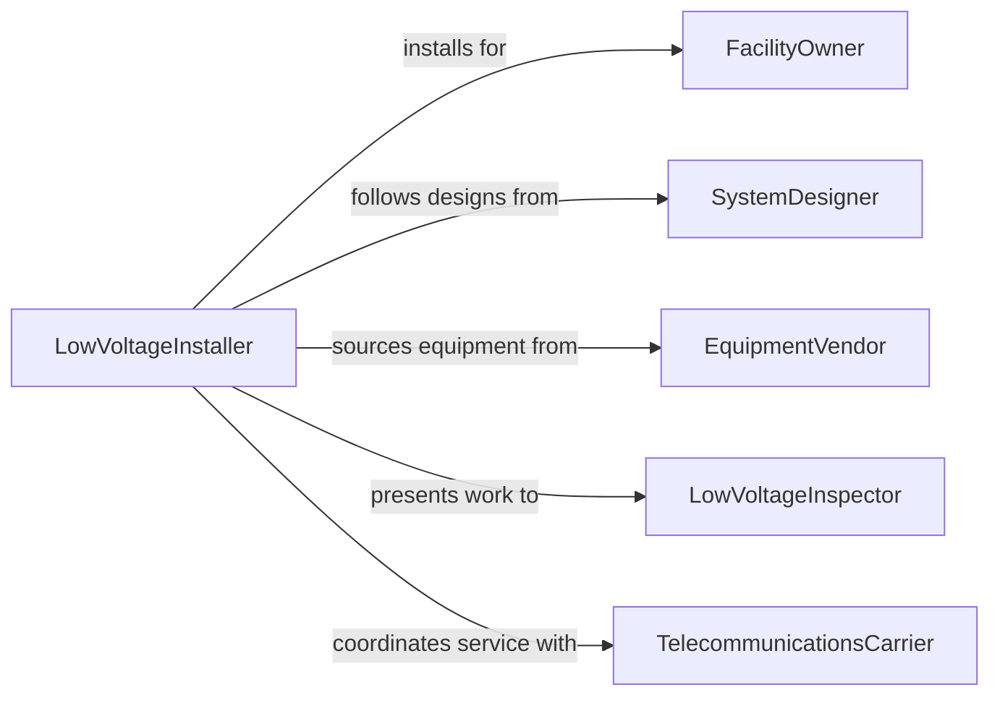

# Install Audio or Communications Equipment

> Business-as-Code definition for audio and communications equipment installation. Models the site survey, cabling, mounting, configuration, and testing of public address systems, intercom networks, telephone systems, two-way radio infrastructure, and structured cabling for voice and data in commercial, institutional, and entertainment facilities.

## Overview

Installing audio or communications equipment involves conducting site surveys, pulling low-voltage cabling, mounting speakers, amplifiers, consoles, and antenna systems, terminating connections, configuring system parameters, and performing coverage and quality testing. This definition covers commercial sound system installations, hospital nurse call and paging systems, structured cabling for voice-over-IP, two-way radio repeater installations, and arena or venue audio systems.

## Actors

| Actor | Description |
|-------|-------------|
| FacilityOwner | Commissions the installation of audio or communications systems |
| SystemDesigner | Engineers the system layout, equipment selection, and coverage plans |
| EquipmentVendor | Supplies speakers, amplifiers, cabling, radios, and headend equipment |
| LowVoltageInspector | Verifies installation compliance with fire alarm, life safety, and building codes |
| TelecommunicationsCarrier | Provides trunk lines, SIP connections, or fiber handoff for phone systems |

## Roles

| Role | Description |
|------|-------------|
| LowVoltageInstaller | Pulls cable, mounts devices, and terminates connections |
| AudioEngineer | Configures DSP, equalization, and amplifier settings for optimal sound |
| SystemProgrammer | Programs telephone systems, intercom logic, and paging zones |
| ProjectCoordinator | Manages installation schedules, material delivery, and subcontractors |

## Entities

| Entity | Description |
|--------|-------------|
| SpeakerSystem | Loudspeakers and amplifiers distributing audio throughout a facility |
| CableRun | Structured wiring connecting audio and communications devices |
| HeadendRack | A centralized equipment cabinet housing amplifiers, processors, and switches |
| PagingZone | A defined area receiving targeted audio announcements |
| CoverageMap | A diagram showing signal strength or audio coverage across the facility |
| CommissioningReport | Documentation of system performance tests and final configuration settings |
| PunchDownBlock | A termination point for voice and data cabling |

## Actions

| Action | Description |
|--------|-------------|
| surveySite | Evaluate the facility for cable routing, mounting locations, and coverage needs |
| pullCable | Route low-voltage cabling through ceiling spaces, walls, and conduit |
| mountDevices | Secure speakers, microphones, cameras, and communication endpoints |
| terminateCabling | Land cables on patch panels, punch-down blocks, and device connectors |
| configureSystem | Program DSP settings, zone assignments, and network parameters |
| testCoverage | Verify audio levels, speech intelligibility, and signal quality throughout the facility |
| documentSystem | Record as-built drawings, configurations, and commissioning results |

## Events

| Event | Description |
|-------|-------------|
| siteSurveyed | Facility has been evaluated and installation plan confirmed |
| cablePulled | All low-voltage cabling has been routed to device locations |
| devicesMounted | Speakers, endpoints, and equipment have been secured in position |
| cablingTerminated | All cable connections have been landed and tested for continuity |
| systemConfigured | Audio processing, zones, and network settings have been programmed |
| coverageTested | Audio levels and signal quality meet design specifications |
| systemDocumented | As-built drawings and commissioning reports have been completed |

## Searches

| Search | Description |
|--------|-------------|
| findInstallations | Locate audio or communications projects by facility, status, or system type |
| getCoverageData | Retrieve signal or audio level test results by zone or area |
| getCableSchedule | Look up cable run details by device, rack, or pathway |
| findPunchList | List outstanding installation items requiring completion |
| getConfigurationBackup | Retrieve saved system configurations for a specific installation |


## Entity Relationships



## State Diagram


## Workflow



## Actor Relationships



## Usage

### Calling Actions

```typescript
import { installAudioCommunicationsEquipment } from '@headlessly/install-audio-communications-equipment'

const comms = installAudioCommunicationsEquipment()

// Survey the site and pull cable
await comms.surveySite({
  facilityId: 'FAC-2024-0088',
  systemType: 'paging-and-intercom',
  zones: 12,
  ceilingType: 'drop-tile',
  pathways: ['above-ceiling-j-hooks', 'wall-conduit']
})

await comms.pullCable({
  projectId: 'AV-2024-0088',
  cableType: '18-2-shielded-plenum',
  runs: 48,
  homeRunTo: 'IT-closet-2nd-floor'
})

// Test coverage after configuration
const coverage = await comms.testCoverage({
  projectId: 'AV-2024-0088',
  tests: ['spl-measurement', 'sti-intelligibility', 'ambient-noise-floor'],
  zones: ['lobby', 'corridor-2nd', 'cafeteria', 'loading-dock']
})
```

### Event-Driven Automation

```typescript
// Schedule final inspection when coverage testing passes
comms.coverageTested(async ({ projectId, allZonesPassed }) => {
  if (allZonesPassed) {
    await inspections.schedule({
      projectId,
      type: 'low-voltage-final',
      requestedDate: nextBusinessDay()
    })
  }
})

// Auto-backup system configuration on completion
comms.systemConfigured(async ({ projectId, systemType, configuration }) => {
  await backups.store({
    projectId,
    systemType,
    configuration,
    version: '1.0',
    timestamp: new Date().toISOString()
  })
})
```
