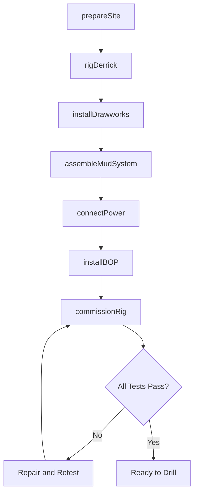
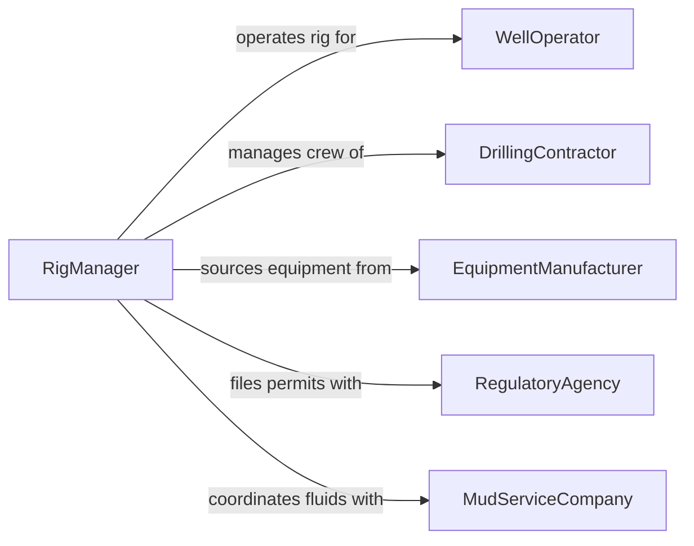

# Install Drilling Equipment

> Business-as-Code definition for drilling equipment installation. Models the site preparation, rigging, assembly, alignment, and commissioning of drilling rigs, downhole tools, and ancillary systems for oil and gas, water well, geothermal, and mineral exploration operations.

## Overview

Installing drilling equipment involves preparing the drill site, rigging up the derrick or mast, assembling the drawworks, rotary table, and mud system, connecting power and fluid lines, and performing operational tests before spudding the well. This definition covers onshore oil and gas rig-up, water well drilling rig setup, directional drilling tool assembly, geothermal drilling installations, and core drilling equipment mobilization.

## Actors

| Actor | Description |
|-------|-------------|
| DrillingContractor | Owns and operates the drilling rig and crew |
| WellOperator | Commissions the drilling program and manages the well site |
| EquipmentManufacturer | Supplies rig components, downhole tools, and spare parts |
| RegulatoryAgency | Issues drilling permits and enforces well construction standards |
| MudServiceCompany | Provides drilling fluid systems, chemicals, and mixing equipment |

## Roles

| Role | Description |
|------|-------------|
| RigManager | Oversees the rig-up process and site logistics |
| Derrickhand | Assembles mast sections, handling equipment, and pipe racks |
| Mechanic | Installs and aligns drawworks, pumps, and power generation equipment |
| ElectricalTechnician | Wires SCR drives, VFDs, and rig instrumentation |

## Entities

| Entity | Description |
|--------|-------------|
| DrillingRig | The complete assembly of derrick, drawworks, and ancillary equipment |
| Derrick | The vertical structure supporting the traveling block and drill string |
| Drawworks | The primary hoisting machine raising and lowering the drill string |
| MudSystem | Tanks, pumps, and solids control equipment circulating drilling fluid |
| BOP | A blowout preventer providing well control during drilling operations |
| RigUpPlan | A document specifying the assembly sequence, crane picks, and safety measures |
| DrillingPermit | Regulatory authorization to drill at the specified location |

## Actions

| Action | Description |
|--------|-------------|
| prepareSite | Grade the location, install cellar, and position mat boards or pad |
| rigDerrick | Assemble and raise the mast or derrick using cranes and gin poles |
| installDrawworks | Position and align the primary hoisting equipment on the rig floor |
| assembleMudSystem | Connect mud tanks, pumps, shale shakers, and solids control equipment |
| installBOP | Mount and test the blowout preventer stack on the wellhead |
| connectPower | Wire generators, SCR drives, or utility power to all rig systems |
| commissionRig | Perform function tests on all rig systems before drilling begins |

## Events

| Event | Description |
|-------|-------------|
| sitePrepared | Drill pad and cellar are complete and ready for rig-up |
| derrickRigged | Mast or derrick has been assembled and raised to operating position |
| drawworksInstalled | Hoisting equipment has been positioned and aligned |
| mudSystemAssembled | Drilling fluid circulation system is connected and operational |
| bopInstalled | Blowout preventer has been mounted and pressure-tested |
| powerConnected | Electrical power distribution is wired and operational |
| rigCommissioned | All systems have passed function tests and the rig is ready to drill |

## Searches

| Search | Description |
|--------|-------------|
| findRigUps | Locate rig installation projects by well, contractor, or status |
| getPermitStatus | Check drilling permit approval status |
| getBOPTestRecords | Retrieve blowout preventer pressure test documentation |
| findEquipmentInventory | Look up available rig components and spare parts |
| getRigUpTimeline | View the schedule and progress of rig assembly activities |

## Workflow



## Actor Relationships



## Usage

### Calling Actions

```typescript
import { installDrillingEquipment } from '@headlessly/install-drilling-equipment'

const drilling = installDrillingEquipment()

// Prepare the drill site
await drilling.prepareSite({
  wellId: 'WELL-2024-0034',
  location: { lat: 31.9686, lng: -99.9018 },
  padSize: { lengthFt: 300, widthFt: 300 },
  cellarDepth: 6,
  matBoards: true
})

// Rig the derrick
await drilling.rigDerrick({
  wellId: 'WELL-2024-0034',
  rigType: 'AC-electric-1500hp',
  mastHeight: 142,
  cranePicks: 8,
  windLimit: 30
})

// Commission the complete rig
const commission = await drilling.commissionRig({
  wellId: 'WELL-2024-0034',
  tests: ['drawworks-brake', 'mud-pump-pressure', 'bop-function', 'emergency-shutdown', 'crown-saver'],
  witnessedBy: 'well-operator-rep'
})
```

### Event-Driven Automation

```typescript
// Notify operator when rig is commissioned
drilling.rigCommissioned(async ({ wellId, rigId }) => {
  await notify({
    to: 'well-operator',
    message: `Rig ${rigId} commissioned at well ${wellId}. Ready to spud.`
  })
})

// Schedule BOP retest on installation
drilling.bopInstalled(async ({ wellId, bopSerialNumber }) => {
  await compliance.scheduleBOPTest({
    wellId,
    bopSerialNumber,
    testType: 'initial-pressure-test',
    testPressurePsi: 10000
  })
})
```
