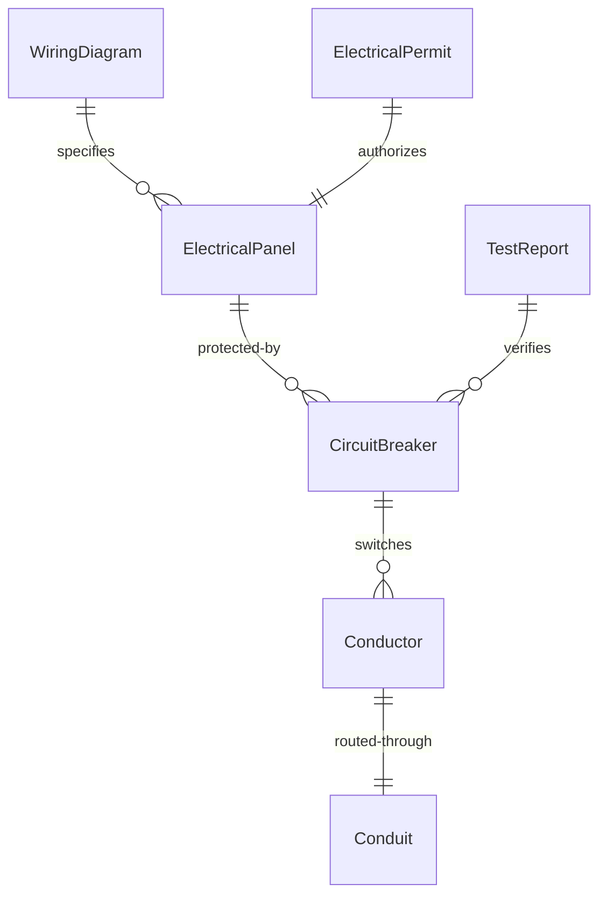
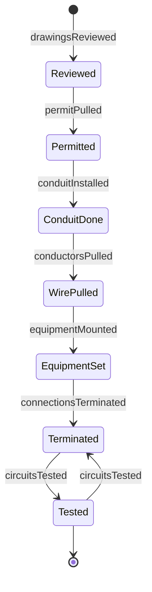
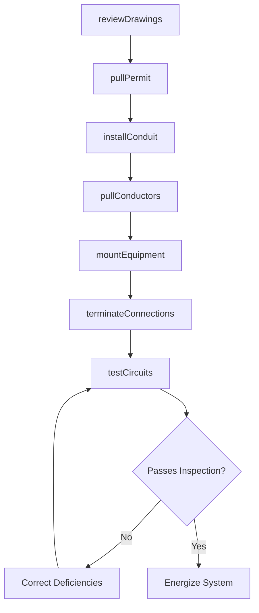
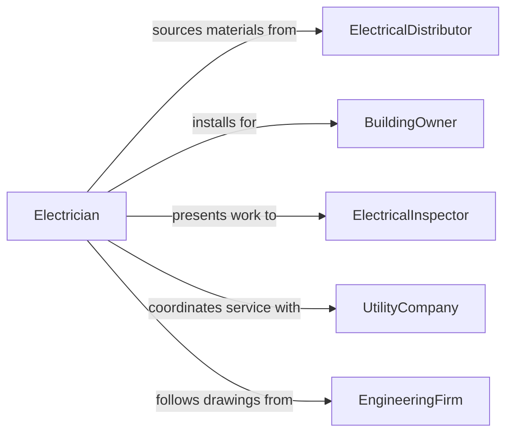

# Install Electrical Components, Equipment, or Systems

> Business-as-Code definition for electrical installation. Models the planning, wiring, mounting, termination, and testing of electrical components, panels, switchgear, lighting, and power distribution systems in commercial, industrial, and residential settings.

## Overview

Installing electrical components, equipment, or systems involves interpreting blueprints and wiring diagrams, pulling conductors through conduit and raceways, mounting panels, switchgear, and fixtures, terminating connections, and performing testing to verify code compliance and proper operation. This definition covers commercial lighting installations, industrial motor control center setups, residential panel upgrades, transformer installations, and emergency generator tie-ins.

## Actors

| Actor | Description |
|-------|-------------|
| ElectricalDistributor | Supplies wire, conduit, panels, breakers, and electrical fixtures |
| BuildingOwner | Commissions electrical work for new construction or renovation |
| ElectricalInspector | Verifies installation meets NEC and local electrical code requirements |
| UtilityCompany | Provides power service connections and meter installations |
| GeneralContractor | Coordinates electrical work within the overall construction schedule |
| EngineeringFirm | Designs electrical systems and produces construction drawings |

## Roles

| Role | Description |
|------|-------------|
| Electrician | Installs wiring, devices, and equipment per drawings and code |
| ElectricalForeman | Supervises installation crews and coordinates with other trades |
| Apprentice | Assists with pulling wire, mounting boxes, and basic installations |
| TestTechnician | Performs megger, continuity, and functional testing on completed installations |

## Entities

| Entity | Description |
|--------|-------------|
| ElectricalPanel | A distribution board housing circuit breakers or fuses |
| Conductor | Wire or cable carrying electrical current |
| Conduit | A protective tube routing and shielding electrical conductors |
| CircuitBreaker | A protective device interrupting current flow on overload or fault |
| WiringDiagram | An engineering drawing showing circuit layouts and termination points |
| ElectricalPermit | A municipal authorization for electrical construction work |
| TestReport | Documentation of insulation resistance, continuity, and functional tests |

## Actions

| Action | Description |
|--------|-------------|
| reviewDrawings | Interpret electrical blueprints and plan the installation sequence |
| pullPermit | Secure electrical construction permits from the local authority |
| installConduit | Mount and connect conduit runs between electrical equipment locations |
| pullConductors | Route wire and cable through conduit and raceways |
| mountEquipment | Secure panels, switchgear, fixtures, and devices to walls or structures |
| terminateConnections | Strip, splice, and land conductors on terminals and lugs |
| testCircuits | Verify insulation resistance, continuity, and proper circuit operation |

## Events

| Event | Description |
|-------|-------------|
| drawingsReviewed | Electrical blueprints have been interpreted and installation planned |
| permitPulled | Electrical construction permit has been issued |
| conduitInstalled | All conduit runs have been mounted and connected |
| conductorsPulled | Wire and cable have been routed through all conduit and raceways |
| equipmentMounted | Panels, switchgear, and fixtures have been secured in position |
| connectionsTerminated | All conductor terminations have been completed |
| circuitsTested | Electrical testing has confirmed proper operation and code compliance |

## Searches

| Search | Description |
|--------|-------------|
| findInstallations | Locate electrical installation projects by building, status, or scope |
| getPermitStatus | Check electrical permit approval status |
| getTestResults | Retrieve circuit test data by panel, circuit, or project |
| findMaterialNeeds | List outstanding material requirements for active projects |
| getInspectionSchedule | Look up upcoming electrical inspection dates by project |


## Entity Relationships



## State Diagram


## Workflow



## Actor Relationships



## Usage

### Calling Actions

```typescript
import { installElectricalComponentsEquipmentSystems } from '@headlessly/install-electrical-components-equipment-systems'

const electrical = installElectricalComponentsEquipmentSystems()

// Review drawings and pull permit
await electrical.reviewDrawings({
  projectId: 'ELEC-2024-0187',
  drawingSet: 'E-100-series',
  panels: ['MDP', 'LP-1', 'LP-2'],
  voltage: '480/277V-3Ph'
})

// Install conduit and pull wire
await electrical.installConduit({
  projectId: 'ELEC-2024-0187',
  runs: [
    { from: 'MDP', to: 'LP-1', type: 'EMT', size: '2-inch', length: 85 },
    { from: 'MDP', to: 'LP-2', type: 'EMT', size: '1.5-inch', length: 120 }
  ]
})

// Test completed circuits
const tests = await electrical.testCircuits({
  projectId: 'ELEC-2024-0187',
  panel: 'LP-1',
  tests: ['insulation-resistance-1000v', 'continuity', 'phase-rotation', 'ground-fault'],
  instrument: 'Fluke-1587'
})
```

### Event-Driven Automation

```typescript
// Schedule inspection when testing is complete
electrical.circuitsTested(async ({ projectId, allPassed }) => {
  if (allPassed) {
    await inspections.schedule({
      projectId,
      type: 'electrical-rough-in',
      requestedDate: nextBusinessDay()
    })
  }
})

// Alert on failed test results
electrical.circuitsTested(async ({ projectId, failedCircuits }) => {
  if (failedCircuits.length > 0) {
    await notify({
      to: 'electrical-foreman',
      message: `Project ${projectId}: ${failedCircuits.length} circuits failed testing. Review required.`
    })
  }
})
```
