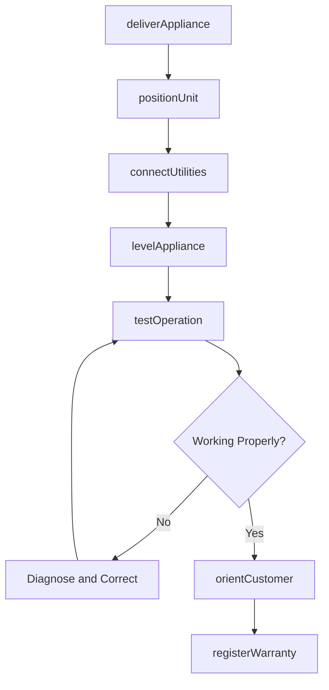
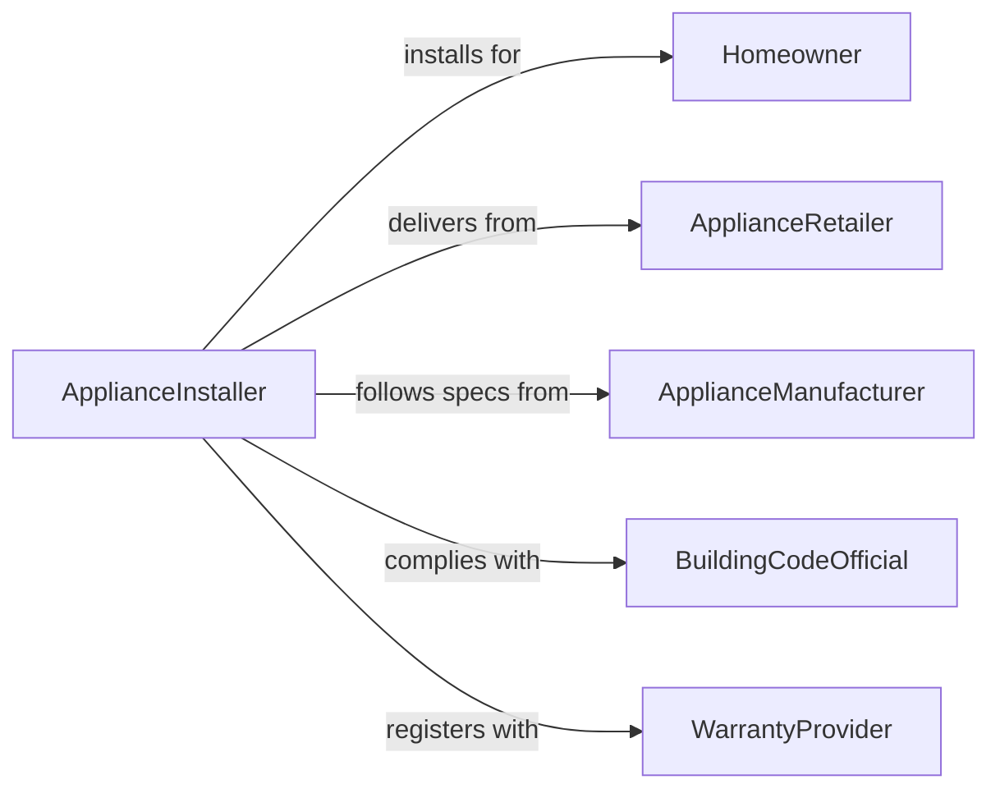

# Install Home Appliances

> Business-as-Code definition for home appliance installation. Models the delivery, positioning, connection, testing, and customer orientation for residential appliances including dishwashers, ranges, refrigerators, washers, dryers, and built-in units.

## Overview

Installing home appliances involves delivering the unit to the residence, removing packaging, positioning the appliance in its designated space, connecting water, gas, electrical, or drain lines, leveling the unit, testing for proper operation, and orienting the homeowner on use and care. This definition covers kitchen appliance installations, laundry equipment hookups, built-in microwave and wall oven mounting, garbage disposal installations, and range hood ventilation connections.

## Actors

| Actor | Description |
|-------|-------------|
| Homeowner | Purchases the appliance and authorizes installation at their residence |
| ApplianceRetailer | Sells the appliance and schedules delivery and installation |
| ApplianceManufacturer | Provides installation specifications, kits, and warranty registration |
| BuildingCodeOfficial | Enforces gas, plumbing, and electrical code requirements |
| WarrantyProvider | Manages the manufacturer or extended warranty covering the appliance |

## Roles

| Role | Description |
|------|-------------|
| ApplianceInstaller | Delivers, positions, connects, and tests home appliances |
| DeliveryDriver | Transports the appliance from the warehouse to the residence |
| Plumber | Connects water supply and drain lines for dishwashers and washing machines |
| GasTechnician | Connects and leak-tests gas lines for ranges, dryers, and cooktops |

## Entities

| Entity | Description |
|--------|-------------|
| Appliance | The residential unit being installed at the home |
| InstallationKit | Supply lines, connectors, fittings, and brackets included with or required by the appliance |
| DeliveryOrder | A schedule specifying delivery date, appliance model, and installation scope |
| LeakTestReport | A record confirming gas or water connections are free of leaks |
| LevelingAdjustment | A record of adjustments made to ensure the appliance sits level |
| OldApplianceRemoval | Hauling away and recycling the replaced appliance |
| WarrantyRegistration | A record activating the manufacturer warranty for the installed appliance |

## Actions

| Action | Description |
|--------|-------------|
| deliverAppliance | Transport the appliance to the residence and remove packaging |
| positionUnit | Move the appliance into its designated space and check fit |
| connectUtilities | Attach water, gas, electrical, or drain connections per manufacturer specs |
| levelAppliance | Adjust legs or leveling screws to ensure the unit sits plumb and level |
| testOperation | Run a cycle or function test to confirm proper operation |
| orientCustomer | Walk the homeowner through controls, features, and maintenance tips |
| registerWarranty | Activate the manufacturer warranty and provide documentation to the homeowner |

## Events

| Event | Description |
|-------|-------------|
| applianceDelivered | Unit has been transported to the residence and unpackaged |
| unitPositioned | Appliance has been placed in its designated location |
| utilitiesConnected | Water, gas, electrical, or drain connections are complete |
| applianceLeveled | Unit has been adjusted to sit plumb and level |
| operationTested | Function test confirms the appliance operates correctly |
| customerOriented | Homeowner has been briefed on appliance use and care |
| warrantyRegistered | Manufacturer warranty has been activated |

## Searches

| Search | Description |
|--------|-------------|
| findDeliveryOrders | Locate appliance delivery and installation jobs by date, address, or status |
| getInstallationHistory | Retrieve past appliance installations at a specific address |
| findPendingInstallations | List appliances delivered but not yet installed or tested |
| getLeakTestRecords | Look up gas or water leak test documentation by address or date |
| getWarrantyInfo | Retrieve warranty registration details for an installed appliance |

## Workflow



## Actor Relationships



## Usage

### Calling Actions

```typescript
import { installHomeAppliances } from '@headlessly/install-home-appliances'

const appliances = installHomeAppliances()

// Deliver and position a dishwasher
await appliances.deliverAppliance({
  orderId: 'DEL-2024-08831',
  model: 'Bosch-SHPM88Z75N',
  address: '425 Oak Lane',
  removeOld: true
})

await appliances.connectUtilities({
  orderId: 'DEL-2024-08831',
  connections: [
    { type: 'hot-water-supply', fitting: '3/8-compression' },
    { type: 'drain-hose', connection: 'air-gap-to-disposal' },
    { type: 'electrical', circuit: '20A-120V-dedicated' }
  ]
})

// Test and orient customer
const test = await appliances.testOperation({
  orderId: 'DEL-2024-08831',
  cycle: 'quick-rinse',
  checks: ['fill', 'spray-arm-rotation', 'drain', 'leak-check']
})
```

### Event-Driven Automation

```typescript
// Auto-register warranty after successful operation test
appliances.operationTested(async ({ orderId, model, serialNumber, passed }) => {
  if (passed) {
    await appliances.registerWarranty({
      orderId,
      model,
      serialNumber,
      purchaseDate: new Date().toISOString()
    })
  }
})

// Schedule haul-away for old appliance
appliances.applianceDelivered(async ({ orderId, removeOld, address }) => {
  if (removeOld) {
    await recycling.schedulePickup({
      orderId,
      address,
      applianceType: 'dishwasher',
      refrigerantRecovery: false
    })
  }
})
```
