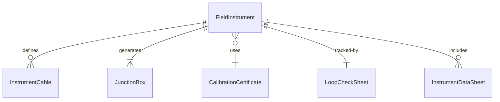
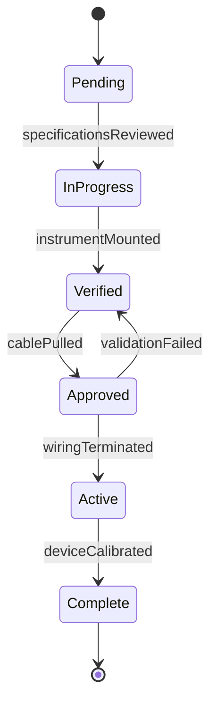
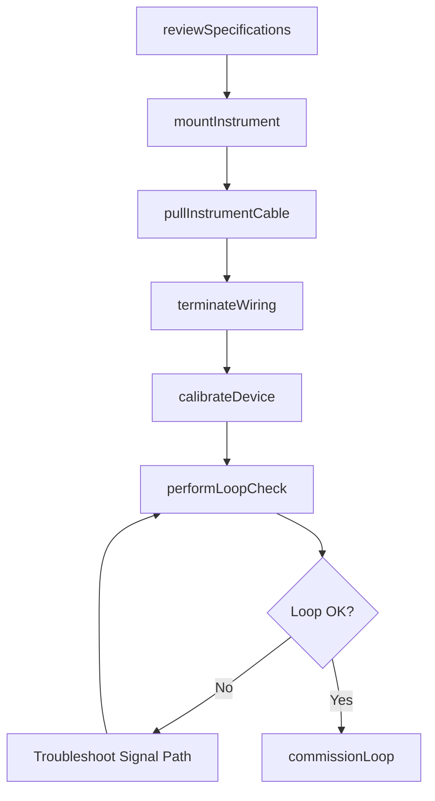
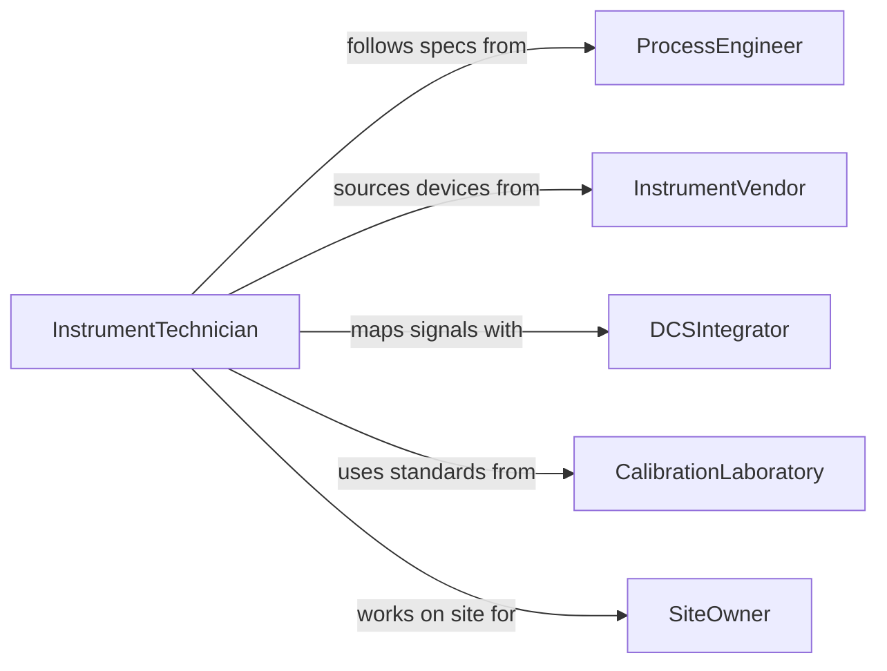

# Install Instrumentation or Electronic Equipment or Systems

> Business-as-Code definition for instrumentation and electronics installation. Models the mounting, wiring, calibration, and loop-checking of sensors, transmitters, analyzers, control valves, and distributed control system components in process plants, laboratories, and building automation environments.

## Overview

Installing instrumentation or electronic equipment involves mounting sensors and transmitters on process piping or equipment, pulling instrument cable, terminating at junction boxes and marshalling cabinets, calibrating each device against known standards, and verifying signal integrity through loop checks. This definition covers process plant instrument installations, building automation system sensor deployments, laboratory analytical instrument setups, and fire detection and suppression system wiring.

## Actors

| Actor | Description |
|-------|-------------|
| ProcessEngineer | Specifies instrument types, ranges, and installation locations |
| InstrumentVendor | Supplies transmitters, sensors, analyzers, and control valves |
| DCSIntegrator | Configures the distributed control system to receive instrument signals |
| CalibrationLaboratory | Provides traceable calibration standards and certificates |
| SiteOwner | Authorizes instrumentation work and provides site access |

## Roles

| Role | Description |
|------|-------------|
| InstrumentTechnician | Mounts, wires, calibrates, and loop-checks field instruments |
| ControlSystemEngineer | Maps instrument signals to DCS or PLC I/O and configures control logic |
| CalibrationSpecialist | Performs multi-point calibration using traceable reference standards |
| InstrumentForeman | Coordinates installation crew scheduling and material staging |

## Entities

| Entity | Description |
|--------|-------------|
| FieldInstrument | A sensor, transmitter, or analyzer installed on process equipment |
| InstrumentCable | Shielded wire carrying analog or digital signals from instruments to control systems |
| JunctionBox | An enclosure where instrument cables are terminated and routed |
| CalibrationCertificate | A document confirming the instrument reads accurately against a known standard |
| LoopCheckSheet | A record verifying the complete signal path from sensor to control room display |
| InstrumentDataSheet | An engineering specification for an individual instrument |
| MarshallingCabinet | A panel where field wiring is organized and connected to control system I/O |

## Actions

| Action | Description |
|--------|-------------|
| reviewSpecifications | Interpret instrument data sheets and installation drawings |
| mountInstrument | Secure the sensor or transmitter to process piping, vessels, or structures |
| pullInstrumentCable | Route shielded cable from the field device to the marshalling cabinet |
| terminateWiring | Land cables at junction boxes, marshalling cabinets, and I/O terminals |
| calibrateDevice | Adjust the instrument to read accurately across its full operating range |
| performLoopCheck | Verify the complete signal path from field device to control room indicator |
| commissionLoop | Confirm the instrument loop operates correctly within the control system |

## Events

| Event | Description |
|-------|-------------|
| specificationsReviewed | Instrument data sheets and drawings have been interpreted |
| instrumentMounted | Field device has been secured in its process location |
| cablePulled | Instrument cable has been routed from field to control room |
| wiringTerminated | All cable terminations have been completed and verified |
| deviceCalibrated | Instrument has been adjusted and confirmed accurate |
| loopCheckCompleted | Signal path from field to display has been verified end to end |
| loopCommissioned | Instrument loop is live and operating within the control system |

## Searches

| Search | Description |
|--------|-------------|
| findInstrumentInstallations | Locate instrument installation tasks by tag, area, or status |
| getCalibrationRecords | Retrieve calibration certificates by instrument tag or date |
| getLoopCheckSheets | Look up loop verification records by loop number or area |
| findPendingCalibrations | List instruments awaiting calibration or recalibration |
| getInstrumentIndex | Retrieve the complete instrument list for a project or plant area |


## Entity Relationships



## State Diagram


## Workflow



## Actor Relationships



## Usage

### Calling Actions

```typescript
import { installInstrumentationElectronicEquipmentSystems } from '@headlessly/install-instrumentation-electronic-equipment-systems'

const instruments = installInstrumentationElectronicEquipmentSystems()

// Mount and wire a pressure transmitter
await instruments.mountInstrument({
  tag: 'PT-2401',
  type: 'pressure-transmitter',
  manufacturer: 'Rosemount',
  model: '3051S',
  range: '0-500-psig',
  location: 'reactor-outlet-header'
})

await instruments.terminateWiring({
  tag: 'PT-2401',
  cableType: '2-pair-shielded-16awg',
  fromJB: 'JB-24-003',
  toMarshalling: 'MC-DCS-04-slot-12'
})

// Calibrate and loop-check
const cal = await instruments.calibrateDevice({
  tag: 'PT-2401',
  points: [0, 125, 250, 375, 500],
  unit: 'psig',
  tolerance: 0.075,
  standard: 'Fluke-721-reference'
})
```

### Event-Driven Automation

```typescript
// Auto-schedule recalibration based on device type
instruments.deviceCalibrated(async ({ tag, calibrationDate, deviceType }) => {
  const intervalMonths = deviceType === 'safety-instrument' ? 6 : 12
  await calibration.scheduleNext({
    tag,
    dueDate: addMonths(calibrationDate, intervalMonths)
  })
})

// Notify control engineer when loop is commissioned
instruments.loopCommissioned(async ({ tag, loopNumber }) => {
  await notify({
    to: 'control-system-engineer',
    message: `Loop ${loopNumber} (${tag}) is commissioned and live in DCS.`
  })
})
```
