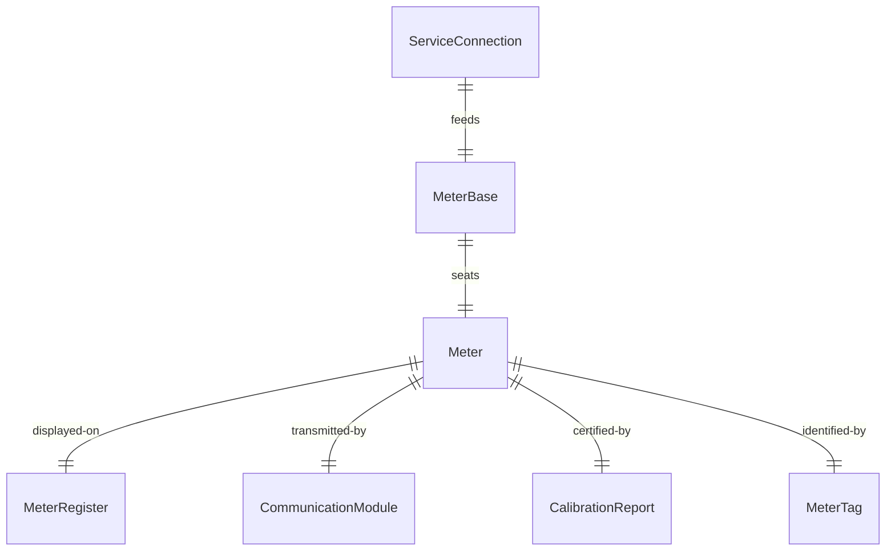
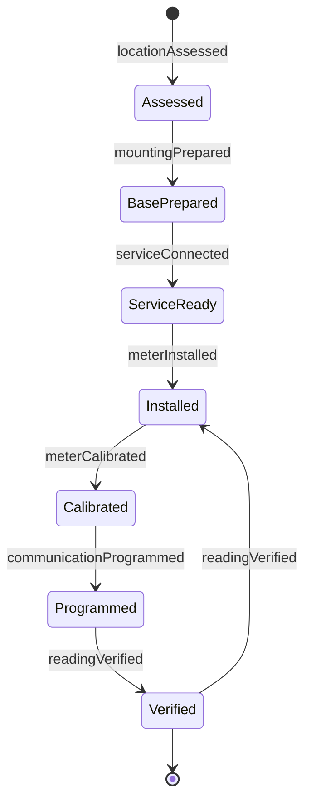
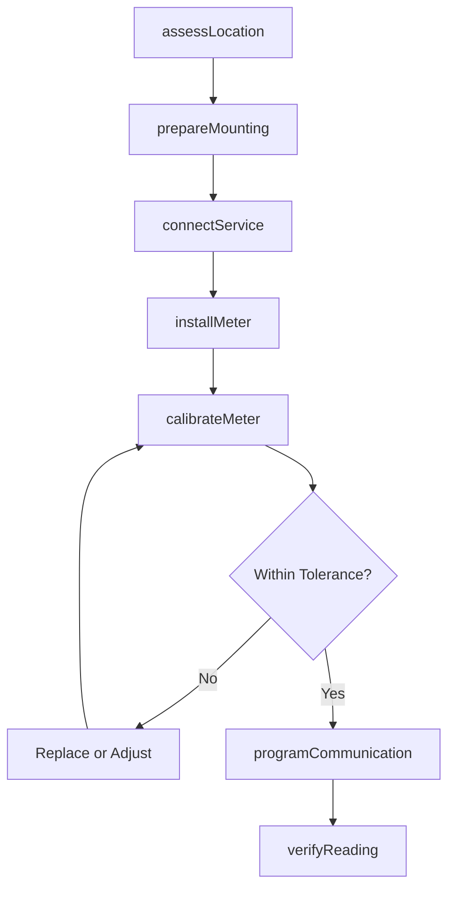
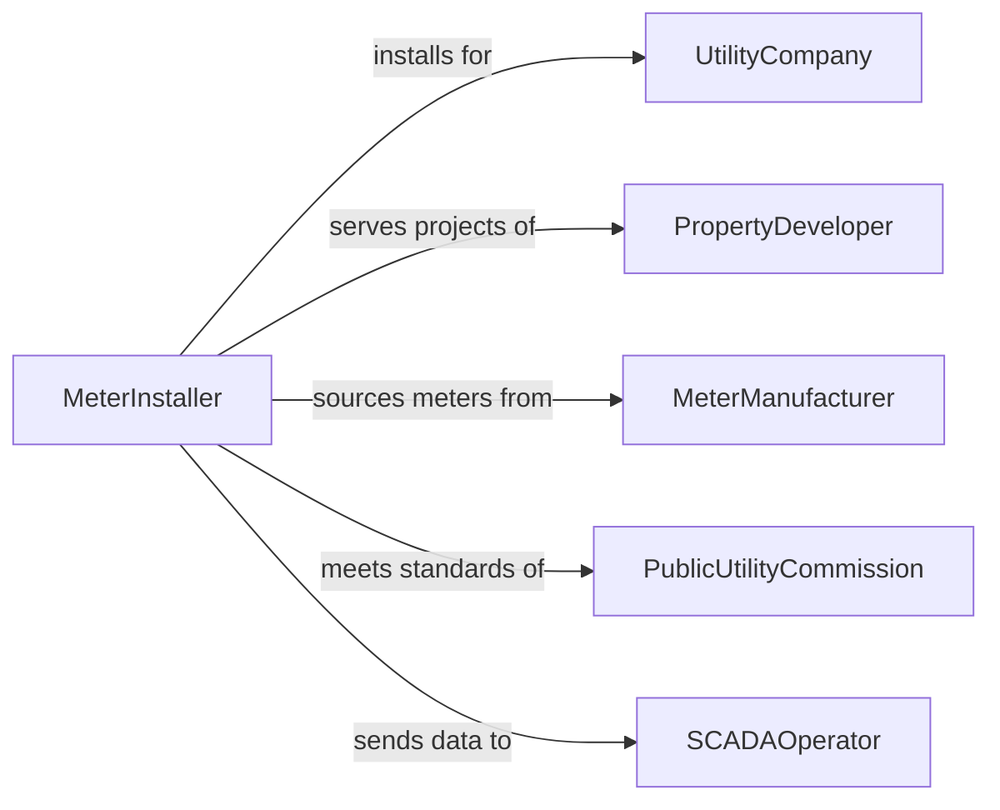

# Install Metering Equipment

> Business-as-Code definition for metering equipment installation. Models the site preparation, mounting, piping or wiring, calibration, and verification of flow meters, electric meters, gas meters, and water meters for utility billing, process measurement, and regulatory compliance.

## Overview

Installing metering equipment involves selecting the correct meter type for the measured medium, preparing the mounting location with proper upstream and downstream straight runs, connecting piping or electrical service, calibrating the meter output, and programming data transmission to billing or SCADA systems. This definition covers utility electric and gas meter installations, industrial flow meter setups, water district meter deployments, custody transfer meter stations, and submetering for tenant billing.

## Actors

| Actor | Description |
|-------|-------------|
| UtilityCompany | Requires meter installation for billing and grid management |
| PropertyDeveloper | Requests meters for new construction or tenant submetering |
| MeterManufacturer | Supplies meters, registers, and communication modules |
| PublicUtilityCommission | Regulates meter accuracy standards and testing requirements |
| SCADAOperator | Receives meter data for system monitoring and demand management |

## Roles

| Role | Description |
|------|-------------|
| MeterInstaller | Mounts meters, connects piping or wiring, and verifies operation |
| MeterTechnician | Calibrates meters and programs communication modules |
| FieldEngineer | Designs metering stations and specifies meter sizing |
| ComplianceAuditor | Verifies meter accuracy meets regulatory standards |

## Entities

| Entity | Description |
|--------|-------------|
| Meter | A device measuring the flow of electricity, gas, water, or other utilities |
| MeterBase | A mounting socket or pad receiving the meter body |
| CommunicationModule | An AMI or AMR radio transmitting meter readings to the utility |
| MeterRegister | A mechanical or electronic display recording cumulative consumption |
| CalibrationReport | A document confirming meter accuracy within regulatory tolerance |
| ServiceConnection | The pipe or conductor linking the utility main to the meter |
| MeterTag | A unique identifier assigned to the meter for billing and tracking |

## Actions

| Action | Description |
|--------|-------------|
| assessLocation | Evaluate the installation site for access, clearances, and straight-run requirements |
| prepareMounting | Install the meter base, socket, or pad at the designated location |
| connectService | Attach piping, conduit, or wiring from the utility main to the meter |
| installMeter | Seat the meter body in its base and secure all connections |
| calibrateMeter | Verify meter accuracy at multiple flow or load points |
| programCommunication | Configure the AMI module for remote reading and data transmission |
| verifyReading | Confirm the meter register matches reference measurements |

## Events

| Event | Description |
|-------|-------------|
| locationAssessed | Installation site has been evaluated and approved |
| mountingPrepared | Meter base or socket has been installed and is ready |
| serviceConnected | Piping or wiring from the utility main is connected |
| meterInstalled | Meter body has been seated and connections secured |
| meterCalibrated | Accuracy has been verified at specified test points |
| communicationProgrammed | AMI module is transmitting readings to the utility system |
| readingVerified | Meter register matches reference measurements within tolerance |

## Searches

| Search | Description |
|--------|-------------|
| findMeterInstallations | Locate meter installation jobs by address, utility type, or status |
| getCalibrationHistory | Retrieve calibration test records for a specific meter |
| findMetersNeedingReplacement | List meters exceeding their service life or failing accuracy tests |
| getAMIStatus | Check communication module connectivity and last reading timestamp |
| getMeterInventory | Look up available meters by type, size, and manufacturer |


## Entity Relationships



## State Diagram


## Workflow



## Actor Relationships



## Usage

### Calling Actions

```typescript
import { installMeteringEquipment } from '@headlessly/install-metering-equipment'

const metering = installMeteringEquipment()

// Assess and prepare location
await metering.assessLocation({
  serviceAddress: '2200 Industrial Pkwy, Unit B',
  meterType: 'water-compound',
  size: '3-inch',
  straightRunRequired: { upstream: 10, downstream: 5, unit: 'diameters' }
})

// Install and calibrate the meter
await metering.installMeter({
  meterId: 'WM-2024-03221',
  type: 'compound-water-meter',
  manufacturer: 'Sensus',
  model: 'OMNI-C2-3in',
  location: 'meter-vault-south'
})

const calibration = await metering.calibrateMeter({
  meterId: 'WM-2024-03221',
  testPoints: [
    { flowGPM: 1.5, tolerance: 1.5 },
    { flowGPM: 15, tolerance: 1.0 },
    { flowGPM: 300, tolerance: 1.0 }
  ]
})
```

### Event-Driven Automation

```typescript
// Register meter in billing system when communication is active
metering.communicationProgrammed(async ({ meterId, serviceAddress, meterType }) => {
  await billing.registerMeter({
    meterId,
    serviceAddress,
    meterType,
    activationDate: new Date().toISOString()
  })
})

// Schedule periodic recalibration
metering.meterCalibrated(async ({ meterId, calibrationDate }) => {
  await maintenance.scheduleRecalibration({
    meterId,
    dueDate: addYears(calibrationDate, 5),
    type: 'periodic-accuracy-test'
  })
})
```
