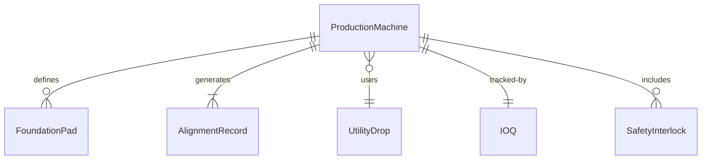
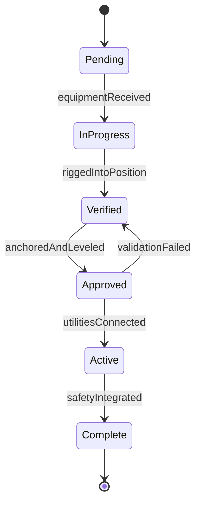
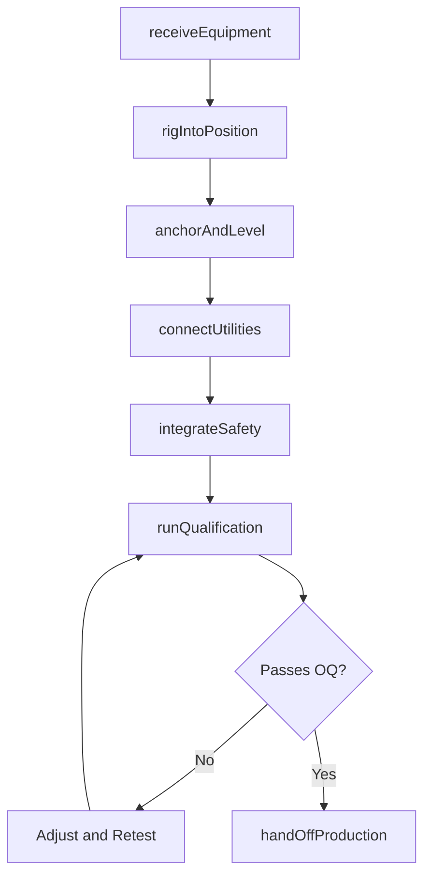
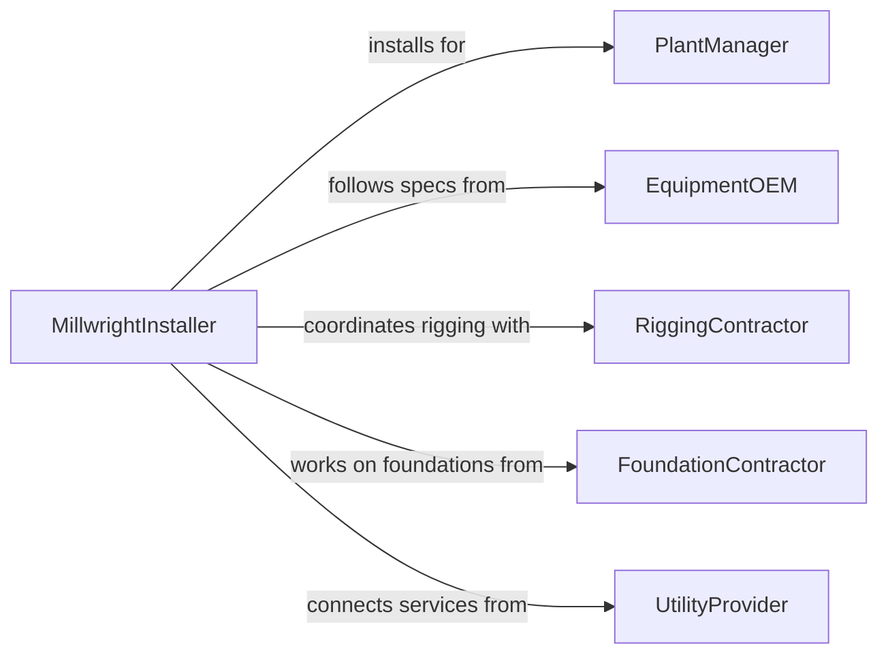

# Install Production Equipment or Systems

> Business-as-Code definition for production equipment installation. Models the rigging, anchoring, alignment, utility connection, and commissioning of manufacturing machinery, conveyor systems, packaging lines, and process equipment in factory and plant environments.

## Overview

Installing production equipment or systems involves receiving and unloading heavy machinery, rigging it into position, anchoring to foundations, leveling and aligning to precision tolerances, connecting electrical, pneumatic, and hydraulic utilities, and performing operational qualification before production handoff. This definition covers CNC machine tool installations, food processing line setups, bottling and packaging system installations, pharmaceutical cleanroom equipment placement, and automated assembly cell commissioning.

## Actors

| Actor | Description |
|-------|-------------|
| PlantManager | Authorizes equipment installation and production line changes |
| EquipmentOEM | Provides machinery, installation manuals, and startup technicians |
| RiggingContractor | Moves and positions heavy equipment using cranes, rollers, and jacks |
| FoundationContractor | Pours equipment pads, installs anchor bolts, and builds pits |
| UtilityProvider | Extends electrical, compressed air, water, and gas services to equipment locations |

## Roles

| Role | Description |
|------|-------------|
| MillwrightInstaller | Aligns, levels, and anchors production machinery to foundations |
| ControlsIntegrator | Wires and programs PLC, HMI, and safety systems for new equipment |
| CommissioningEngineer | Validates equipment performance against factory acceptance test criteria |
| InstallationProjectManager | Coordinates schedule, contractors, and utility readiness |

## Entities

| Entity | Description |
|--------|-------------|
| ProductionMachine | A manufacturing asset being installed on the production floor |
| FoundationPad | A concrete base engineered to support the equipment weight and vibration |
| AlignmentRecord | Precision measurements confirming machine position within tolerance |
| UtilityDrop | An electrical, pneumatic, or fluid connection point at the equipment location |
| IOQ | Installation and operational qualification documentation for regulated industries |
| SafetyInterlock | A guard, light curtain, or e-stop circuit protecting operators |
| AcceptanceTestResult | Performance data collected during commissioning runs |

## Actions

| Action | Description |
|--------|-------------|
| receiveEquipment | Unload, inspect, and stage machinery at the installation site |
| rigIntoPosition | Move the equipment from staging to its final location using rigging |
| anchorAndLevel | Secure the machine to its foundation pad and level to specification |
| connectUtilities | Attach electrical, pneumatic, hydraulic, and process connections |
| integrateSafety | Install guards, interlocks, and safety circuits per machine directive |
| runQualification | Execute installation and operational qualification test protocols |
| handOffProduction | Transfer the installed equipment to the production team |

## Events

| Event | Description |
|-------|-------------|
| equipmentReceived | Machinery has been unloaded, inspected, and staged on site |
| riggedIntoPosition | Equipment has been moved to its final location on the production floor |
| anchoredAndLeveled | Machine is secured to its pad and aligned within tolerance |
| utilitiesConnected | All utility connections have been made and verified |
| safetyIntegrated | Guards, interlocks, and e-stop circuits are installed and tested |
| qualificationCompleted | IQ and OQ protocols have been executed and documented |
| handedOffToProduction | Equipment has been formally transferred to production operations |

## Searches

| Search | Description |
|--------|-------------|
| findInstallationProjects | Locate equipment installations by plant, line, or status |
| getAlignmentRecords | Retrieve leveling and alignment data for installed machines |
| getQualificationDocs | Look up IQ/OQ documentation by equipment or project |
| findUtilityReadiness | Check status of utility drops and connections for pending installations |
| getAcceptanceResults | Retrieve commissioning test performance data |


## Entity Relationships



## State Diagram


## Workflow



## Actor Relationships



## Usage

### Calling Actions

```typescript
import { installProductionEquipmentSystems } from '@headlessly/install-production-equipment-systems'

const production = installProductionEquipmentSystems()

// Receive and rig equipment
await production.receiveEquipment({
  projectId: 'INSTALL-2024-0055',
  equipmentType: 'cnc-5-axis-mill',
  manufacturer: 'DMG-Mori',
  model: 'DMU-80-eVo',
  weightKg: 12000,
  crateCount: 3
})

await production.rigIntoPosition({
  projectId: 'INSTALL-2024-0055',
  method: 'gantry-crane-and-rollers',
  destination: 'Bay-4-Position-C',
  clearanceChecked: true
})

// Run qualification protocols
const qual = await production.runQualification({
  projectId: 'INSTALL-2024-0055',
  protocols: ['geometric-accuracy', 'spindle-runout', 'axis-repeatability', 'tool-changer-cycle'],
  standard: 'ISO-230-2'
})
```

### Event-Driven Automation

```typescript
// Notify production team when equipment is ready
production.qualificationCompleted(async ({ projectId, equipmentId, passed }) => {
  if (passed) {
    await notify({
      to: 'production-manager',
      message: `Equipment ${equipmentId} has passed qualification. Ready for production handoff.`
    })
  }
})

// Auto-register asset in maintenance system
production.handedOffToProduction(async ({ equipmentId, manufacturer, model, serialNumber }) => {
  await cmms.registerAsset({
    equipmentId,
    manufacturer,
    model,
    serialNumber,
    installDate: new Date().toISOString(),
    maintenanceSchedule: 'preventive-quarterly'
  })
})
```
