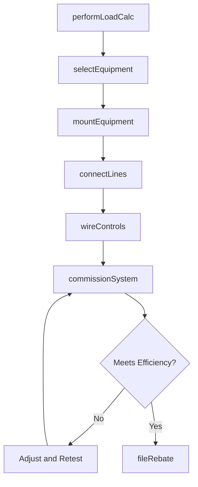
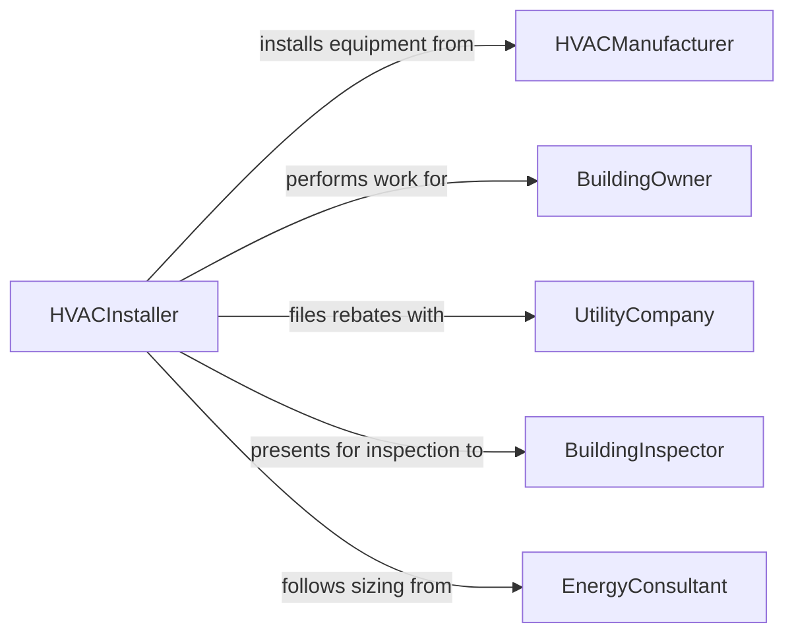

# Install Energy-Efficient Heating, Ventilation, or Air Conditioning (HVAC) Equipment

> Business-as-Code definition for energy-efficient HVAC equipment installation. Models the specification, placement, connection, and commissioning of high-efficiency heating, cooling, and ventilation systems.

## Overview

Installing energy-efficient HVAC equipment involves selecting ENERGY STAR or high-SEER-rated systems, preparing mounting locations, connecting refrigerant lines and ductwork, wiring controls, and commissioning the system for optimal performance. This definition covers heat pump installations, variable-speed air handlers, geothermal loop systems, and smart thermostat integration for residential and commercial buildings pursuing energy efficiency goals.

## Actors

| Actor | Description |
|-------|-------------|
| HVACManufacturer | Produces high-efficiency heating and cooling equipment |
| BuildingOwner | Commissions HVAC installation for their property |
| UtilityCompany | Offers rebates and incentives for energy-efficient equipment |
| BuildingInspector | Verifies HVAC installation meets code and efficiency standards |
| EnergyConsultant | Performs load calculations and recommends system sizing |
| RefrigerantSupplier | Provides refrigerants compliant with environmental regulations |

## Roles

| Role | Description |
|------|-------------|
| HVACInstaller | Mounts equipment, connects lines, and performs startup |
| DesignEngineer | Specifies equipment, ductwork, and control strategies |
| Electrician | Wires electrical connections and control circuits |
| CommissioningAgent | Tests and verifies system performance against design intent |

## Entities

| Entity | Description |
|--------|-------------|
| HVACUnit | A high-efficiency furnace, heat pump, or air conditioning system |
| Ductwork | Supply and return air distribution channels |
| RefrigerantLine | Copper tubing connecting indoor and outdoor HVAC components |
| Thermostat | A control device managing temperature setpoints and schedules |
| LoadCalculation | An engineering analysis of heating and cooling requirements |
| RebateApplication | A utility incentive claim for qualifying equipment |
| CommissioningReport | Documentation of system performance test results |

## Actions

| Action | Description |
|--------|-------------|
| performLoadCalc | Calculate heating and cooling requirements for the building |
| selectEquipment | Choose HVAC units meeting efficiency targets and load requirements |
| mountEquipment | Position and secure indoor and outdoor HVAC components |
| connectLines | Install refrigerant, condensate, and ductwork connections |
| wireControls | Connect electrical power, thermostats, and building automation |
| commissionSystem | Verify airflow, refrigerant charge, and system efficiency |
| fileRebate | Submit utility rebate applications for qualifying equipment |

## Events

| Event | Description |
|-------|-------------|
| loadCalcCompleted | Building heating and cooling requirements have been determined |
| equipmentSelected | HVAC units have been specified and ordered |
| equipmentMounted | Indoor and outdoor components have been positioned and secured |
| linesConnected | Refrigerant, condensate, and duct connections are complete |
| controlsWired | Electrical and thermostat wiring has been installed |
| systemCommissioned | Performance testing confirms design efficiency targets |
| rebateFiled | Utility incentive application has been submitted |

## Searches

| Search | Description |
|--------|-------------|
| findInstallations | Locate HVAC installations by property, equipment type, or date |
| getLoadCalculations | Retrieve design load data for a building or unit |
| getRebateStatus | Check utility rebate application status |
| getCommissioningData | Look up system performance test results |
| findEligibleRebates | List available utility incentives for qualifying equipment |

## Workflow



## Actor Relationships



## Usage

### Calling Actions

```typescript
import { installEnergyEfficientHeatingVentilationAir } from '@headlessly/install-energy-efficient-heating-ventilation-air'

const hvac = installEnergyEfficientHeatingVentilationAir()

// Perform load calculation
const load = await hvac.performLoadCalc({
  buildingId: 'BLDG-2024-0032',
  squareFeet: 2400,
  climateZone: '4A',
  insulationRValue: 38
})

// Select and mount equipment
await hvac.selectEquipment({
  loadId: load.id,
  type: 'heat-pump',
  seerRating: 20,
  hspfRating: 10,
  manufacturer: 'Carrier'
})

await hvac.mountEquipment({
  buildingId: 'BLDG-2024-0032',
  outdoorPad: 'concrete-level',
  indoorLocation: 'utility-closet'
})
```

### Event-Driven Automation

```typescript
// Auto-file rebate when system is commissioned
hvac.systemCommissioned(async ({ buildingId, seerRating, equipmentModel }) => {
  if (seerRating >= 16) {
    await hvac.fileRebate({
      buildingId,
      equipmentModel,
      utilityProgram: 'energy-efficiency-upgrade'
    })
  }
})

// Alert on commissioning failure
hvac.systemCommissioned(async ({ buildingId, passed, issues }) => {
  if (!passed) {
    await notify({
      to: 'design-engineer',
      message: `HVAC commissioning failed at ${buildingId}: ${issues.join(', ')}`
    })
  }
})
```
