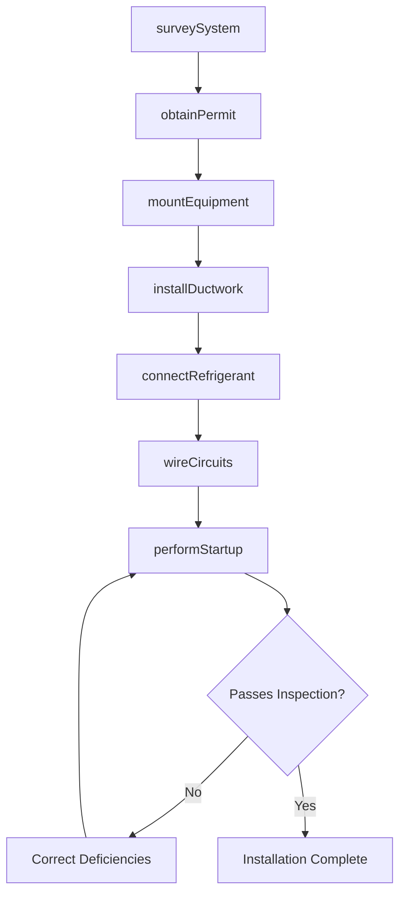
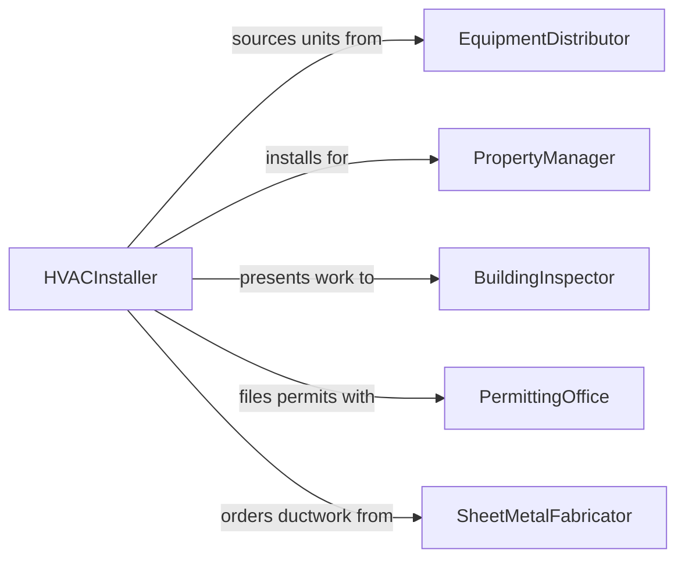

# Install Heating, Ventilation, or Air Conditioning (HVAC) Equipment

> Business-as-Code definition for HVAC equipment installation. Models the site preparation, equipment mounting, ductwork connection, refrigerant charging, and system commissioning for residential, commercial, and industrial heating, ventilation, and air conditioning systems.

## Overview

Installing HVAC equipment involves evaluating existing infrastructure, sizing replacement or new units, mounting indoor and outdoor components, connecting ductwork and refrigerant lines, wiring electrical and control circuits, and performing startup and performance verification. This definition covers split-system air conditioners, packaged rooftop units, furnace installations, ductless mini-splits, and commercial variable air volume systems.

## Actors

| Actor | Description |
|-------|-------------|
| EquipmentDistributor | Supplies HVAC units, components, and replacement parts |
| PropertyManager | Authorizes HVAC installation at the facility or building |
| BuildingInspector | Verifies installation meets mechanical and electrical code |
| PermittingOffice | Issues mechanical and electrical permits for HVAC work |
| SheetMetalFabricator | Produces custom ductwork and fittings for the installation |
| ControlsVendor | Provides thermostats, zone controllers, and building automation components |

## Roles

| Role | Description |
|------|-------------|
| HVACInstaller | Mounts equipment, connects refrigerant lines, and performs startup |
| SheetMetalWorker | Fabricates and installs ductwork, plenums, and transitions |
| Electrician | Wires power circuits, disconnects, and control wiring |
| ProjectForeman | Coordinates crew schedules, inspections, and material delivery |

## Entities

| Entity | Description |
|--------|-------------|
| HVACUnit | A furnace, air conditioner, heat pump, or air handler being installed |
| Ductwork | Sheet metal or flexible conduit distributing conditioned air |
| RefrigerantCharge | The measured quantity of refrigerant added to the sealed system |
| Thermostat | A temperature control device managing system operation |
| MechanicalPermit | A municipal authorization for HVAC construction work |
| StartupChecklist | A documented sequence of tests verifying proper system operation |
| Lineset | Insulated copper tubing connecting indoor and outdoor units |

## Actions

| Action | Description |
|--------|-------------|
| surveySystem | Evaluate existing HVAC infrastructure and determine installation requirements |
| obtainPermit | Submit plans and secure mechanical and electrical permits |
| mountEquipment | Position and secure indoor and outdoor HVAC units |
| installDuctwork | Fabricate and connect supply, return, and exhaust duct runs |
| connectRefrigerant | Braze or flare refrigerant lines and charge the system |
| wireCircuits | Install electrical power, disconnect, and thermostat wiring |
| performStartup | Verify airflow, refrigerant pressures, and temperature differential |

## Events

| Event | Description |
|-------|-------------|
| systemSurveyed | Existing infrastructure has been evaluated and installation plan confirmed |
| permitObtained | Mechanical and electrical permits have been issued |
| equipmentMounted | Indoor and outdoor HVAC components have been secured in position |
| ductworkInstalled | All supply, return, and exhaust connections are complete |
| refrigerantConnected | Linesets are brazed, pressurized, and charged with refrigerant |
| circuitsWired | Electrical power and control wiring have been connected |
| startupCompleted | System operation has been verified against design specifications |

## Searches

| Search | Description |
|--------|-------------|
| findInstallations | Locate HVAC installation projects by property, status, or equipment type |
| getPermitStatus | Check the approval status of mechanical or electrical permits |
| getStartupResults | Retrieve commissioning test data for a completed installation |
| findScheduledWork | List upcoming installations by date, crew, or location |
| getEquipmentSpecs | Look up unit specifications by model number or project |

## Workflow



## Actor Relationships



## Usage

### Calling Actions

```typescript
import { installHeatingVentilationAirConditioning } from '@headlessly/install-heating-ventilation-air-conditioning'

const hvac = installHeatingVentilationAirConditioning()

// Survey the existing system
const survey = await hvac.surveySystem({
  propertyId: 'PROP-2024-0412',
  existingSystem: 'gas-furnace-ac-split',
  squareFeet: 3200,
  stories: 2
})

// Mount the new equipment
await hvac.mountEquipment({
  projectId: 'HVAC-2024-0412',
  indoorUnit: { model: 'Trane-XR15', location: 'basement-utility' },
  outdoorUnit: { model: 'Trane-4TWR5036', location: 'east-side-pad' }
})

// Perform system startup
const startup = await hvac.performStartup({
  projectId: 'HVAC-2024-0412',
  checks: ['airflow-cfm', 'static-pressure', 'superheat', 'subcooling', 'temperature-split'],
  ambientTemp: 85
})
```

### Event-Driven Automation

```typescript
// Schedule inspection when startup is complete
hvac.startupCompleted(async ({ projectId, propertyId }) => {
  await inspections.schedule({
    projectId,
    propertyId,
    type: 'mechanical-final',
    requestedDate: nextBusinessDay()
  })
})

// Notify property manager when permit is obtained
hvac.permitObtained(async ({ projectId, permitNumber }) => {
  await notify({
    to: 'property-manager',
    message: `HVAC permit ${permitNumber} approved for project ${projectId}. Installation can proceed.`
  })
})
```
