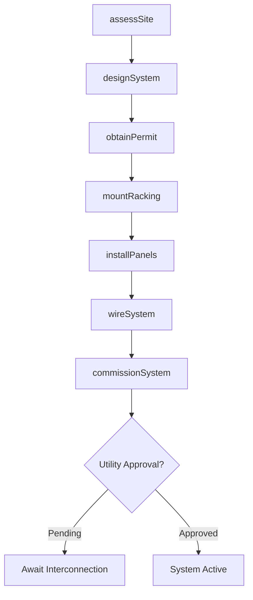
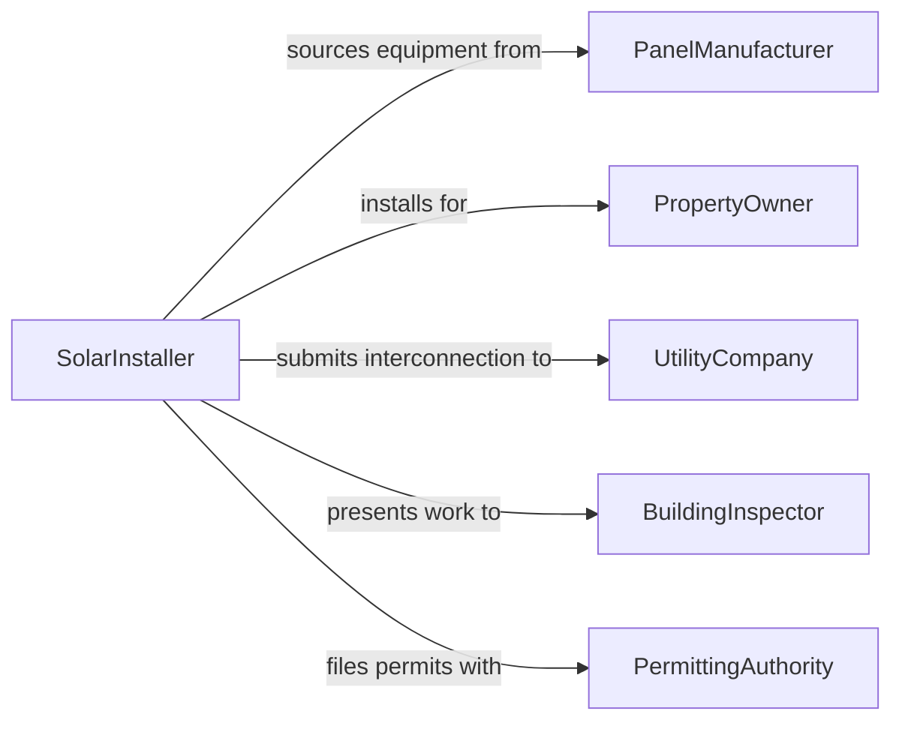

# Install Solar Energy Systems

> Business-as-Code definition for solar energy system installation. Models the design, mounting, wiring, and commissioning of photovoltaic panels and solar thermal systems for residential and commercial properties.

## Overview

Installing solar energy systems involves conducting site assessments, designing panel arrays, mounting racking on rooftops or ground structures, wiring strings to inverters, connecting to the electrical panel, and coordinating utility interconnection. This definition covers rooftop PV installations, ground-mount solar farms, solar water heating, and battery storage integration.

## Actors

| Actor | Description |
|-------|-------------|
| PanelManufacturer | Produces photovoltaic panels, inverters, and racking systems |
| PropertyOwner | Commissions solar installation on their building or land |
| UtilityCompany | Approves interconnection and administers net metering agreements |
| BuildingInspector | Verifies electrical and structural code compliance |
| PermittingAuthority | Issues construction and electrical permits for solar installations |
| FinancingProvider | Offers solar loans, leases, or power purchase agreements |

## Roles

| Role | Description |
|------|-------------|
| SolarInstaller | Mounts panels, connects wiring, and performs system startup |
| SystemDesigner | Creates array layouts, string sizing, and electrical schematics |
| Electrician | Wires inverters to the main electrical panel and utility meter |
| ProjectManager | Coordinates permitting, installation scheduling, and inspections |

## Entities

| Entity | Description |
|--------|-------------|
| PVPanel | A photovoltaic module converting sunlight to electricity |
| Inverter | A device converting DC panel output to AC grid power |
| RackingSystem | Mounting hardware securing panels to rooftops or ground structures |
| InterconnectionAgreement | A utility contract for grid-tied solar energy export |
| SystemDesign | An engineering document with array layout and electrical specs |
| InstallationPermit | A municipal permit authorizing solar construction |
| ProductionEstimate | Projected annual energy output based on site conditions |

## Actions

| Action | Description |
|--------|-------------|
| assessSite | Evaluate roof condition, orientation, shading, and structural capacity |
| designSystem | Create panel layout, string configuration, and electrical plans |
| obtainPermit | Submit plans and secure construction and electrical permits |
| mountRacking | Install mounting hardware on the roof or ground structure |
| installPanels | Secure photovoltaic panels onto the racking system |
| wireSystem | Connect panel strings to inverters and the electrical panel |
| commissionSystem | Test system output, safety disconnects, and monitoring |

## Events

| Event | Description |
|-------|-------------|
| siteAssessed | Roof and shading analysis has been completed |
| systemDesigned | Array layout and electrical plans have been finalized |
| permitObtained | Construction and electrical permits have been issued |
| rackingMounted | Mounting hardware has been installed and secured |
| panelsInstalled | All photovoltaic panels have been placed on racking |
| systemWired | Electrical connections from panels to grid are complete |
| systemCommissioned | Solar system is producing power and monitoring is active |

## Searches

| Search | Description |
|--------|-------------|
| findInstallations | Locate solar projects by property, status, or system size |
| getSiteAssessments | Retrieve shading and structural analysis for a property |
| getProductionData | Look up actual energy output versus design estimates |
| findPendingPermits | List permit applications awaiting approval |
| getInterconnectionStatus | Check utility interconnection agreement progress |

## Workflow



## Actor Relationships



## Usage

### Calling Actions

```typescript
import { installSolarEnergySystems } from '@headlessly/install-solar-energy-systems'

const solar = installSolarEnergySystems()

// Assess the installation site
const site = await solar.assessSite({
  propertyId: 'PROP-2024-0187',
  roofType: 'composite-shingle',
  roofAgePitchAzimuth: { ageYears: 5, pitchDeg: 25, azimuthDeg: 180 },
  annualSunHours: 1800
})

// Design the PV system
const design = await solar.designSystem({
  siteId: site.id,
  targetKw: 8.4,
  panelWatts: 400,
  inverterType: 'microinverter',
  batteryStorage: false
})

// Commission the installed system
await solar.commissionSystem({
  projectId: 'SOLAR-2024-0187',
  tests: ['open-circuit-voltage', 'ground-fault', 'production-verify'],
  monitoringPlatform: 'enphase-enlighten'
})
```

### Event-Driven Automation

```typescript
// Auto-submit interconnection request on panel installation
solar.panelsInstalled(async ({ projectId, systemSizeKw }) => {
  await utility.submitInterconnection({
    projectId,
    systemSizeKw,
    meterType: 'net-meter'
  })
})

// Notify owner when system is producing
solar.systemCommissioned(async ({ projectId, firstDayProductionKwh }) => {
  await notify({
    to: 'property-owner',
    message: `Solar system ${projectId} is live! First day: ${firstDayProductionKwh} kWh`
  })
})
```
