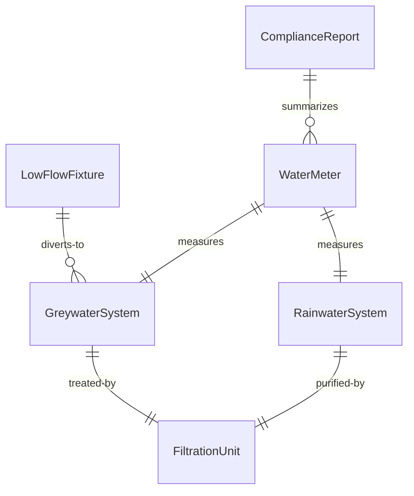
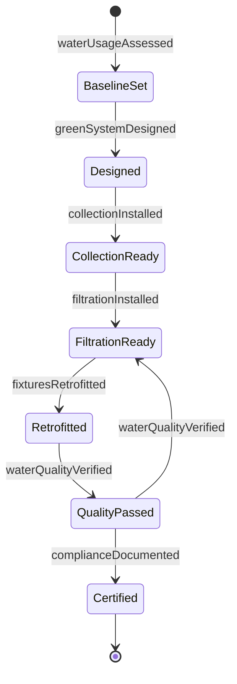
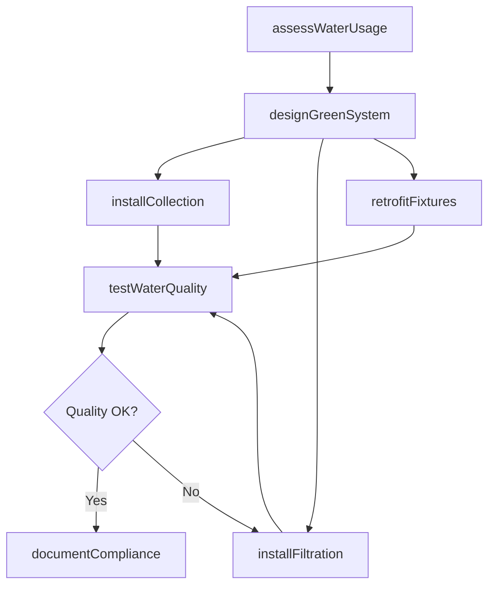
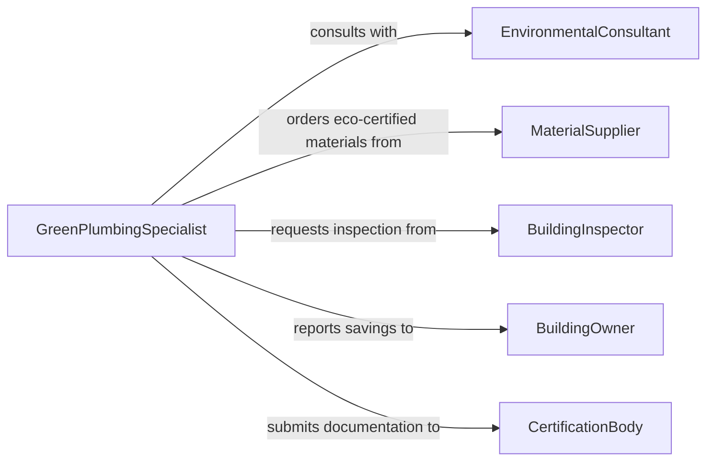

# Install Green Plumbing Water Handling

> Business-as-Code definition for green plumbing and water handling system installation. Models the workflow for installing water-efficient fixtures, rainwater harvesting, greywater recycling, and sustainable water management infrastructure.

## Overview

Green plumbing and water handling installation involves fitting and connecting environmentally sustainable water systems designed to reduce consumption, recycle greywater, and harvest rainwater. This activity covers low-flow fixture installation, solar water heating piping, greywater diversion systems, and rainwater collection infrastructure. The definition provides actions for system design, component installation, and sustainability verification to support LEED and WaterSense compliance.

## Actors

| Actor | Description |
|-------|-------------|
| BuildingOwner | Commissions green plumbing systems for the property |
| EnvironmentalConsultant | Advises on water conservation requirements and certifications |
| BuildingInspector | Verifies installations meet green building codes |
| MaterialSupplier | Provides eco-certified fixtures, tanks, and filtration components |
| CertificationBody | Issues LEED, WaterSense, or similar sustainability certifications |

## Roles

| Role | Description |
|------|-------------|
| GreenPlumbingSpecialist | Designs and installs sustainable water handling systems |
| WaterSystemsEngineer | Engineers greywater and rainwater system specifications |
| InstallationTechnician | Performs hands-on fitting and connection of green components |
| SustainabilityAuditor | Measures water savings and validates system performance |

## Entities

| Entity | Description |
|--------|-------------|
| RainwaterSystem | A collection and storage system for harvested rainwater |
| GreywaterSystem | A treatment and redistribution system for reusable wastewater |
| LowFlowFixture | A water-efficient faucet, showerhead, or toilet |
| FiltrationUnit | A filter or treatment module for recycled water |
| WaterMeter | A device measuring flow rates and consumption volumes |
| ComplianceReport | A document recording sustainability metrics and certifications |

## Actions

| Action | Description |
|--------|-------------|
| assessWaterUsage | Evaluate current water consumption and identify reduction opportunities |
| designGreenSystem | Create specifications for rainwater, greywater, or low-flow systems |
| installCollection | Set up rainwater gutters, downspouts, and storage tanks |
| installFiltration | Connect greywater treatment and filtration components |
| retrofitFixtures | Replace existing fixtures with low-flow certified alternatives |
| testWaterQuality | Verify recycled water meets quality standards for intended use |
| documentCompliance | Record system performance data for certification submission |

## Events

| Event | Description |
|-------|-------------|
| waterUsageAssessed | Baseline water consumption analysis completed |
| greenSystemDesigned | System specifications and layout finalized |
| collectionInstalled | Rainwater harvesting infrastructure is operational |
| filtrationInstalled | Greywater treatment system is connected and functioning |
| fixturesRetrofitted | Low-flow fixtures installed and verified |
| waterQualityVerified | Recycled water passed quality testing standards |
| complianceDocumented | Sustainability documentation submitted for certification |

## Searches

| Search | Description |
|--------|-------------|
| findGreenSystems | List green plumbing installations by type, building, or status |
| getWaterSavings | Retrieve water consumption reduction metrics by system |
| getCertifications | Look up certification status for installed green systems |
| findFixtureInventory | Search available eco-certified fixtures by rating and type |


## Entity Relationships



## State Diagram


## Workflow



## Actor Relationships



## Usage

### Calling Actions

```typescript
import { installGreenPlumbingWaterHandling } from '@headlessly/install-green-plumbing-water-handling'

const greenPlumbing = installGreenPlumbingWaterHandling()

// Assess current water usage baseline
const assessment = await greenPlumbing.assessWaterUsage({
  buildingId: 'bldg-2200',
  currentGallonsPerDay: 1200,
  occupants: 45
})

// Design a combined rainwater and greywater system
const design = await greenPlumbing.designGreenSystem({
  assessmentId: assessment.id,
  systems: ['rainwater-harvesting', 'greywater-recycling', 'low-flow-retrofit'],
  targetReduction: 0.40
})

// Test recycled water quality
const quality = await greenPlumbing.testWaterQuality({
  systemId: design.id,
  samplePoints: ['greywater-outlet', 'rainwater-tank'],
  standards: 'NSF-350'
})
```

### Event-Driven Automation

```typescript
// Submit certification when compliance documentation is ready
greenPlumbing.complianceDocumented(async ({ buildingId, reportId, savings }) => {
  await submitCertification({
    program: 'LEED-Water',
    buildingId,
    evidence: reportId,
    annualSavingsGallons: savings.annual
  })
})

// Alert facilities team on water quality failure
greenPlumbing.waterQualityVerified(async ({ systemId, passed, contaminants }) => {
  if (!passed) {
    await notify({
      to: 'facilities-manager',
      message: `Water quality test failed for system ${systemId}: ${contaminants.join(', ')}`
    })
  }
})
```
