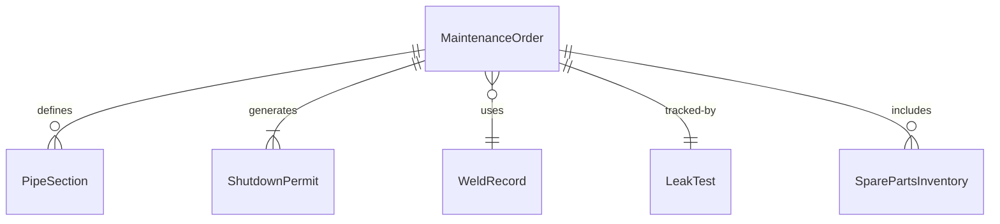
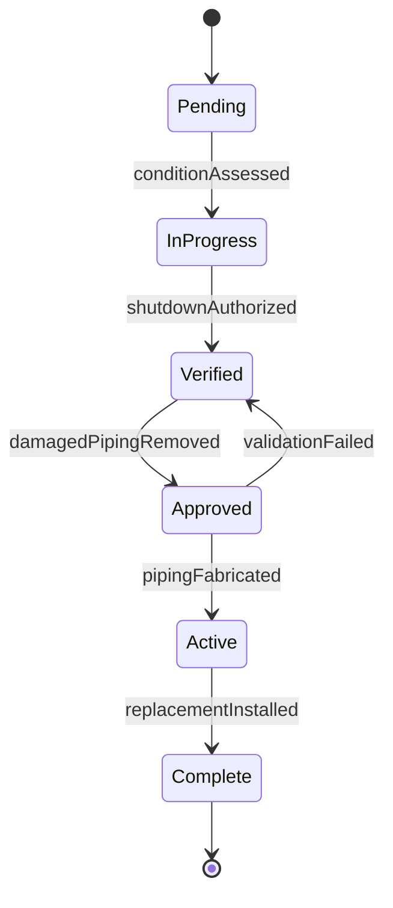
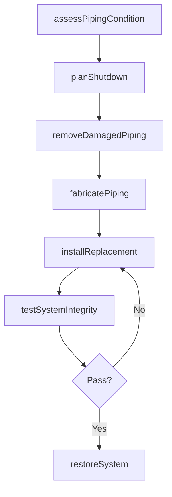
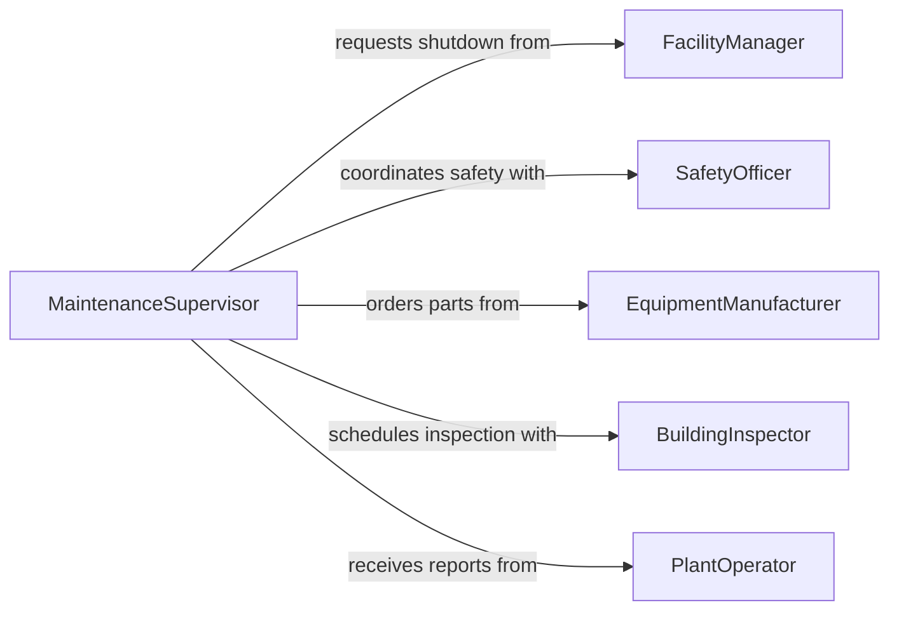

# Install Piping Installation Maintenance Activities

> Business-as-Code definition for piping installation and maintenance activities. Models the workflow for installing, replacing, and repairing piping systems in industrial, commercial, and institutional facilities.

## Overview

Piping installation for maintenance activities involves fitting, connecting, and replacing pipe sections within existing systems to restore function or upgrade capacity. This covers steam lines, process piping, HVAC distribution, compressed air systems, and utility piping in operating facilities. The definition provides actions for shutdown coordination, pipe replacement, system restoration, and post-maintenance verification to minimize facility downtime.

## Actors

| Actor | Description |
|-------|-------------|
| FacilityManager | Authorizes maintenance work and coordinates operational shutdowns |
| EquipmentManufacturer | Supplies replacement piping components and technical specifications |
| SafetyOfficer | Ensures lockout/tagout procedures and safe work conditions |
| BuildingInspector | Verifies maintenance work meets applicable codes |
| PlantOperator | Monitors system performance and reports piping issues |

## Roles

| Role | Description |
|------|-------------|
| Pipefitter | Performs hands-on pipe installation and replacement |
| MaintenanceSupervisor | Plans and schedules piping maintenance activities |
| WeldingTechnician | Executes pipe welding and joint fabrication |
| QualityInspector | Tests completed work for leak-free operation and code compliance |

## Entities

| Entity | Description |
|--------|-------------|
| MaintenanceOrder | A documented request for piping repair or replacement |
| PipeSection | A segment of piping identified for installation or replacement |
| ShutdownPermit | An authorization to take a system offline for maintenance |
| WeldRecord | Documentation of welding procedures and inspection results |
| LeakTest | A recorded test confirming joint and connection integrity |
| SparePartsInventory | Available replacement pipes, fittings, and gaskets |

## Actions

| Action | Description |
|--------|-------------|
| assessPipingCondition | Evaluate existing piping for corrosion, wear, or damage |
| planShutdown | Coordinate system isolation and lockout/tagout procedures |
| removeDamagedPiping | Cut and extract pipe sections requiring replacement |
| fabricatePiping | Cut, thread, or weld new pipe sections to specification |
| installReplacement | Fit and connect replacement piping into the system |
| testSystemIntegrity | Perform hydrostatic or pneumatic testing on repaired sections |
| restoreSystem | Remove isolation, restore flow, and verify normal operation |

## Events

| Event | Description |
|-------|-------------|
| conditionAssessed | Piping inspection completed with findings documented |
| shutdownAuthorized | System isolation permit approved and lockout applied |
| damagedPipingRemoved | Deteriorated pipe sections extracted from the system |
| pipingFabricated | Replacement pipe sections cut and prepared |
| replacementInstalled | New piping connected and secured in position |
| integrityTestPassed | Repaired system passed pressure and leak testing |
| systemRestored | Piping system returned to full operational service |

## Searches

| Search | Description |
|--------|-------------|
| findMaintenanceOrders | List maintenance orders by system, priority, or status |
| getSparePartsStock | Retrieve available replacement components by size and material |
| getWeldRecords | Look up welding documentation by job, welder, or procedure |
| findLeakTestHistory | Search past test results by pipe section or system |


## Entity Relationships



## State Diagram


## Workflow



## Actor Relationships



## Usage

### Calling Actions

```typescript
import { installPipingInstallationMaintenanceActivities } from '@headlessly/install-piping-installation-maintenance-activities'

const piping = installPipingInstallationMaintenanceActivities()

// Assess condition of steam distribution piping
const assessment = await piping.assessPipingCondition({
  systemId: 'steam-loop-north',
  inspectionType: 'ultrasonic-thickness',
  sections: ['header-A', 'riser-3', 'branch-7']
})

// Plan and authorize a system shutdown
const shutdown = await piping.planShutdown({
  systemId: 'steam-loop-north',
  scheduledStart: '2026-03-15T06:00:00Z',
  estimatedDuration: '8h',
  affectedZones: ['building-C', 'building-D']
})

// Test integrity after replacement
const test = await piping.testSystemIntegrity({
  maintenanceOrderId: shutdown.orderId,
  testType: 'hydrostatic',
  pressurePsi: 150,
  holdMinutes: 30
})
```

### Event-Driven Automation

```typescript
// Notify operations when system is restored
piping.systemRestored(async ({ systemId, maintenanceOrderId }) => {
  await notify({
    to: 'plant-operations',
    message: `System ${systemId} restored to service. Order ${maintenanceOrderId} complete.`
  })
})

// Escalate when integrity test fails
piping.integrityTestPassed(async ({ maintenanceOrderId, passed }) => {
  if (!passed) {
    await escalate({
      to: 'maintenance-supervisor',
      priority: 'high',
      message: `Integrity test failed on order ${maintenanceOrderId}. Rework required.`
    })
  }
})
```
