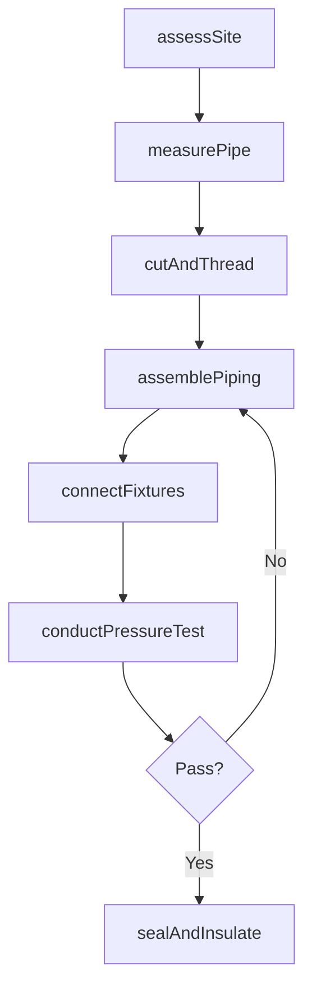
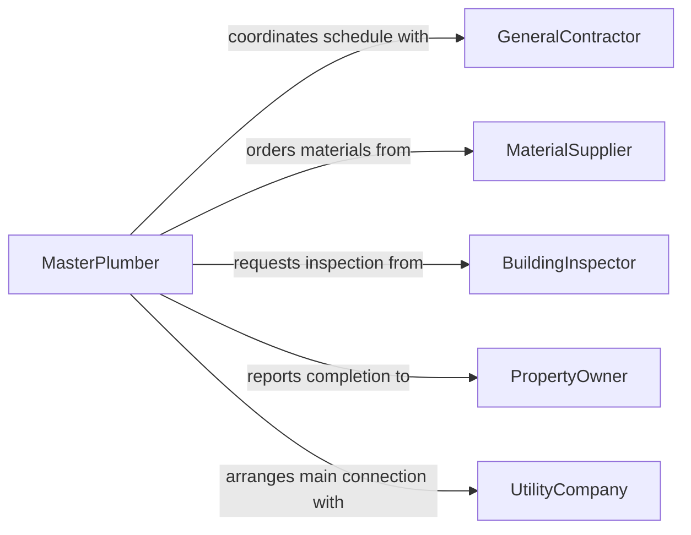

# Install Plumbing Piping

> Business-as-Code definition for plumbing and piping installation. Models the complete workflow from site assessment through pipe fitting, connection, and pressure testing.

## Overview

Plumbing and piping installation encompasses measuring, cutting, threading, and assembling pipes, fittings, and fixtures for water supply, drainage, and gas distribution systems. This activity covers residential, commercial, and industrial piping installations including copper, PVC, cast iron, and steel pipe systems. The definition exposes actions for each stage of the installation process, events for workflow coordination, and searches for tracking materials and job progress.

## Actors

| Actor | Description |
|-------|-------------|
| GeneralContractor | Oversees the construction project and schedules plumbing work |
| BuildingInspector | Inspects completed installations for code compliance |
| MaterialSupplier | Provides pipes, fittings, valves, and related materials |
| PropertyOwner | Commissions the plumbing installation work |
| UtilityCompany | Manages water and sewer connections at the main lines |

## Roles

| Role | Description |
|------|-------------|
| MasterPlumber | Designs pipe layouts and oversees installation crews |
| JourneymanPlumber | Performs hands-on pipe fitting and installation |
| PlumbingApprentice | Assists with installations under supervision |
| ProjectEstimator | Calculates material requirements and labor costs |

## Entities

| Entity | Description |
|--------|-------------|
| PipeRun | A continuous section of piping from origin to terminus |
| Fitting | A connector piece joining two or more pipe sections |
| Fixture | An end-use device such as a faucet, toilet, or drain |
| Valve | A device controlling flow rate or direction within a pipe system |
| PressureTest | A recorded test verifying system integrity under pressure |
| WorkOrder | A documented job specifying scope, materials, and schedule |

## Actions

| Action | Description |
|--------|-------------|
| assessSite | Survey the location and plan pipe routing paths |
| measurePipe | Determine required pipe lengths and cut dimensions |
| cutAndThread | Cut pipe to length and thread ends for connections |
| assemblePiping | Join pipes, fittings, and valves into a complete run |
| connectFixtures | Attach end-use fixtures to the piping system |
| conductPressureTest | Pressurize the system to verify leak-free operation |
| sealAndInsulate | Apply sealant, hangers, and insulation to finished runs |

## Events

| Event | Description |
|-------|-------------|
| siteAssessed | Site survey and pipe routing plan completed |
| pipeCut | Pipe sections cut to specified dimensions |
| pipingAssembled | Pipe run fully assembled with fittings and valves |
| fixturesConnected | End-use fixtures attached to the piping system |
| pressureTestPassed | System passed leak and pressure integrity testing |
| pressureTestFailed | System failed pressure test requiring remediation |
| installationCompleted | Plumbing installation finished and ready for inspection |

## Searches

| Search | Description |
|--------|-------------|
| findWorkOrders | List work orders by status, location, or date range |
| getPipeInventory | Retrieve available pipe stock by type, size, and material |
| getTestResults | Look up pressure test results by job or pipe run |
| findFixtures | Search installed fixtures by type, location, or model |

## Workflow



## Actor Relationships



## Usage

### Calling Actions

```typescript
import { installPlumbingPiping } from '@headlessly/install-plumbing-piping'

const plumbing = installPlumbingPiping()

// Assess the job site and plan pipe routing
const site = await plumbing.assessSite({
  address: '450 Industrial Blvd',
  buildingType: 'commercial',
  floors: 3,
  systemType: 'water-supply'
})

// Measure and cut pipe for a specific run
const pipes = await plumbing.measurePipe({
  siteId: site.id,
  material: 'copper',
  diameter: '3/4-inch',
  runs: [
    { from: 'main-shutoff', to: 'second-floor-manifold', length: 42 }
  ]
})

// Conduct pressure test on the assembled system
const test = await plumbing.conductPressureTest({
  siteId: site.id,
  psiTarget: 80,
  holdDuration: '30m'
})
```

### Event-Driven Automation

```typescript
// Notify inspector when pressure test passes
plumbing.pressureTestPassed(async ({ siteId, testId, psi }) => {
  await scheduleInspection({
    siteId,
    type: 'plumbing-rough-in',
    evidence: testId
  })
})

// Alert crew lead on pressure test failure
plumbing.pressureTestFailed(async ({ siteId, testId, failurePoint }) => {
  await notify({
    to: 'crew-lead',
    message: `Pressure test failed at ${failurePoint} on site ${siteId}`
  })
})
```
