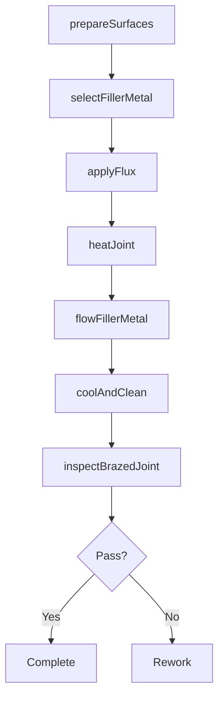
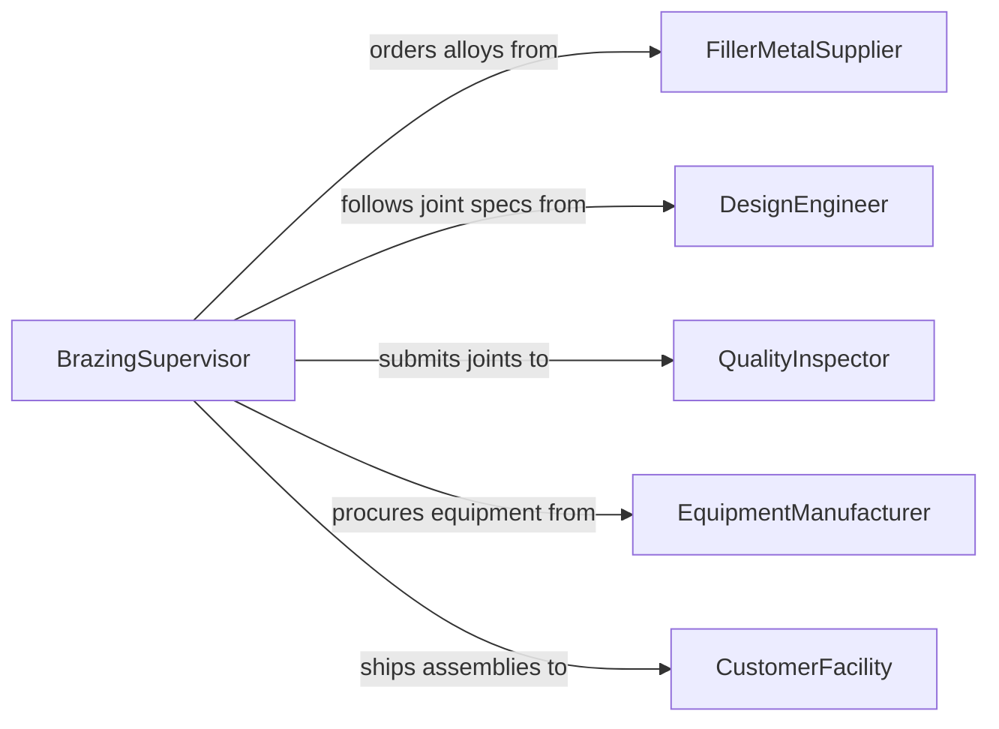

# Braze Metal Parts Components

> Business-as-Code definition for brazing metal parts and components. Models the workflow for joint preparation, flux application, filler metal selection, heating, and post-braze inspection in manufacturing and repair operations.

## Overview

Brazing metal parts involves joining components using a filler metal heated above 840 degrees Fahrenheit but below the melting point of the base metals. This capillary-action joining process is used in HVAC, automotive, aerospace, and plumbing industries for creating strong, leak-tight joints between dissimilar metals. The definition provides actions for surface preparation, brazing execution, and joint verification, along with events for production tracking and quality control.

## Actors

| Actor | Description |
|-------|-------------|
| FillerMetalSupplier | Provides brazing alloys, fluxes, and atmosphere gases |
| DesignEngineer | Specifies joint geometry, filler metal, and clearance tolerances |
| QualityInspector | Tests brazed joints for strength, leak-tightness, and appearance |
| EquipmentManufacturer | Supplies brazing torches, furnaces, and induction heating systems |
| CustomerFacility | Receives finished brazed assemblies for integration into products |

## Roles

| Role | Description |
|------|-------------|
| BrazingTechnician | Performs hands-on brazing operations using torch or furnace methods |
| BrazingSupervisor | Plans brazing sequences and monitors process parameters |
| MetallurgicalEngineer | Selects filler metals and optimizes joint clearances for the application |
| InspectionTechnician | Conducts visual, dye-penetrant, or pressure tests on brazed joints |

## Entities

| Entity | Description |
|--------|-------------|
| BrazedJoint | A connection formed by capillary flow of molten filler metal |
| FillerMetal | A brazing alloy such as silver, copper-phosphorus, or nickel-based |
| Flux | A chemical agent that prevents oxidation and promotes filler flow |
| JointClearance | The gap between mating surfaces designed for capillary action |
| BrazingProcedure | A documented specification for temperature, filler, and technique |
| TestReport | Results from destructive or non-destructive joint testing |

## Actions

| Action | Description |
|--------|-------------|
| prepareSurfaces | Clean and fit mating surfaces to achieve proper joint clearance |
| applyFlux | Coat joint areas with flux to prevent oxidation during heating |
| selectFillerMetal | Choose the appropriate brazing alloy for the base metals and application |
| heatJoint | Apply controlled heat using torch, furnace, or induction methods |
| flowFillerMetal | Feed filler metal into the joint and allow capillary action to fill the gap |
| coolAndClean | Allow the joint to cool and remove residual flux |
| inspectBrazedJoint | Test the completed joint for integrity using visual or NDT methods |

## Events

| Event | Description |
|-------|-------------|
| surfacesPrepared | Joint surfaces cleaned and fitted to specification |
| fluxApplied | Flux coating applied to joint areas |
| fillerMetalSelected | Brazing alloy chosen and documented for the procedure |
| jointHeated | Base metals brought to brazing temperature |
| fillerFlowed | Filler metal drawn into the joint by capillary action |
| jointCooled | Brazed joint cooled and flux residue removed |
| jointInspected | Brazed joint tested and inspection results recorded |

## Searches

| Search | Description |
|--------|-------------|
| findBrazingJobs | List brazing jobs by assembly, filler metal, or status |
| getFillerMetalInventory | Retrieve available brazing alloys by type and quantity |
| getTestReports | Look up inspection results by joint, batch, or procedure |
| findBrazingProcedures | Search documented procedures by base metal combination |

## Workflow



## Actor Relationships



## Usage

### Calling Actions

```typescript
import { brazeMetalPartsComponents } from '@headlessly/braze-metal-parts-components'

const brazing = brazeMetalPartsComponents()

// Prepare copper tube surfaces for an HVAC joint
const surfaces = await brazing.prepareSurfaces({
  assemblyId: 'condenser-unit-44',
  baseMetal1: 'copper',
  baseMetal2: 'brass',
  jointType: 'tube-to-fitting',
  clearance: 0.003
})

// Select filler metal and apply flux
await brazing.selectFillerMetal({
  jointId: surfaces.jointId,
  fillerType: 'BCuP-5',
  form: 'rod'
})

await brazing.applyFlux({
  jointId: surfaces.jointId,
  fluxType: 'AWS-FB3-A'
})

// Heat and flow filler metal
await brazing.heatJoint({
  jointId: surfaces.jointId,
  method: 'oxy-acetylene-torch',
  targetTemp: 1300
})
```

### Event-Driven Automation

```typescript
// Schedule pressure test when joint is cooled
brazing.jointCooled(async ({ jointId, assemblyId }) => {
  await schedulePressureTest({
    jointId,
    assemblyId,
    testPressure: 500,
    medium: 'nitrogen'
  })
})

// Alert on inspection failure
brazing.jointInspected(async ({ jointId, passed, defectType }) => {
  if (!passed) {
    await notify({
      to: 'brazing-supervisor',
      message: `Joint ${jointId} failed inspection: ${defectType}`
    })
  }
})
```
