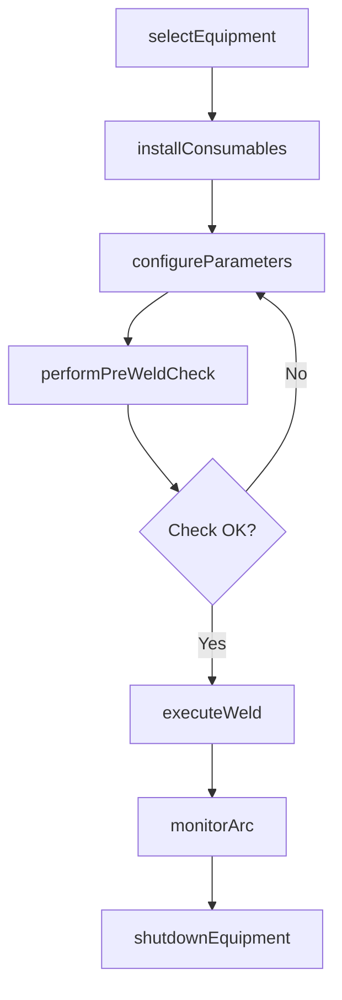
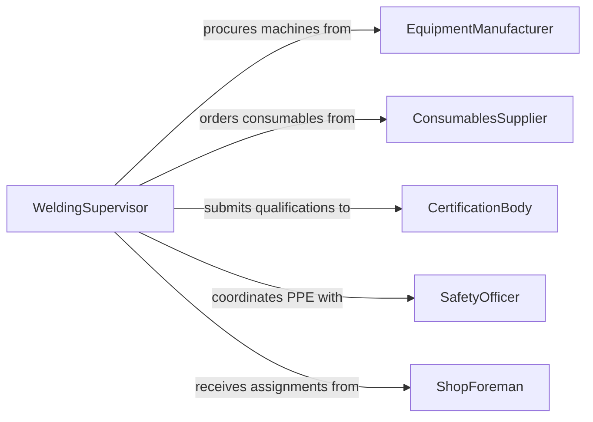

# Operate Welding Equipment

> Business-as-Code definition for operating welding equipment. Models the workflow for equipment setup, parameter configuration, welding execution, and post-weld verification across MIG, TIG, stick, and flux-core processes.

## Overview

Operating welding equipment involves setting up, configuring, and running welding machines to join metal components using various arc and resistance welding processes. This activity covers MIG (GMAW), TIG (GTAW), stick (SMAW), flux-core (FCAW), and submerged arc (SAW) welding in fabrication shops, construction sites, and manufacturing plants. The definition provides actions for equipment preparation, parameter adjustment, and weld execution, along with events for maintenance tracking and operator qualification management.

## Actors

| Actor | Description |
|-------|-------------|
| EquipmentManufacturer | Supplies welding machines, torches, and power sources |
| ConsumablesSupplier | Provides welding wire, electrodes, shielding gas, and flux |
| CertificationBody | Issues welder qualifications and procedure approvals (AWS, ASME) |
| SafetyOfficer | Enforces PPE requirements and ventilation standards |
| ShopForeman | Assigns welding work and manages shop floor schedules |

## Roles

| Role | Description |
|------|-------------|
| WeldingOperator | Sets up and operates welding equipment for production work |
| WeldingSupervisor | Oversees equipment usage, operator assignments, and process quality |
| MaintenanceTechnician | Performs preventive maintenance and repairs on welding machines |
| WeldingEngineer | Develops welding procedure specifications and process parameters |

## Entities

| Entity | Description |
|--------|-------------|
| WeldingMachine | A power source and wire feeder or electrode holder assembly |
| WeldingProcedure | A WPS document specifying process, parameters, and technique |
| ShieldingGas | An inert or active gas protecting the weld pool from contamination |
| Electrode | A consumable or non-consumable conductor carrying the welding arc |
| OperatorQualification | A certification record for a welder on a specific process and position |
| MaintenanceLog | A record of equipment service, calibration, and repairs |

## Actions

| Action | Description |
|--------|-------------|
| selectEquipment | Choose the appropriate welding machine for the process and material |
| configureParameters | Set voltage, amperage, wire speed, and gas flow rate |
| installConsumables | Load wire spools, electrodes, or flux and connect shielding gas |
| performPreWeldCheck | Verify ground connections, torch condition, and safety equipment |
| executeWeld | Run the welding arc to join metal components per procedure |
| monitorArc | Observe arc stability, puddle behavior, and travel speed during welding |
| shutdownEquipment | Power down the machine and secure consumables after use |

## Events

| Event | Description |
|-------|-------------|
| equipmentSelected | Welding machine chosen and positioned for the job |
| parametersConfigured | Voltage, amperage, and feed settings dialed in |
| consumablesInstalled | Wire, electrodes, and gas connected and verified |
| preWeldCheckCompleted | Safety and equipment checks passed |
| weldExecuted | Welding pass completed on the joint |
| arcMonitored | Arc quality and stability observations recorded |
| equipmentShutdown | Machine powered down and workstation secured |

## Searches

| Search | Description |
|--------|-------------|
| findWeldingMachines | List available machines by type, process, and amperage capacity |
| getOperatorQualifications | Retrieve certifications for welders by process and position |
| getMaintenanceLogs | Look up service history by machine serial number |
| findConsumablesStock | Search available electrodes, wire, and gas by type and quantity |

## Workflow



## Actor Relationships



## Usage

### Calling Actions

```typescript
import { operateWeldingEquipment } from '@headlessly/operate-welding-equipment'

const welding = operateWeldingEquipment()

// Select equipment for a MIG welding job
const machine = await welding.selectEquipment({
  process: 'GMAW',
  material: 'carbon-steel',
  thickness: 0.25,
  position: 'flat'
})

// Configure welding parameters
await welding.configureParameters({
  machineId: machine.id,
  voltage: 22,
  wireSpeed: 280,
  shieldingGas: '75Ar-25CO2',
  gasFlowRate: 35
})

// Execute the weld
const weld = await welding.executeWeld({
  machineId: machine.id,
  procedureId: 'WPS-2026-044',
  jointType: 'butt',
  passes: 2,
  operatorId: 'welder-cert-118'
})
```

### Event-Driven Automation

```typescript
// Schedule maintenance when machine hours threshold reached
welding.equipmentShutdown(async ({ machineId, totalHours }) => {
  if (totalHours % 500 === 0) {
    await scheduleService({
      machineId,
      type: 'preventive-maintenance',
      priority: 'standard'
    })
  }
})

// Alert supervisor on pre-weld check failure
welding.preWeldCheckCompleted(async ({ machineId, passed, issues }) => {
  if (!passed) {
    await notify({
      to: 'welding-supervisor',
      message: `Pre-weld check failed on machine ${machineId}: ${issues.join(', ')}`
    })
  }
})
```
