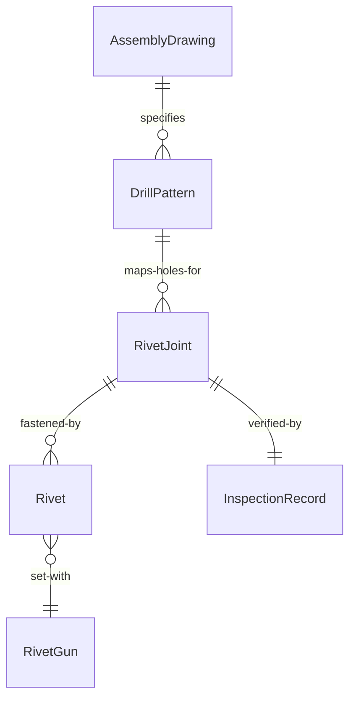
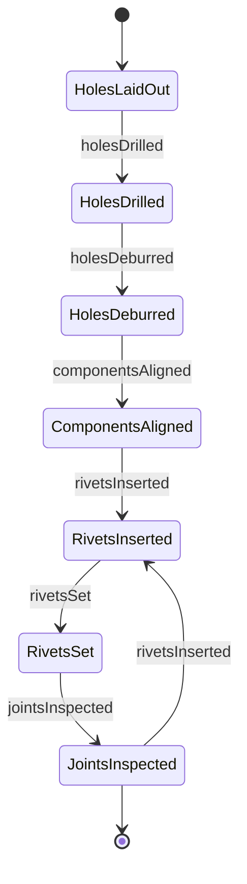
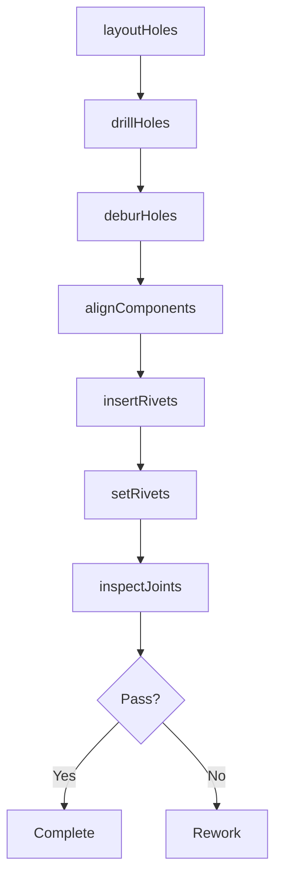
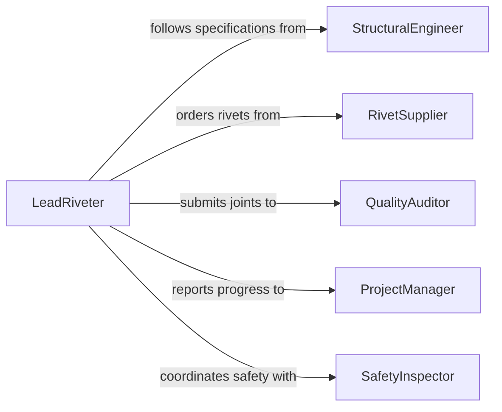

# Rivet Metal Components

> Business-as-Code definition for riveting metal components. Models the workflow for drilling, aligning, inserting, and setting rivets to create permanent mechanical joints in structural and manufacturing applications.

## Overview

Riveting metal components involves creating permanent mechanical fastener joints by drilling holes, aligning parts, inserting rivets, and setting them using pneumatic guns, hydraulic squeezers, or bucking bars. This activity is used in aerospace, shipbuilding, structural steel, and heavy equipment manufacturing where high-strength, vibration-resistant joints are required. The definition provides actions for each riveting step, events for quality tracking, and searches for production and inspection data.

## Actors

| Actor | Description |
|-------|-------------|
| StructuralEngineer | Specifies rivet patterns, sizes, and load requirements |
| RivetSupplier | Provides rivets in required materials, sizes, and head styles |
| QualityAuditor | Inspects completed rivet joints for conformance to specifications |
| ProjectManager | Coordinates assembly schedules and resource allocation |
| SafetyInspector | Verifies safe use of pneumatic and hydraulic riveting tools |

## Roles

| Role | Description |
|------|-------------|
| LeadRiveter | Plans riveting sequences and oversees the riveting crew |
| Riveter | Operates riveting tools to set fasteners in prepared holes |
| Driller | Prepares rivet holes to specified diameters and tolerances |
| BuckingBarOperator | Holds the bucking bar on the shop side during driven rivet installation |

## Entities

| Entity | Description |
|--------|-------------|
| RivetJoint | A connection formed by one or more rivets joining metal parts |
| Rivet | A permanent cylindrical fastener with a manufactured head |
| DrillPattern | A layout specifying hole locations, spacing, and diameters |
| AssemblyDrawing | Engineering documentation showing component fit-up and rivet placement |
| InspectionRecord | Documentation of rivet joint quality measurements |
| RivetGun | A pneumatic or hydraulic tool used to set rivets |

## Actions

| Action | Description |
|--------|-------------|
| layoutHoles | Mark rivet hole positions on components per the drill pattern |
| drillHoles | Bore holes to specified diameter and tolerance |
| deburHoles | Remove burrs and clean drilled holes for rivet insertion |
| alignComponents | Clamp and position metal parts with holes aligned |
| insertRivets | Place rivets into prepared holes through aligned components |
| setRivets | Drive or squeeze rivets to form the shop head and lock the joint |
| inspectJoints | Measure rivet heads and check for proper clinch and fill |

## Events

| Event | Description |
|-------|-------------|
| holesLaidOut | Rivet hole positions marked on all components |
| holesDrilled | All rivet holes bored to specification |
| holesDeburred | Drilled holes cleaned and prepared for riveting |
| componentsAligned | Parts clamped in position with holes matched |
| rivetsInserted | Rivets placed in all prepared holes |
| rivetsSet | All rivets driven and shop heads formed |
| jointsInspected | Rivet joint quality verified against specifications |

## Searches

| Search | Description |
|--------|-------------|
| findRivetJobs | List riveting jobs by assembly, status, or date |
| getRivetInventory | Retrieve available rivet stock by material, size, and type |
| getInspectionResults | Look up joint inspection outcomes by assembly or batch |
| findDrillPatterns | Search drill patterns by part number or assembly drawing |


## Entity Relationships



## State Diagram


## Workflow



## Actor Relationships



## Usage

### Calling Actions

```typescript
import { rivetMetalComponents } from '@headlessly/rivet-metal-components'

const riveting = rivetMetalComponents()

// Layout hole positions for a wing panel
const layout = await riveting.layoutHoles({
  assemblyId: 'wing-panel-L4',
  drawingNumber: 'DWG-4421-A',
  rivetCount: 340,
  pattern: 'staggered',
  pitch: 0.75
})

// Drill rivet holes
await riveting.drillHoles({
  layoutId: layout.id,
  diameter: 0.1875,
  tolerance: 0.001,
  material: 'aluminum-2024-T3'
})

// Set rivets using pneumatic gun
await riveting.setRivets({
  assemblyId: 'wing-panel-L4',
  rivetType: 'AN470-AD5',
  method: 'pneumatic-gun',
  operatorId: 'riveter-22'
})
```

### Event-Driven Automation

```typescript
// Schedule inspection when rivets are set
riveting.rivetsSet(async ({ assemblyId, rivetCount }) => {
  await scheduleInspection({
    assemblyId,
    type: 'rivet-joint',
    sampleSize: Math.ceil(rivetCount * 0.10)
  })
})

// Flag rework on failed inspection
riveting.jointsInspected(async ({ assemblyId, passed, defects }) => {
  if (!passed) {
    await createReworkOrder({
      assemblyId,
      defects,
      priority: 'high'
    })
  }
})
```
