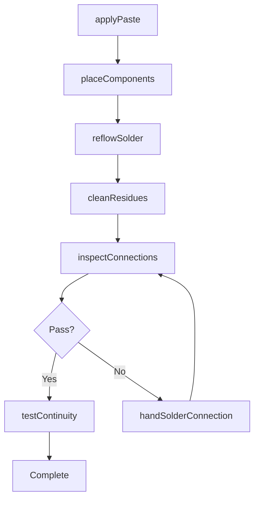
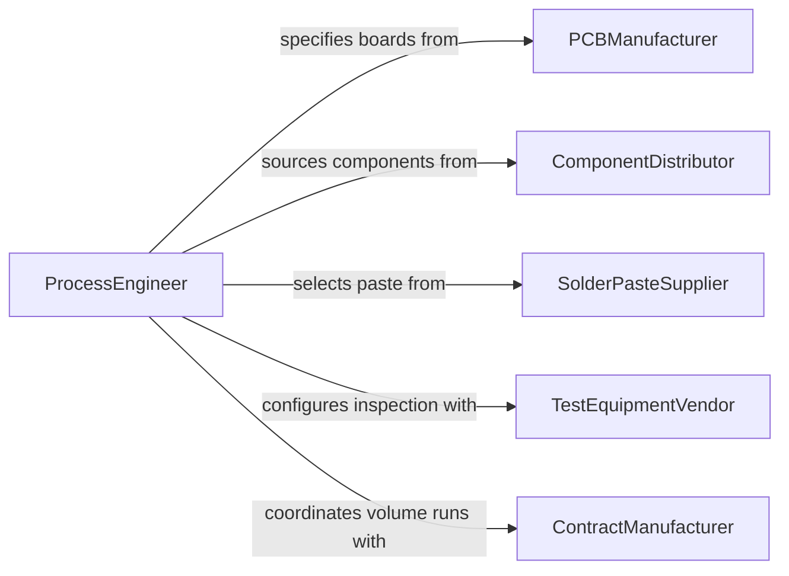

# Solder Parts Connections Between Parts

> Business-as-Code definition for soldering parts and connections between components. Models the workflow for preparing interconnects, applying solder paste, reflowing or hand-soldering connections, and verifying electrical or mechanical continuity.

## Overview

Soldering parts and connections between components involves creating electrically conductive or mechanically sound joints between circuit board components, wire terminations, and connector pins. This activity is central to electronics manufacturing, wire harness assembly, and PCB production using both hand soldering and automated reflow processes. The definition provides actions for interconnect preparation, solder application, and continuity verification, along with events for defect tracking and production quality management.

## Actors

| Actor | Description |
|-------|-------------|
| PCBManufacturer | Supplies bare circuit boards with solder pads and through-holes |
| ComponentDistributor | Provides electronic components, connectors, and terminals |
| SolderPasteSupplier | Provides solder paste, flux, and preforms for reflow processes |
| TestEquipmentVendor | Supplies in-circuit testers, AOI systems, and X-ray inspection units |
| ContractManufacturer | Outsources soldering work for high-volume production runs |

## Roles

| Role | Description |
|------|-------------|
| ElectronicsSolderingTechnician | Performs hand soldering and rework on circuit assemblies |
| SMTLineOperator | Operates stencil printers, pick-and-place machines, and reflow ovens |
| ProcessEngineer | Develops solder paste profiles and reflow temperature curves |
| QualityInspector | Conducts AOI, X-ray, and visual inspection of solder connections |

## Entities

| Entity | Description |
|--------|-------------|
| SolderConnection | An individual soldered joint between a component lead and pad |
| SolderPaste | A mixture of powdered solder and flux applied via stencil printing |
| ReflowProfile | A temperature-time curve controlling the reflow soldering process |
| CircuitAssembly | A populated PCB with soldered components |
| StencilMask | A metal template for applying solder paste to PCB pads |
| ContinuityTest | A measurement verifying electrical connectivity through solder joints |

## Actions

| Action | Description |
|--------|-------------|
| applyPaste | Print solder paste onto PCB pads using a stencil mask |
| placeComponents | Position components onto pasted pads using pick-and-place or by hand |
| reflowSolder | Pass the assembly through a reflow oven following the temperature profile |
| handSolderConnection | Apply solder to individual joints using a soldering iron |
| cleanResidues | Remove flux residues from the soldered assembly |
| inspectConnections | Examine solder joints using AOI, X-ray, or visual methods |
| testContinuity | Verify electrical connectivity and resistance across soldered connections |

## Events

| Event | Description |
|-------|-------------|
| pasteApplied | Solder paste deposited on PCB pads via stencil printing |
| componentsPlaced | All components positioned on the solder-pasted board |
| reflowCompleted | Assembly passed through the reflow oven and solder solidified |
| handSoldered | Individual connections completed by hand soldering |
| residuesCleaned | Flux residues removed from the finished assembly |
| connectionsInspected | Solder joints examined and defects identified |
| continuityVerified | Electrical connectivity confirmed across all connections |

## Searches

| Search | Description |
|--------|-------------|
| findAssemblies | List circuit assemblies by board revision, status, or production lot |
| getDefectRates | Retrieve defect statistics by component type, pad, or reflow profile |
| getReflowProfiles | Look up temperature profiles by solder paste type and board thickness |
| findReworkQueue | Search assemblies requiring hand solder rework |

## Workflow



## Actor Relationships



## Usage

### Calling Actions

```typescript
import { solderPartsConnectionsBetweenParts } from '@headlessly/solder-parts-connections-between-parts'

const soldering = solderPartsConnectionsBetweenParts()

// Apply solder paste to a PCB
const paste = await soldering.applyPaste({
  boardId: 'PCB-rev-C-0044',
  stencilId: 'stencil-rev-C',
  pasteType: 'SAC305',
  thickness: 0.005
})

// Place components and reflow
await soldering.placeComponents({
  boardId: paste.boardId,
  componentCount: 248,
  method: 'pick-and-place'
})

await soldering.reflowSolder({
  boardId: paste.boardId,
  profileId: 'SAC305-standard',
  peakTemp: 245,
  dwellTime: 60
})

// Test connectivity
const test = await soldering.testContinuity({
  assemblyId: paste.boardId,
  testPoints: 'full-net',
  maxResistance: 0.5
})
```

### Event-Driven Automation

```typescript
// Route to rework queue on inspection failure
soldering.connectionsInspected(async ({ assemblyId, passed, defects }) => {
  if (!passed) {
    await addToReworkQueue({
      assemblyId,
      defects,
      reworkType: 'hand-solder-touchup'
    })
  }
})

// Update production metrics on successful continuity test
soldering.continuityVerified(async ({ assemblyId, allPassed, failedNets }) => {
  await updateProductionMetrics({
    assemblyId,
    status: allPassed ? 'passed' : 'failed',
    failedConnections: failedNets.length
  })
})
```
