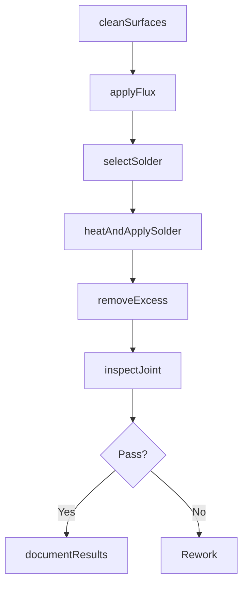
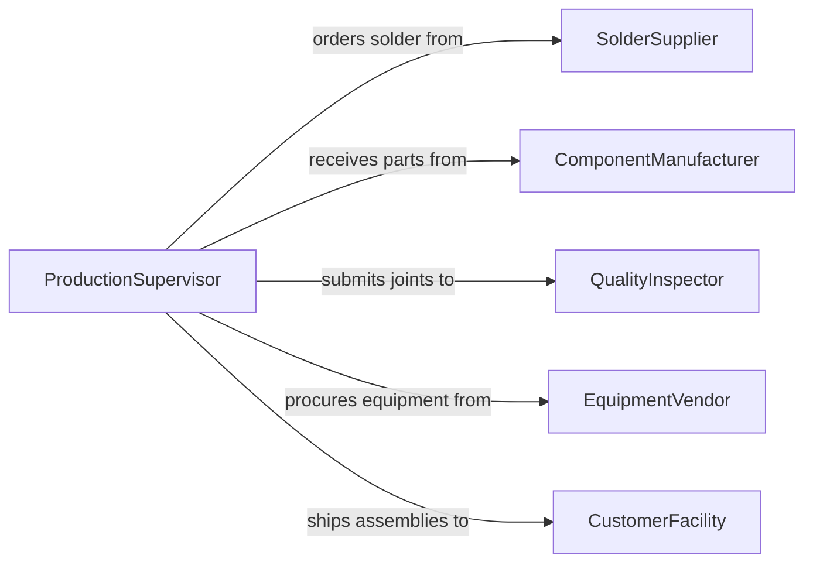

# Solder Parts Workpieces

> Business-as-Code definition for soldering parts and workpieces. Models the workflow for surface preparation, flux application, solder selection, heating, and joint inspection in electronics, plumbing, and metal fabrication.

## Overview

Soldering parts and workpieces involves joining metal components using a filler metal (solder) that melts below 840 degrees Fahrenheit without melting the base materials. This activity is used in electronics assembly, plumbing, sheet metal work, jewelry making, and HVAC fabrication. The definition provides actions for surface cleaning, solder application, and joint verification, along with events for production tracking and quality assurance across hand soldering and machine soldering operations.

## Actors

| Actor | Description |
|-------|-------------|
| SolderSupplier | Provides solder wire, paste, and flux in various alloy compositions |
| ComponentManufacturer | Supplies parts and workpieces requiring solder joints |
| QualityInspector | Examines solder joints for proper wetting, fill, and appearance |
| EquipmentVendor | Supplies soldering irons, stations, and reflow ovens |
| CustomerFacility | Receives finished soldered assemblies for integration |

## Roles

| Role | Description |
|------|-------------|
| SolderingTechnician | Performs hand or machine soldering operations |
| ProductionSupervisor | Manages soldering workflow and throughput targets |
| ProcessEngineer | Develops soldering profiles, temperatures, and technique standards |
| InspectionTechnician | Conducts visual and X-ray inspection of solder joints |

## Entities

| Entity | Description |
|--------|-------------|
| SolderJoint | A connection formed by melted solder between two metal surfaces |
| Solder | A fusible alloy such as tin-lead, lead-free SAC, or silver solder |
| Flux | A chemical agent promoting solder flow and preventing oxidation |
| Workpiece | A metal part or assembly receiving solder connections |
| SolderingProfile | Temperature and time parameters for the soldering process |
| InspectionRecord | Documentation of joint quality measurements and acceptance |

## Actions

| Action | Description |
|--------|-------------|
| cleanSurfaces | Remove oxidation, grease, and contaminants from joint areas |
| applyFlux | Coat mating surfaces with flux to promote solder wetting |
| selectSolder | Choose the appropriate solder alloy for the materials and application |
| heatAndApplySolder | Bring the joint to soldering temperature and flow solder into the connection |
| removeExcess | Clean residual flux and trim excess solder from completed joints |
| inspectJoint | Examine the solder joint for proper wetting, fillet formation, and continuity |
| documentResults | Record joint quality data and pass/fail disposition |

## Events

| Event | Description |
|-------|-------------|
| surfacesCleaned | Joint surfaces prepared and free of contaminants |
| fluxApplied | Flux coating applied to mating surfaces |
| solderSelected | Solder alloy chosen and matched to the procedure |
| solderApplied | Solder flowed into the joint and connection formed |
| excessRemoved | Residual flux and excess solder cleaned from the joint |
| jointInspected | Solder joint examined and quality determination made |
| resultsDocumented | Inspection data and disposition recorded |

## Searches

| Search | Description |
|--------|-------------|
| findSolderingJobs | List soldering jobs by assembly, status, or production line |
| getSolderInventory | Retrieve available solder alloys by type and quantity |
| getInspectionResults | Look up joint inspection outcomes by batch or workpiece |
| findSolderingProfiles | Search temperature profiles by solder type and base material |

## Workflow



## Actor Relationships



## Usage

### Calling Actions

```typescript
import { solderPartsWorkpieces } from '@headlessly/solder-parts-workpieces'

const soldering = solderPartsWorkpieces()

// Clean copper pipe surfaces for a plumbing joint
const surfaces = await soldering.cleanSurfaces({
  workpieceId: 'copper-tee-assembly',
  method: 'emery-cloth',
  material: 'copper'
})

// Select solder and apply
await soldering.selectSolder({
  jointId: surfaces.jointId,
  alloy: '95Sn-5Sb',
  form: 'wire',
  diameter: 0.125
})

await soldering.heatAndApplySolder({
  jointId: surfaces.jointId,
  heatSource: 'propane-torch',
  targetTemp: 450,
  technique: 'capillary-feed'
})
```

### Event-Driven Automation

```typescript
// Schedule inspection when solder is applied
soldering.solderApplied(async ({ jointId, workpieceId }) => {
  await scheduleInspection({
    jointId,
    workpieceId,
    type: 'visual-solder',
    standard: 'IPC-A-610'
  })
})

// Alert on inspection failure
soldering.jointInspected(async ({ jointId, passed, defects }) => {
  if (!passed) {
    await createReworkOrder({
      jointId,
      defects,
      action: 'desolder-and-reflow'
    })
  }
})
```
