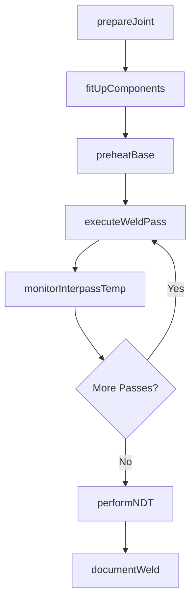
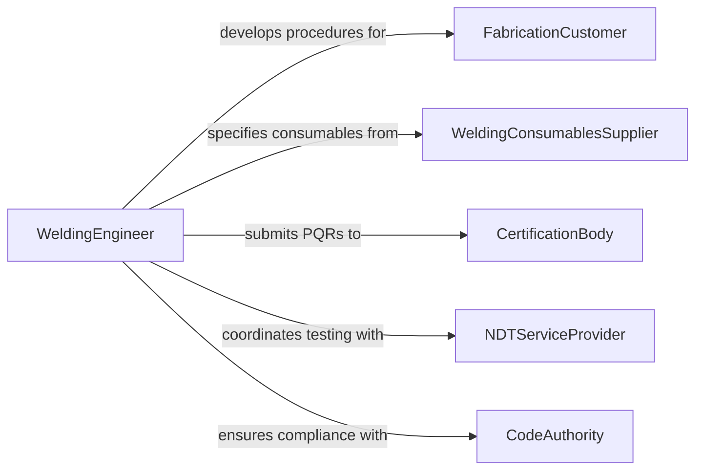

# Weld Metal Components

> Business-as-Code definition for welding metal components. Models the complete workflow from joint preparation and fit-up through multi-pass welding, interpass temperature management, and non-destructive testing.

## Overview

Welding metal components involves fusing base metals together using heat generated by an electric arc, gas flame, or resistance to create a permanent metallurgical bond. This activity covers structural steel fabrication, pressure vessel construction, pipeline assembly, and general manufacturing welding using processes such as SMAW, GMAW, GTAW, and FCAW. The definition provides actions for joint preparation, weld execution, and post-weld inspection, along with events for certification tracking and quality documentation per AWS D1.1 or ASME Section IX standards.

## Actors

| Actor | Description |
|-------|-------------|
| FabricationCustomer | Commissions welded assemblies and provides design specifications |
| WeldingConsumablesSupplier | Provides electrodes, wire, flux, and shielding gases |
| CertificationBody | Issues welder performance qualifications and procedure approvals |
| NDTServiceProvider | Performs radiographic, ultrasonic, or magnetic particle testing |
| CodeAuthority | Enforces welding codes such as AWS D1.1 or ASME Section IX |

## Roles

| Role | Description |
|------|-------------|
| CertifiedWelder | Executes welds per qualified welding procedure specifications |
| WeldingInspector | Performs visual and dimensional inspection of completed welds |
| WeldingEngineer | Develops and qualifies welding procedure specifications |
| FitUpTechnician | Prepares joints, tack welds, and aligns components for welding |

## Entities

| Entity | Description |
|--------|-------------|
| WeldJoint | A connection formed by fusing base metals with or without filler |
| WeldingProcedureSpecification | A WPS document detailing process, parameters, and technique |
| ProcedureQualificationRecord | Test results qualifying a welding procedure |
| WelderQualification | A performance qualification record for a specific welder |
| NDTReport | Non-destructive testing results for a welded joint |
| WeldMap | A drawing showing weld locations, symbols, and sequence |

## Actions

| Action | Description |
|--------|-------------|
| prepareJoint | Bevel, grind, and clean the joint surfaces per the WPS |
| fitUpComponents | Align and tack-weld components with proper root opening and alignment |
| preheatBase | Apply preheat to base metals when required by the procedure |
| executeWeldPass | Run a single weld pass depositing filler metal into the joint |
| monitorInterpassTemp | Check and maintain interpass temperature within specified limits |
| performNDT | Conduct non-destructive testing on completed welds |
| documentWeld | Record weld parameters, welder ID, and inspection results |

## Events

| Event | Description |
|-------|-------------|
| jointPrepared | Joint surfaces beveled, cleaned, and ready for fit-up |
| componentsFitUp | Parts aligned, tack-welded, and approved for welding |
| basePreheated | Base metals brought to required preheat temperature |
| weldPassCompleted | A single weld pass deposited and interpass temp recorded |
| weldCompleted | All passes deposited and final weld cap applied |
| ndtCompleted | Non-destructive testing performed and results available |
| weldDocumented | Complete weld record filed with parameters and inspection data |

## Searches

| Search | Description |
|--------|-------------|
| findWeldJobs | List welding jobs by project, joint type, or status |
| getWelderQualifications | Retrieve welder certifications by process, position, and expiration |
| getNDTResults | Look up non-destructive test results by joint or project |
| findWPSDocuments | Search welding procedure specifications by material and process |

## Workflow



## Actor Relationships



## Usage

### Calling Actions

```typescript
import { weldMetalComponents } from '@headlessly/weld-metal-components'

const welding = weldMetalComponents()

// Prepare a V-groove butt joint
const joint = await welding.prepareJoint({
  projectId: 'bridge-span-7',
  material: 'A572-Grade-50',
  thickness: 0.75,
  bevelAngle: 37.5,
  rootOpening: 0.125
})

// Fit up and tack weld
await welding.fitUpComponents({
  jointId: joint.id,
  alignment: 'within-1/16',
  tackWelds: 4,
  spacing: 12
})

// Execute multi-pass weld
for (let pass = 1; pass <= 4; pass++) {
  await welding.executeWeldPass({
    jointId: joint.id,
    passNumber: pass,
    process: 'SMAW',
    electrode: 'E7018',
    amperage: 130,
    welderId: 'cw-2026-088'
  })
}
```

### Event-Driven Automation

```typescript
// Schedule NDT when weld is completed
welding.weldCompleted(async ({ jointId, projectId, welderId }) => {
  await scheduleNDT({
    jointId,
    projectId,
    testMethods: ['radiographic', 'ultrasonic'],
    priority: 'standard'
  })
})

// Alert on NDT rejection
welding.ndtCompleted(async ({ jointId, passed, indications }) => {
  if (!passed) {
    await notify({
      to: 'welding-engineer',
      message: `Joint ${jointId} NDT rejected: ${indications.join(', ')}`
    })
  }
})
```
