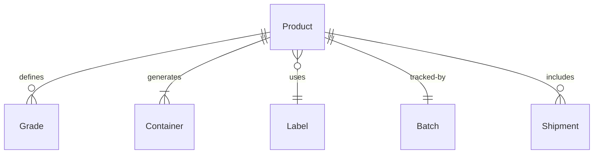
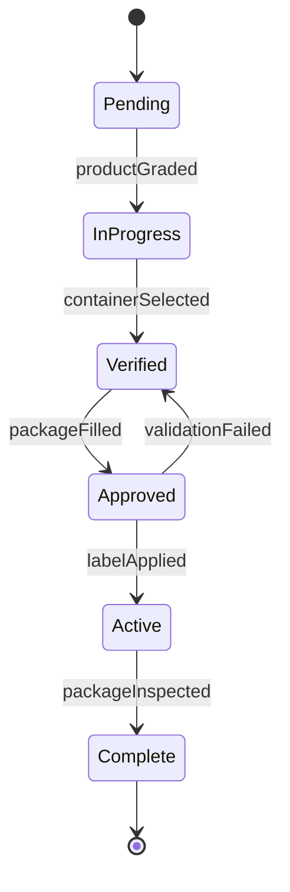
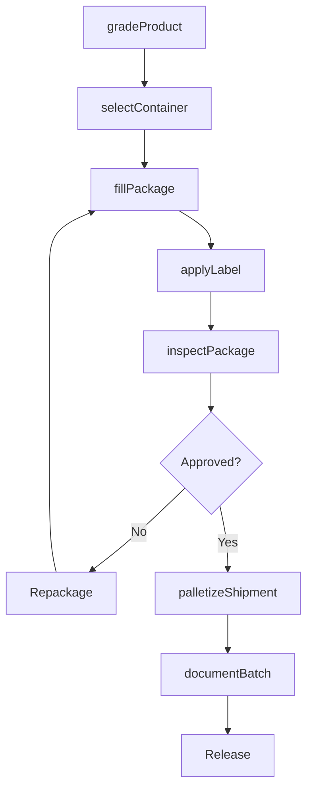
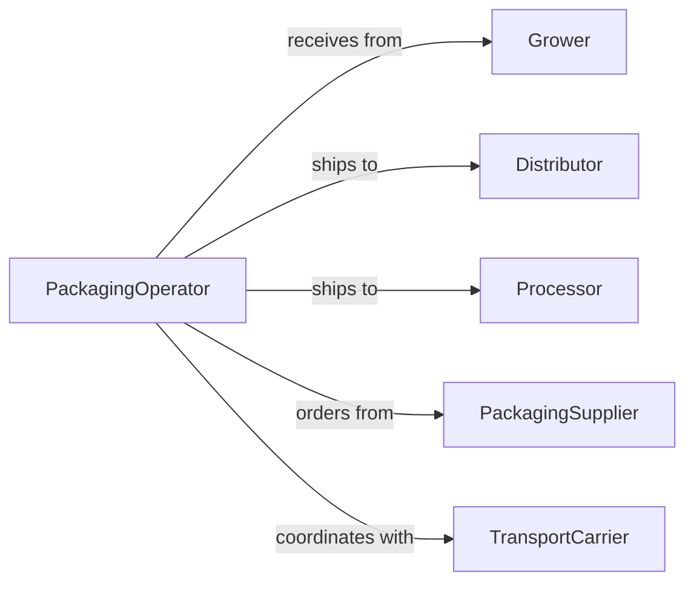

# Package Agricultural Products Shipment Further

> Business-as-Code definition for agricultural product packaging operations. Models the complete packaging workflow from grading through labeling for distribution or processing.

## Overview

Agricultural product packaging involves sorting, grading, protecting, and labeling fresh produce, grains, and farm products for shipment to processors, distributors, or retailers. This definition exposes actions for quality assessment, packaging selection, execution, and traceability across diverse product types and destination requirements.

## Actors

| Actor | Description |
|-------|-------------|
| Grower | Produces agricultural products for packaging |
| Distributor | Receives packaged products for resale |
| Processor | Transforms products into finished goods |
| PackagingSupplier | Provides containers, labels, and materials |
| TransportCarrier | Ships packaged products to destinations |
| InspectionService | Verifies quality and regulatory compliance |

## Roles

| Role | Description |
|------|-------------|
| PackagingOperator | Executes packaging operations |
| QualityGrader | Assesses product quality and grades |
| InventoryManager | Tracks packaged products and materials |
| ShippingCoordinator | Arranges transport and documentation |

## Entities

| Entity | Description |
|--------|-------------|
| Product | Agricultural commodity for packaging |
| Grade | Quality classification of product |
| Container | Box, bag, or crate for packaging |
| Label | Identification and regulatory information |
| Batch | Group of products packaged together |
| Shipment | Packaged products prepared for transport |

## Actions

| Action | Description |
|--------|-------------|
| gradeProduct | Assess quality and assign classification |
| selectContainer | Choose appropriate packaging for product |
| fillPackage | Place products into containers |
| applyLabel | Attach identification and compliance information |
| inspectPackage | Verify packaging meets standards |
| palletizeShipment | Organize packages for transport |
| documentBatch | Record traceability and quality data |

## Events

| Event | Description |
|-------|-------------|
| productGraded | Quality assessment completed |
| containerSelected | Packaging type chosen |
| packageFilled | Products placed in containers |
| labelApplied | Identification attached to package |
| packageInspected | Quality verification completed |
| shipmentPalletized | Packages organized for transport |
| batchDocumented | Traceability records created |

## Searches

| Search | Description |
|--------|-------------|
| findProducts | List agricultural items by type or grade |
| getBatches | Retrieve packaging runs by date or product |
| getShipments | Find palletized packages by destination |
| getLabels | List packaging labels by compliance standard |
| getGrades | Retrieve quality classifications by product |


## Entity Relationships



## State Diagram


## Workflow



## Actor Relationships



## Usage

### Calling Actions

```typescript
import { packageAgriculturalProductsShipmentFurther } from '@headlessly/package-agricultural-products-shipment-further'

const agPackaging = packageAgriculturalProductsShipmentFurther()

// Grade incoming products
const grading = await agPackaging.gradeProduct({
  productType: 'apples',
  variety: 'honeycrisp',
  quantity: 500,
  criteria: ['size', 'color', 'blemishes', 'firmness']
})

// Select appropriate packaging
const container = await agPackaging.selectContainer({
  productType: 'apples',
  grade: grading.grade,
  destination: 'retail-distribution',
  weight: 40
})

// Execute packaging workflow
const batch = await agPackaging.fillPackage({
  gradingId: grading.id,
  containerId: container.id,
  count: 12,
  weight: 40
})

await agPackaging.applyLabel({
  batchId: batch.id,
  labelData: {
    product: 'Honeycrisp Apples',
    grade: 'Fancy',
    weight: '40 lbs',
    origin: 'Washington State',
    harvestDate: '2026-02-01',
    lot: 'LOT-2026-0205-HC'
  }
})

// Inspect and prepare for shipment
const inspection = await agPackaging.inspectPackage({
  batchId: batch.id,
  checks: ['label-accuracy', 'container-integrity', 'weight-compliance']
})

await agPackaging.palletizeShipment({
  batchIds: [batch.id],
  palletConfig: { layers: 5, boxesPerLayer: 10 }
})
```

### Event-Driven Automation

```typescript
// Auto-select container based on grading results
agPackaging.productGraded(async ({ productType, grade, quantity }) => {
  await agPackaging.selectContainer({
    productType,
    grade,
    destination: getDestinationForGrade(grade),
    weight: calculateContainerWeight(quantity)
  })
})

// Alert if inspection fails packaging standards
agPackaging.packageInspected(async ({ batchId, passed, issues }) => {
  if (!passed) {
    await notify({
      to: 'quality-grader',
      message: `Batch ${batchId} failed inspection: ${issues.join(', ')}`
    })
    await agPackaging.documentBatch({
      batchId,
      status: 'rejected',
      reason: issues[0]
    })
  }
})
```
