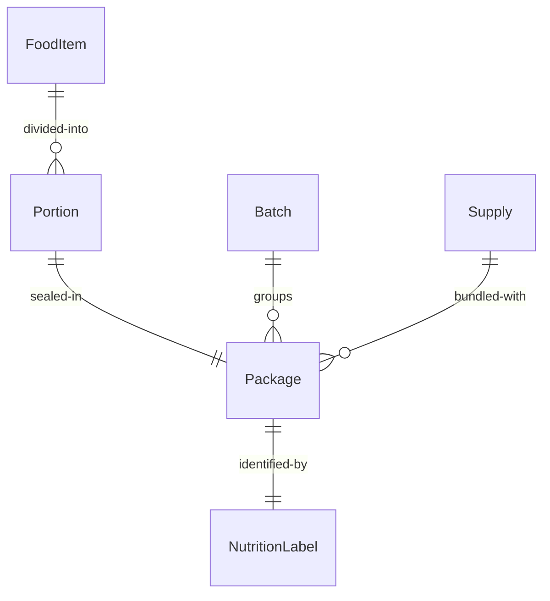
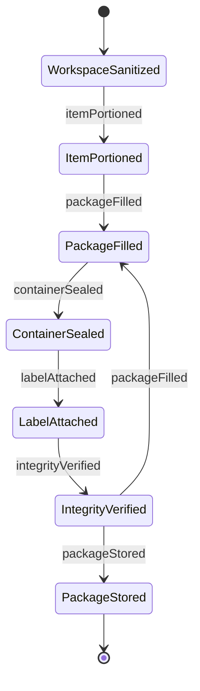
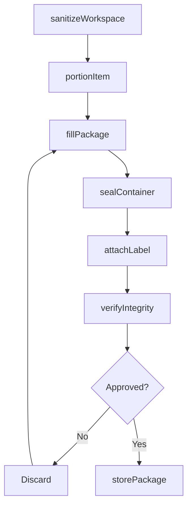
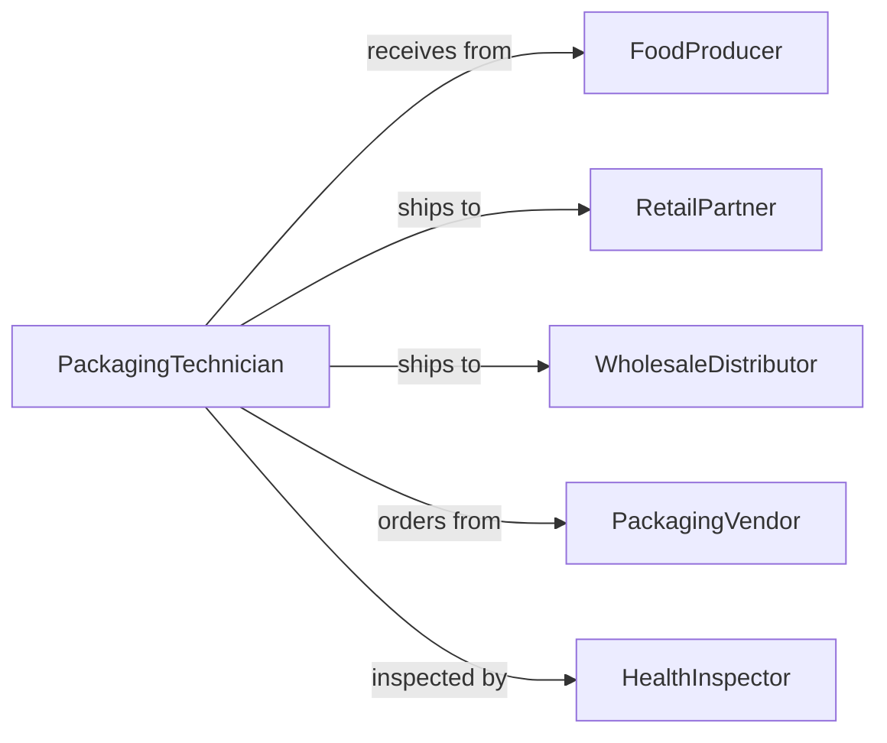

# Package Food Supplies

> Business-as-Code definition for food and supply packaging operations. Models the complete packaging process from preparation through sealing for distribution and consumption.

## Overview

Food and supply packaging involves protecting, preserving, and preparing consumable products and materials for storage, transport, and end-use. This definition exposes actions for sanitation, portion control, sealing, labeling, and quality assurance across prepared foods, ingredients, and emergency supplies.

## Actors

| Actor | Description |
|-------|-------------|
| FoodProducer | Manufactures or prepares food items |
| Consumer | Receives packaged food or supplies |
| RetailPartner | Distributes packaged goods to end customers |
| PackagingVendor | Supplies containers, films, and sealing materials |
| HealthInspector | Verifies food safety compliance |
| WholesaleDistributor | Purchases bulk packaged supplies |

## Roles

| Role | Description |
|------|-------------|
| PackagingTechnician | Executes packaging operations |
| FoodSafetyOfficer | Ensures compliance with safety standards |
| PortionController | Manages serving sizes and weights |
| WarehouseManager | Oversees packaged inventory |

## Entities

| Entity | Description |
|--------|-------------|
| FoodItem | Consumable product for packaging |
| Supply | Non-food item requiring packaging |
| Portion | Individual serving or unit |
| Package | Container with sealed contents |
| NutritionLabel | Required food information |
| Batch | Group of items packaged together |

## Actions

| Action | Description |
|--------|-------------|
| sanitizeWorkspace | Clean and prepare packaging area |
| portionItem | Divide food into individual servings |
| fillPackage | Place items into containers |
| sealContainer | Close and secure package |
| attachLabel | Apply nutrition and identification information |
| verifyIntegrity | Inspect seal and packaging quality |
| storePackage | Move completed packages to inventory |

## Events

| Event | Description |
|-------|-------------|
| workspaceSanitized | Packaging area prepared |
| itemPortioned | Food divided into servings |
| packageFilled | Items placed in containers |
| containerSealed | Package closed and secured |
| labelAttached | Information applied to package |
| integrityVerified | Quality inspection completed |
| packageStored | Inventory updated with completed packages |

## Searches

| Search | Description |
|--------|-------------|
| findFoodItems | List products by type or expiration |
| getPortions | Retrieve serving sizes by product |
| getPackages | Find completed packages by batch or date |
| getBatches | List packaging runs by operator or shift |
| getLabels | Retrieve nutrition information by product |


## Entity Relationships



## State Diagram


## Workflow



## Actor Relationships



## Usage

### Calling Actions

```typescript
import { packageFoodSupplies } from '@headlessly/package-food-supplies'

const foodPackaging = packageFoodSupplies()

// Prepare workspace and portion food
await foodPackaging.sanitizeWorkspace({
  area: 'line-3',
  protocol: 'food-grade-sanitation',
  verification: true
})

const portions = await foodPackaging.portionItem({
  foodItemId: 'FI-8472',
  servingSize: 12,
  unit: 'ounce',
  count: 100
})

// Package and seal
for (const portion of portions.items) {
  await foodPackaging.fillPackage({
    portionId: portion.id,
    containerType: 'plastic-tray',
    additionalItems: ['utensils', 'napkin']
  })

  const sealed = await foodPackaging.sealContainer({
    portionId: portion.id,
    sealType: 'heat-seal',
    temperature: 350,
    pressure: 40
  })

  await foodPackaging.attachLabel({
    packageId: sealed.id,
    nutritionFacts: {
      servingSize: '12 oz',
      calories: 420,
      protein: 28,
      carbs: 45,
      fat: 12
    },
    expirationDate: '2026-02-12',
    allergens: ['wheat', 'soy']
  })

  await foodPackaging.verifyIntegrity({
    packageId: sealed.id,
    checks: ['seal-strength', 'label-adhesion', 'container-integrity']
  })
}
```

### Event-Driven Automation

```typescript
// Auto-label after sealing
foodPackaging.containerSealed(async ({ packageId, foodItemId }) => {
  const nutritionData = await getNutritionFacts(foodItemId)
  await foodPackaging.attachLabel({
    packageId,
    nutritionFacts: nutritionData,
    expirationDate: calculateExpiration(foodItemId)
  })
})

// Alert if seal integrity fails
foodPackaging.integrityVerified(async ({ packageId, passed, issues }) => {
  if (!passed) {
    await notify({
      to: 'food-safety-officer',
      message: `Package ${packageId} failed integrity check: ${issues.join(', ')}`
    })
    await quarantine({ packageId })
  } else {
    await foodPackaging.storePackage({ packageId })
  }
})
```
