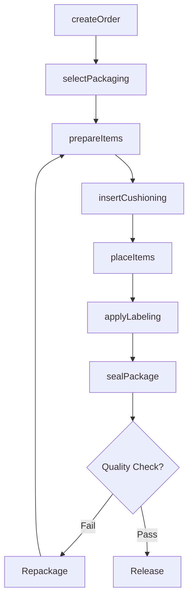
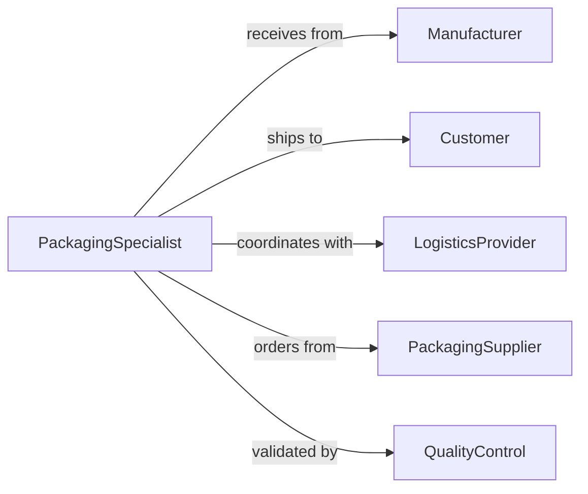

# Package Materials Products

> Business-as-Code definition for general material and product packaging operations. Models the complete packaging workflow from selection through protection for various goods and materials.

## Overview

Material and product packaging encompasses the protection, containment, and preparation of manufactured goods, raw materials, and finished products for storage, handling, and distribution. This definition exposes actions for packaging selection, execution, protection, and documentation across diverse product categories and distribution channels.

## Actors

| Actor | Description |
|-------|-------------|
| Manufacturer | Produces goods requiring packaging |
| Customer | Orders and receives packaged products |
| LogisticsProvider | Transports packaged materials |
| PackagingSupplier | Provides boxes, cushioning, and materials |
| QualityControl | Verifies packaging meets standards |
| RegulatoryCounseling | Ensures compliance with labeling regulations |

## Roles

| Role | Description |
|------|-------------|
| PackagingSpecialist | Executes packaging operations |
| MaterialsPlanner | Manages packaging inventory |
| ShippingCoordinator | Prepares packages for transport |
| ComplianceOfficer | Ensures regulatory adherence |

## Entities

| Entity | Description |
|--------|-------------|
| Material | Raw or intermediate goods for packaging |
| Product | Finished goods requiring packaging |
| Container | Box, crate, or wrapper for contents |
| Cushioning | Protective material to prevent damage |
| Label | Identification and handling instructions |
| PackagingOrder | Request to package specific items |

## Actions

| Action | Description |
|--------|-------------|
| createOrder | Initialize packaging request for items |
| selectPackaging | Choose appropriate container and materials |
| prepareItems | Organize products for packaging |
| insertCushioning | Add protective materials to container |
| placeItems | Position products in packaging |
| applyLabeling | Attach identification and handling instructions |
| sealPackage | Close and secure container for transport |

## Events

| Event | Description |
|-------|-------------|
| orderCreated | Packaging request initialized |
| packagingSelected | Container and materials chosen |
| itemsPrepared | Products organized for packaging |
| cushioningInserted | Protective materials added |
| itemsPlaced | Products positioned in container |
| labelingApplied | Information attached to package |
| packageSealed | Container closed and secured |

## Searches

| Search | Description |
|--------|-------------|
| findOrders | List packaging requests by status or date |
| getProducts | Retrieve items by category or destination |
| getContainers | Find packaging by size or material type |
| getLabels | List identification by compliance standard |
| getPackages | Retrieve completed packages by order or batch |

## Workflow



## Actor Relationships



## Usage

### Calling Actions

```typescript
import { packageMaterialsProducts } from '@headlessly/package-materials-products'

const packaging = packageMaterialsProducts()

// Create packaging order
const order = await packaging.createOrder({
  productIds: ['PROD-8472', 'PROD-8473', 'PROD-8474'],
  destination: 'warehouse-east',
  priority: 'standard',
  requiredBy: '2026-02-10'
})

// Select appropriate packaging materials
const selection = await packaging.selectPackaging({
  orderId: order.id,
  criteria: {
    size: 'large',
    strength: 'heavy-duty',
    weatherResistance: true
  }
})

// Prepare and package items
await packaging.prepareItems({
  orderId: order.id,
  grouping: 'by-fragility',
  inspection: true
})

await packaging.insertCushioning({
  orderId: order.id,
  material: 'bubble-wrap',
  coverage: 'full'
})

await packaging.placeItems({
  orderId: order.id,
  arrangement: 'heaviest-bottom',
  orientation: 'upright'
})

await packaging.applyLabeling({
  orderId: order.id,
  labels: {
    shipTo: 'Warehouse East, 123 Industrial Pkwy',
    shipFrom: 'Manufacturing Plant 7',
    handling: ['Fragile', 'Keep Dry', 'This Side Up'],
    weight: '45 lbs'
  }
})

const sealed = await packaging.sealPackage({
  orderId: order.id,
  method: 'tape-seal',
  verification: true
})
```

### Event-Driven Automation

```typescript
// Auto-select packaging based on product dimensions
packaging.orderCreated(async ({ orderId, productIds }) => {
  const products = await getProducts(productIds)
  const dimensions = calculateTotalDimensions(products)

  await packaging.selectPackaging({
    orderId,
    criteria: {
      size: selectSizeForDimensions(dimensions),
      strength: selectStrengthForWeight(products.totalWeight)
    }
  })
})

// Alert if packaging order exceeds weight limit
packaging.itemsPlaced(async ({ orderId, totalWeight }) => {
  const MAX_WEIGHT = 70

  if (totalWeight > MAX_WEIGHT) {
    await notify({
      to: 'packaging-specialist',
      message: `Order ${orderId} exceeds weight limit: ${totalWeight} lbs > ${MAX_WEIGHT} lbs. Split required.`
    })
  }
})
```
