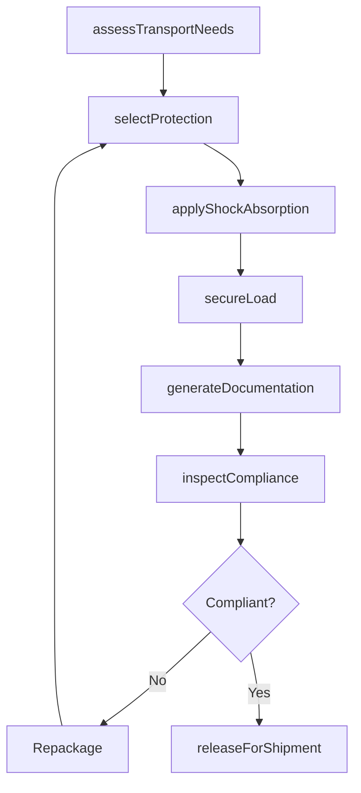
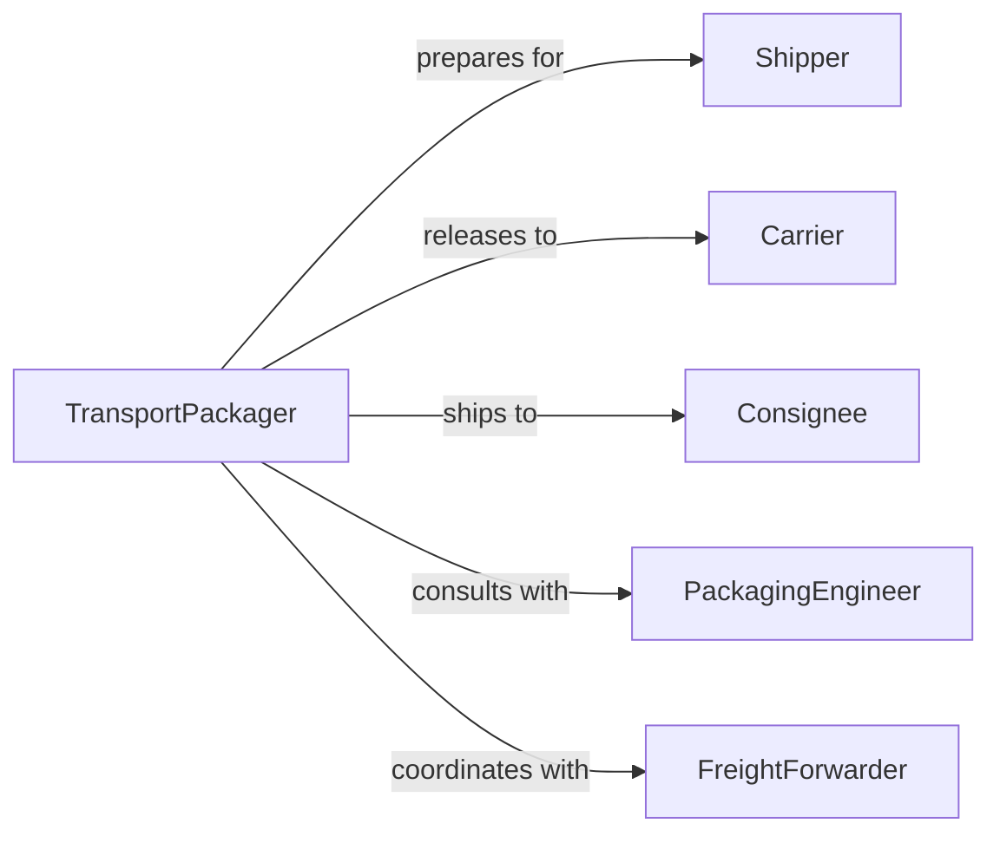

# Package Materials Transport

> Business-as-Code definition for transport-focused material packaging operations. Models packaging workflows optimized for shipping, handling, and transit protection.

## Overview

Transport-focused material packaging involves preparing goods for the rigors of shipping, handling, and delivery across various transportation modes. This definition exposes actions for transport assessment, protective packaging, load securing, and documentation to ensure safe arrival and regulatory compliance.

## Actors

| Actor | Description |
|-------|-------------|
| Shipper | Sends materials via transport services |
| Carrier | Provides freight or parcel transport |
| Consignee | Receives materials at destination |
| PackagingEngineer | Designs transport-specific packaging solutions |
| FreightForwarder | Coordinates international shipments |
| CustomsAgent | Processes cross-border documentation |

## Roles

| Role | Description |
|------|-------------|
| TransportPackager | Executes transport-ready packaging |
| LoadingSpecialist | Secures packages for transit |
| DocumentationClerk | Prepares shipping paperwork |
| SafetyInspector | Verifies hazmat and safety compliance |

## Entities

| Entity | Description |
|--------|-------------|
| Shipment | Collection of materials for transport |
| TransportMode | Method of delivery such as truck, rail, air, or sea |
| ProtectivePackaging | Materials designed for transit protection |
| Pallet | Platform for unitizing packages |
| BillOfLading | Legal document of shipped goods |
| HazmatDeclaration | Safety documentation for dangerous goods |

## Actions

| Action | Description |
|--------|-------------|
| assessTransportNeeds | Evaluate materials and route requirements |
| selectProtection | Choose packaging for transport mode and distance |
| applyShockAbsorption | Add cushioning for vibration and impact protection |
| secureLoad | Fasten items to prevent shifting in transit |
| generateDocumentation | Create shipping and customs paperwork |
| inspectCompliance | Verify packaging meets transport regulations |
| releaseForShipment | Authorize package for carrier pickup |

## Events

| Event | Description |
|-------|-------------|
| transportNeedsAssessed | Materials and route evaluated |
| protectionSelected | Packaging type chosen for transport |
| shockAbsorptionApplied | Cushioning materials added |
| loadSecured | Items fastened for transit |
| documentationGenerated | Shipping paperwork created |
| complianceInspected | Regulatory verification completed |
| shipmentReleased | Package authorized for transport |

## Searches

| Search | Description |
|--------|-------------|
| findShipments | List packages by status or destination |
| getTransportModes | Retrieve shipping methods by route |
| getProtection | Find packaging materials by transport type |
| getBillsOfLading | List shipping documents by carrier or date |
| getCompliance | Retrieve inspection records by regulation |

## Workflow



## Actor Relationships



## Usage

### Calling Actions

```typescript
import { packageMaterialsTransport } from '@headlessly/package-materials-transport'

const transport = packageMaterialsTransport()

// Assess transport requirements
const assessment = await transport.assessTransportNeeds({
  materialIds: ['MAT-4872', 'MAT-4873'],
  route: {
    origin: 'Chicago, IL',
    destination: 'Los Angeles, CA',
    distance: 2015,
    duration: 48
  },
  mode: 'ltl-truck',
  specialRequirements: ['temperature-control']
})

// Select and apply protective packaging
const protection = await transport.selectProtection({
  assessmentId: assessment.id,
  criteria: {
    shockResistance: 'high',
    moistureBarrier: true,
    temperatureRange: { min: 35, max: 45 }
  }
})

await transport.applyShockAbsorption({
  assessmentId: assessment.id,
  materials: ['foam-corner-guards', 'air-pillows', 'edge-protectors'],
  coverage: 'full'
})

// Secure load and prepare documentation
await transport.secureLoad({
  assessmentId: assessment.id,
  palletConfig: {
    stackHeight: 4,
    strappingType: 'polyester',
    strappingCount: 6
  }
})

const docs = await transport.generateDocumentation({
  assessmentId: assessment.id,
  documentTypes: ['bill-of-lading', 'packing-list', 'freight-invoice']
})

// Inspect and release
const inspection = await transport.inspectCompliance({
  assessmentId: assessment.id,
  regulations: ['dot-transportation', 'iata-cargo']
})

if (inspection.compliant) {
  await transport.releaseForShipment({
    assessmentId: assessment.id,
    carrier: 'carrier-xyz',
    pickupTime: '2026-02-06T08:00:00Z'
  })
}
```

### Event-Driven Automation

```typescript
// Auto-generate documentation after load secured
transport.loadSecured(async ({ assessmentId }) => {
  await transport.generateDocumentation({
    assessmentId,
    documentTypes: ['bill-of-lading', 'packing-list']
  })
})

// Alert if compliance inspection fails
transport.complianceInspected(async ({ assessmentId, compliant, violations }) => {
  if (!compliant) {
    await notify({
      to: 'safety-inspector',
      message: `Shipment ${assessmentId} failed compliance: ${violations.join(', ')}`
    })
    await escalate({
      assessmentId,
      reason: 'non-compliant-packaging',
      priority: 'high'
    })
  }
})
```
