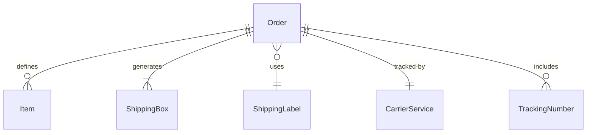
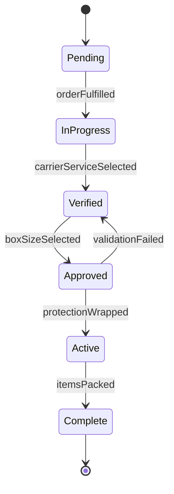
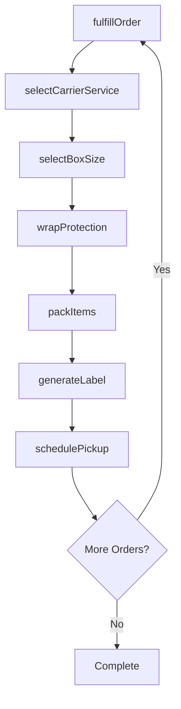
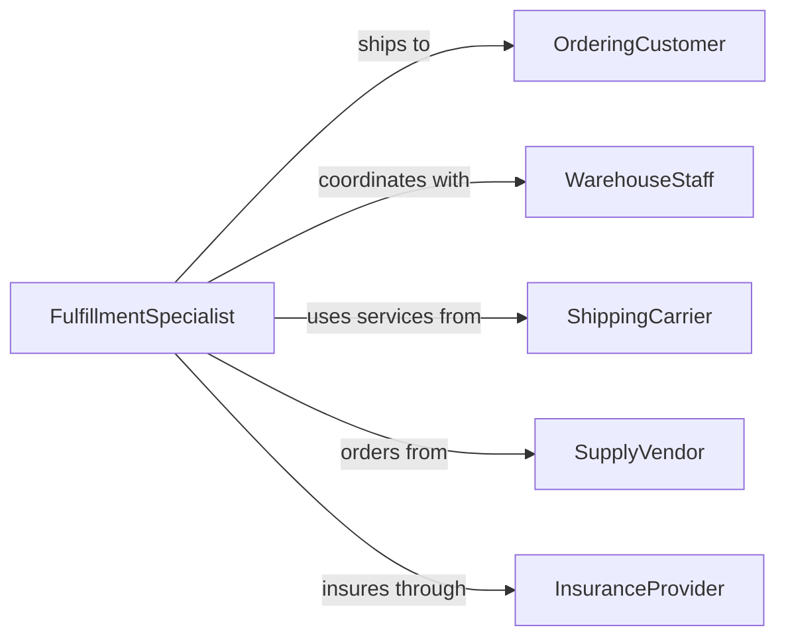

# Package Objects Shipping

> Business-as-Code definition for shipping-focused object packaging operations. Models the complete workflow from order fulfillment through carrier handoff.

## Overview

Shipping-focused object packaging encompasses the preparation of items for parcel or freight delivery, including selection of appropriate carriers, protective packaging, labeling, and documentation. This definition exposes actions for fulfillment, protection, labeling, and tracking across diverse shipping methods and service levels.

## Actors

| Actor | Description |
|-------|-------------|
| OrderingCustomer | Purchases items requiring shipment |
| WarehouseStaff | Retrieves items for shipping |
| ShippingCarrier | Provides delivery services |
| SupplyVendor | Delivers boxes, tape, and shipping materials |
| InsuranceProvider | Offers shipment protection coverage |
| TrackingService | Monitors package location and status |

## Roles

| Role | Description |
|------|-------------|
| FulfillmentSpecialist | Prepares orders for shipping |
| PackingTechnician | Executes protective packaging |
| LabelingClerk | Creates and applies shipping labels |
| ShippingManager | Coordinates carrier relationships and schedules |

## Entities

| Entity | Description |
|--------|-------------|
| Order | Customer request for shipped items |
| Item | Individual object requiring packaging |
| ShippingBox | Container sized for parcel delivery |
| ShippingLabel | Address and tracking information |
| CarrierService | Specific delivery method and speed |
| TrackingNumber | Unique identifier for shipment monitoring |

## Actions

| Action | Description |
|--------|-------------|
| fulfillOrder | Retrieve items from inventory for shipment |
| selectCarrierService | Choose shipping method based on requirements |
| selectBoxSize | Determine appropriate container dimensions |
| wrapProtection | Apply cushioning and protective materials |
| packItems | Place objects securely in shipping box |
| generateLabel | Create shipping label with address and tracking |
| schedulePickup | Arrange carrier collection of packages |

## Events

| Event | Description |
|-------|-------------|
| orderFulfilled | Items retrieved from inventory |
| carrierServiceSelected | Shipping method chosen |
| boxSizeSelected | Container dimensions determined |
| protectionWrapped | Cushioning materials applied |
| itemsPacked | Objects secured in shipping box |
| labelGenerated | Shipping label created |
| pickupScheduled | Carrier collection arranged |

## Searches

| Search | Description |
|--------|-------------|
| findOrders | List customer shipments by status or date |
| getItems | Retrieve objects by order or SKU |
| getCarrierServices | Find shipping methods by speed or cost |
| getLabels | List shipping labels by tracking number |
| getPackages | Retrieve completed shipments by carrier or date |


## Entity Relationships



## State Diagram


## Workflow



## Actor Relationships



## Usage

### Calling Actions

```typescript
import { packageObjectsShipping } from '@headlessly/package-objects-shipping'

const shipping = packageObjectsShipping()

// Fulfill customer order
const fulfillment = await shipping.fulfillOrder({
  orderId: 'ORD-28471',
  items: [
    { sku: 'SKU-001', quantity: 2 },
    { sku: 'SKU-002', quantity: 1 }
  ]
})

// Select carrier and packaging
const carrier = await shipping.selectCarrierService({
  orderId: fulfillment.orderId,
  destination: {
    address: '123 Main St',
    city: 'Seattle',
    state: 'WA',
    zip: '98101'
  },
  preferences: {
    speed: 'ground',
    insurance: true,
    signature: false
  }
})

const box = await shipping.selectBoxSize({
  orderId: fulfillment.orderId,
  itemDimensions: fulfillment.totalDimensions,
  cushioningSpace: 2
})

// Package and label
await shipping.wrapProtection({
  orderId: fulfillment.orderId,
  materials: ['bubble-wrap', 'packing-paper'],
  fragileItems: ['SKU-002']
})

await shipping.packItems({
  orderId: fulfillment.orderId,
  boxId: box.id,
  arrangement: 'heaviest-bottom'
})

const label = await shipping.generateLabel({
  orderId: fulfillment.orderId,
  carrierServiceId: carrier.id,
  returnAddress: true
})

// Schedule carrier pickup
await shipping.schedulePickup({
  carrierId: carrier.carrierId,
  pickupDate: '2026-02-06',
  packageCount: 1,
  totalWeight: box.weight
})
```

### Event-Driven Automation

```typescript
// Auto-select carrier based on order attributes
shipping.orderFulfilled(async ({ orderId, destination, weight }) => {
  const carrierService = await selectOptimalCarrier({
    destination,
    weight,
    criteria: ['cost', 'speed', 'reliability']
  })

  await shipping.selectCarrierService({
    orderId,
    carrierServiceId: carrierService.id
  })
})

// Notify customer when label generated
shipping.labelGenerated(async ({ orderId, trackingNumber }) => {
  const order = await getOrder(orderId)

  await notify({
    to: order.customerEmail,
    subject: 'Your order has shipped',
    message: `Your order ${orderId} has been shipped. Track your package: ${trackingNumber}`,
    trackingLink: `https://track.carrier.com/${trackingNumber}`
  })
})
```
