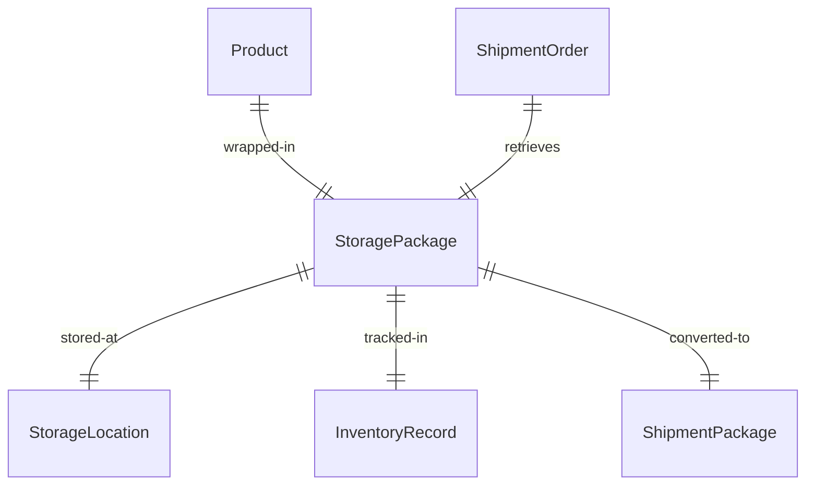
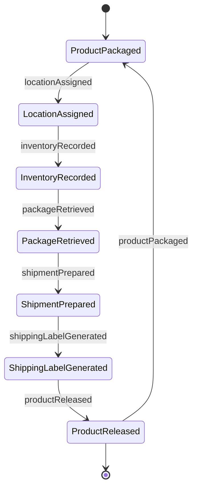
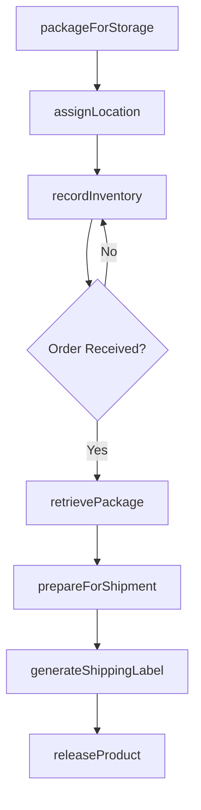
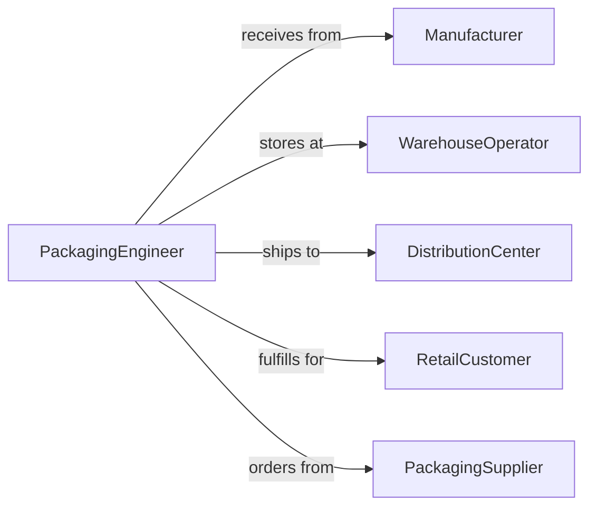

# Package Products Storage Shipment

> Business-as-Code definition for dual-purpose product packaging operations. Models packaging workflows optimized for both warehouse storage and eventual shipment.

## Overview

Dual-purpose product packaging involves preparing finished goods for intermediate storage while ensuring readiness for eventual distribution. This definition exposes actions for storage optimization, protection during warehousing, shipment preparation, and inventory management across diverse product categories and fulfillment strategies.

## Actors

| Actor | Description |
|-------|-------------|
| Manufacturer | Produces finished products for packaging |
| WarehouseOperator | Manages stored packaged products |
| DistributionCenter | Receives products for regional fulfillment |
| RetailCustomer | Orders products for shipment |
| PackagingSupplier | Provides multi-purpose packaging materials |
| LogisticsCoordinator | Plans storage and shipping strategies |

## Roles

| Role | Description |
|------|-------------|
| PackagingEngineer | Designs storage and shipping solutions |
| WarehouseTechnician | Executes packaging for storage |
| FulfillmentSpecialist | Prepares stored products for shipment |
| InventoryManager | Tracks packaged product locations and status |

## Entities

| Entity | Description |
|--------|-------------|
| Product | Finished good requiring packaging |
| StoragePackage | Container optimized for warehousing |
| ShipmentPackage | Container prepared for delivery |
| StorageLocation | Warehouse position for packaged products |
| InventoryRecord | Tracking data for packaged products |
| ShipmentOrder | Request to release stored products |

## Actions

| Action | Description |
|--------|-------------|
| packageForStorage | Prepare products for warehouse placement |
| assignLocation | Designate warehouse position for package |
| recordInventory | Document packaged product in system |
| retrievePackage | Locate and remove package from storage |
| prepareForShipment | Modify or reinforce package for delivery |
| generateShippingLabel | Create delivery documentation |
| releaseProduct | Authorize package departure from warehouse |

## Events

| Event | Description |
|-------|-------------|
| productPackaged | Item prepared for storage |
| locationAssigned | Warehouse position designated |
| inventoryRecorded | Package documented in system |
| packageRetrieved | Item removed from storage |
| shipmentPrepared | Package modified for delivery |
| shippingLabelGenerated | Delivery documentation created |
| productReleased | Package authorized for departure |

## Searches

| Search | Description |
|--------|-------------|
| findProducts | List items by category or storage status |
| getStorageLocations | Retrieve warehouse positions by zone |
| getInventoryRecords | Find packaged products by SKU or date |
| getShipmentOrders | List pending delivery requests |
| getPackages | Retrieve items by packaging type or destination |


## Entity Relationships



## State Diagram


## Workflow



## Actor Relationships



## Usage

### Calling Actions

```typescript
import { packageProductsStorageShipment } from '@headlessly/package-products-storage-shipment'

const dualPackaging = packageProductsStorageShipment()

// Package products for initial storage
const storagePackage = await dualPackaging.packageForStorage({
  productIds: ['PROD-8271', 'PROD-8272'],
  packagingType: 'corrugated-box',
  stackable: true,
  protection: 'standard'
})

// Assign warehouse location and record inventory
const location = await dualPackaging.assignLocation({
  packageId: storagePackage.id,
  zone: 'A',
  aisle: 12,
  level: 3,
  criteria: ['accessibility', 'temperature-control']
})

await dualPackaging.recordInventory({
  packageId: storagePackage.id,
  locationId: location.id,
  productDetails: {
    sku: ['SKU-001', 'SKU-002'],
    quantity: 50,
    receivedDate: new Date().toISOString()
  }
})

// When shipment order received, prepare for delivery
const shipmentOrder = await getShipmentOrder('ORD-19283')

const retrieved = await dualPackaging.retrievePackage({
  orderId: shipmentOrder.id,
  locationId: location.id
})

const shipReady = await dualPackaging.prepareForShipment({
  packageId: retrieved.packageId,
  modifications: ['reinforce-corners', 'add-cushioning'],
  destination: shipmentOrder.destination
})

const label = await dualPackaging.generateShippingLabel({
  packageId: shipReady.packageId,
  orderId: shipmentOrder.id,
  carrier: 'fedex',
  service: 'ground'
})

await dualPackaging.releaseProduct({
  packageId: shipReady.packageId,
  carrier: 'fedex',
  pickupScheduled: '2026-02-06T10:00:00Z'
})
```

### Event-Driven Automation

```typescript
// Auto-assign storage location after packaging
dualPackaging.productPackaged(async ({ packageId }) => {
  const optimalLocation = await findOptimalStorageLocation({
    packageId,
    criteria: ['proximity-to-shipping', 'accessibility']
  })

  await dualPackaging.assignLocation({
    packageId,
    locationId: optimalLocation.id
  })

  await dualPackaging.recordInventory({
    packageId,
    locationId: optimalLocation.id
  })
})

// Alert when package requires shipment preparation
dualPackaging.packageRetrieved(async ({ packageId, orderId }) => {
  const order = await getShipmentOrder(orderId)

  if (order.priority === 'express') {
    await notify({
      to: 'fulfillment-specialist',
      message: `Express order ${orderId} retrieved for package ${packageId}. Prepare immediately.`
    })
  }

  await dualPackaging.prepareForShipment({
    packageId,
    modifications: selectModificationsForRoute(order.destination)
  })
})
```
