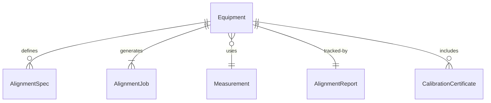
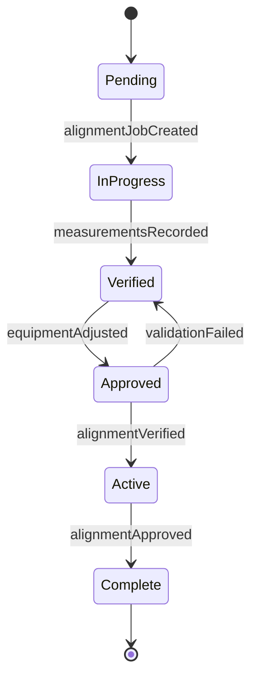
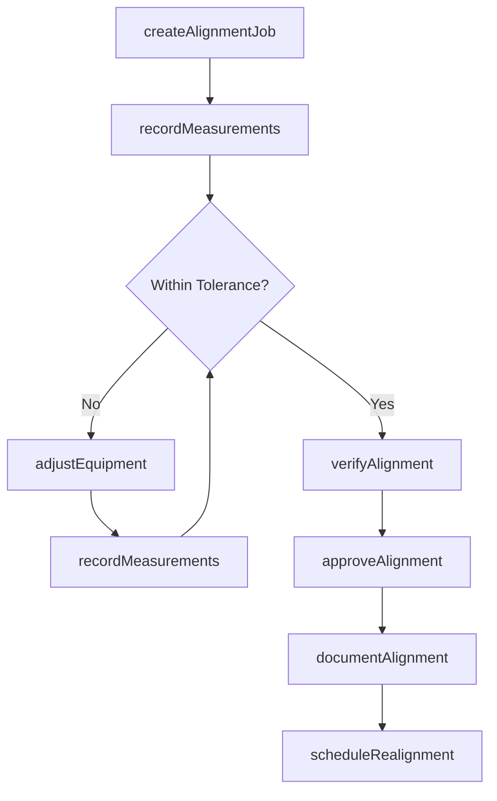
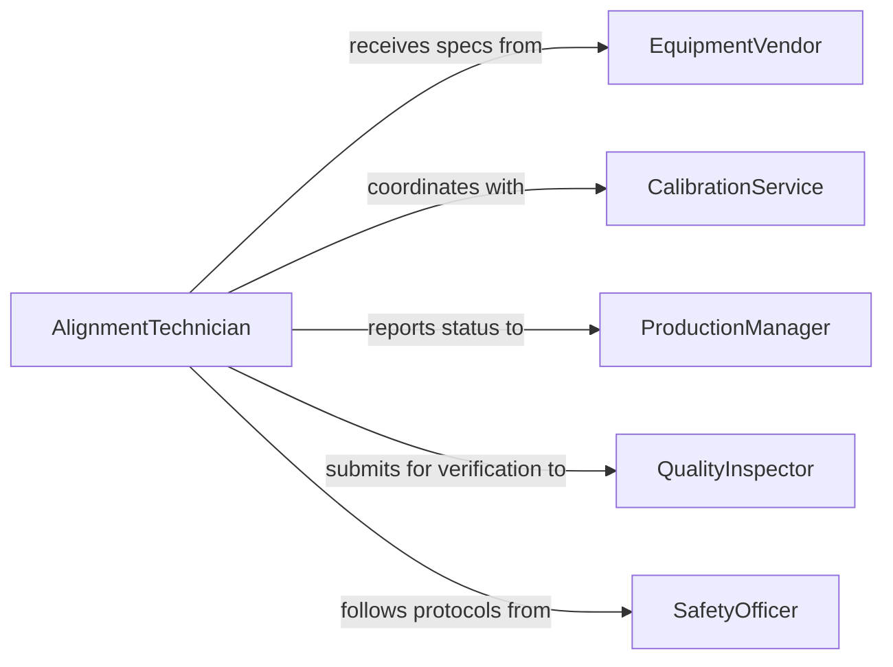

# Align Equipment Machinery

> Business-as-Code definition for precision alignment of production equipment and machinery. Models alignment procedures, tolerance verification, and calibration tracking.

## Overview

Equipment and machinery alignment ensures that production assets are positioned within specified tolerances for optimal performance and product quality. This definition exposes actions for alignment procedures, events for workflow automation, and searches for tracking alignment status and calibration history.

## Actors

| Actor | Description |
|-------|-------------|
| EquipmentVendor | Provides alignment specifications and technical support |
| CalibrationService | Performs precision measurement and certification |
| ProductionManager | Requests alignment for manufacturing efficiency |
| QualityInspector | Verifies alignment meets tolerance requirements |
| MaintenanceTechnician | Executes physical alignment procedures |
| SafetyOfficer | Ensures alignment work follows safety protocols |

## Roles

| Role | Description |
|------|-------------|
| AlignmentTechnician | Performs equipment alignment and adjustment |
| AlignmentEngineer | Designs alignment procedures and tolerances |
| MeasurementSpecialist | Conducts precision measurements and verification |
| AlignmentCoordinator | Schedules and tracks alignment activities |

## Entities

| Entity | Description |
|--------|-------------|
| Equipment | Machinery or production asset requiring alignment |
| AlignmentSpec | Technical requirements and tolerance limits |
| AlignmentJob | A scheduled alignment task for specific equipment |
| Measurement | Recorded data from alignment verification |
| AlignmentReport | Documentation of alignment procedure and results |
| CalibrationCertificate | Formal verification of alignment accuracy |

## Actions

| Action | Description |
|--------|-------------|
| createAlignmentJob | Schedule equipment for alignment procedure |
| recordMeasurements | Capture alignment measurement data |
| adjustEquipment | Make physical adjustments to meet tolerances |
| verifyAlignment | Confirm equipment meets alignment specifications |
| approveAlignment | Formally accept alignment results |
| documentAlignment | Generate alignment report and certificate |
| scheduleRealignment | Plan future alignment based on drift or schedule |

## Events

| Event | Description |
|-------|-------------|
| alignmentJobCreated | New alignment work order has been scheduled |
| measurementsRecorded | Initial or verification measurements captured |
| equipmentAdjusted | Physical adjustments made to equipment position |
| alignmentVerified | Equipment confirmed within tolerance limits |
| alignmentApproved | Alignment results formally accepted |
| toleranceExceeded | Equipment found outside acceptable limits |
| realignmentScheduled | Future alignment work planned |

## Searches

| Search | Description |
|--------|-------------|
| findAlignmentJobs | List alignment work orders by status or equipment |
| getMeasurements | Retrieve measurement history for equipment |
| getAlignmentReports | Find alignment documentation by date or equipment |
| getOutOfTolerance | Identify equipment exceeding tolerance limits |


## Entity Relationships



## State Diagram


## Workflow



## Actor Relationships



## Usage

### Calling Actions

```typescript
import { alignEquipmentMachinery } from '@headlessly/align-equipment-machinery'

const alignment = alignEquipmentMachinery()

// Create alignment job for CNC machine
const job = await alignment.createAlignmentJob({
  equipmentId: 'CNC-401',
  type: 'Spindle Alignment',
  tolerances: {
    axial: 0.001,
    radial: 0.0005,
    angular: 0.0002
  },
  scheduledDate: '2026-02-15'
})

// Record initial measurements
await alignment.recordMeasurements({
  jobId: job.id,
  phase: 'initial',
  measurements: {
    axial: 0.0023,
    radial: 0.0008,
    angular: 0.00015
  }
})

// Adjust equipment to meet tolerances
await alignment.adjustEquipment({
  jobId: job.id,
  adjustments: [
    { component: 'Bearing Housing', axis: 'X', amount: -0.0013 },
    { component: 'Spindle Mount', axis: 'Y', amount: 0.0003 }
  ]
})

// Verify final alignment
const verification = await alignment.verifyAlignment({
  jobId: job.id,
  finalMeasurements: {
    axial: 0.0008,
    radial: 0.0004,
    angular: 0.00015
  }
})
```

### Event-Driven Automation

```typescript
// Alert when equipment exceeds tolerance
alignment.toleranceExceeded(async ({ equipmentId, measurement, tolerance }) => {
  await notify({
    to: 'maintenance-team',
    priority: 'high',
    message: `Equipment ${equipmentId} out of tolerance: ${measurement.axis} at ${measurement.value}, limit ${tolerance}`
  })
})

// Auto-schedule preventive realignment
alignment.alignmentApproved(async ({ equipmentId, alignmentDate }) => {
  const nextAlignmentDate = addMonths(alignmentDate, 6)
  await alignment.scheduleRealignment({
    equipmentId,
    scheduledDate: nextAlignmentDate,
    type: 'Preventive'
  })
})
```
