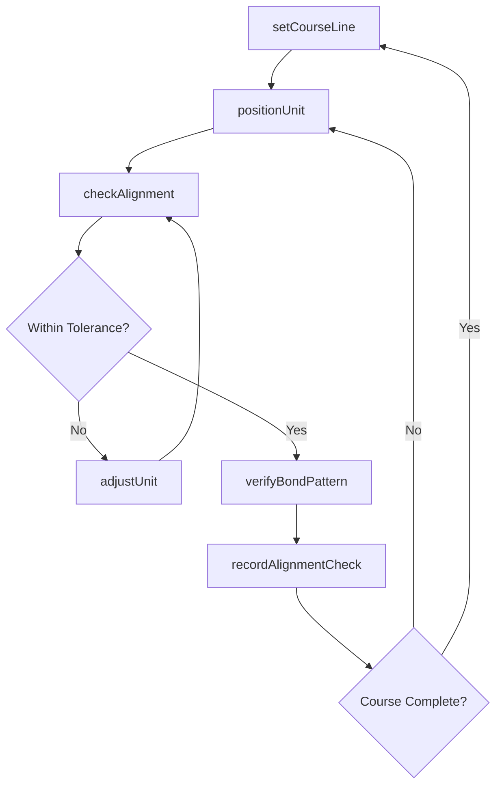
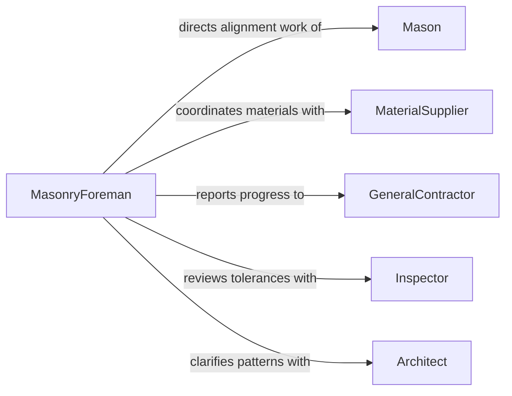

# Align Masonry Materials

> Business-as-Code definition for masonry material alignment. Models the process of positioning bricks, blocks, stones, and other masonry units to achieve precise placement during construction.

## Overview

Aligning masonry materials involves positioning bricks, concrete blocks, stones, and similar units along established reference lines to ensure level courses and plumb walls. This activity requires the use of string lines, levels, and spacing tools to maintain consistent joint widths and structural integrity. Proper alignment is critical for both the structural performance and visual appearance of masonry assemblies.

## Actors

| Actor | Description |
|-------|-------------|
| MaterialSupplier | Provides bricks, blocks, stones, and masonry units to the jobsite |
| GeneralContractor | Oversees the construction project and coordinates trades |
| Architect | Specifies masonry patterns, bond types, and alignment tolerances |
| StructuralEngineer | Defines load-bearing requirements and reinforcement placement |
| Inspector | Verifies alignment tolerances and code compliance on site |

## Roles

| Role | Description |
|------|-------------|
| Mason | Positions and aligns masonry units along reference lines |
| MasonryForeman | Supervises alignment quality and crew productivity |
| Laborer | Mixes mortar, stages materials, and assists with string lines |
| QualityController | Measures alignment deviations and approves coursework |

## Entities

| Entity | Description |
|--------|-------------|
| MasonryUnit | An individual brick, block, or stone being placed |
| CourseLine | A horizontal reference line defining the top of each masonry course |
| JointProfile | The mortar joint specification including width and tooling style |
| AlignmentCheck | A recorded measurement of plumb, level, and course height |
| WallSection | A defined segment of masonry wall under construction |
| BondPattern | The arrangement pattern of masonry units (running bond, stack bond, etc.) |

## Actions

| Action | Description |
|--------|-------------|
| setCourseLine | Establish string lines and reference marks for the next course |
| positionUnit | Place a masonry unit along the course line with proper spacing |
| checkAlignment | Verify plumb, level, and course height with measuring instruments |
| adjustUnit | Tap or reposition a unit to correct alignment before mortar sets |
| verifyBondPattern | Confirm that the masonry bond pattern matches specifications |
| recordAlignmentCheck | Log alignment measurements for quality documentation |

## Events

| Event | Description |
|-------|-------------|
| courseLineSet | A reference line has been established for the next course |
| unitPositioned | A masonry unit has been placed along the course line |
| alignmentChecked | Plumb and level measurements have been taken and recorded |
| unitAdjusted | A masonry unit has been repositioned to correct alignment |
| bondPatternVerified | The masonry bond pattern has been confirmed as correct |
| courseCompleted | All units in a horizontal course have been aligned and set |
| alignmentDeviationDetected | A measurement exceeds the allowable tolerance |

## Searches

| Search | Description |
|--------|-------------|
| findAlignmentChecks | Retrieve alignment measurements by wall section, date, or status |
| getWallSections | List wall sections by project, elevation, or completion status |
| getCourseProgress | Get the number of completed courses for a given wall section |

## Workflow



## Actor Relationships



## Usage

### Calling Actions

```typescript
import { alignMasonryMaterials } from '@headlessly/align-masonry-materials'

const masonry = alignMasonryMaterials()

// Establish a course line for the next row
const course = await masonry.setCourseLine({
  wallSectionId: 'ws-north-exterior-001',
  courseNumber: 14,
  elevation: 3.625,
  referencePoints: ['corner-A', 'corner-B']
})

// Place a masonry unit along the line
await masonry.positionUnit({
  courseLineId: course.id,
  unitType: 'CMU-8x8x16',
  position: { index: 0, offset: 0 },
  jointWidth: 0.375
})

// Verify alignment
const check = await masonry.checkAlignment({
  wallSectionId: 'ws-north-exterior-001',
  courseNumber: 14,
  measurements: { plumb: true, level: true, courseHeight: true }
})
```

### Event-Driven Automation

```typescript
// Alert foreman when alignment deviation is detected
masonry.alignmentDeviationDetected(async ({ wallSectionId, courseNumber, deviation }) => {
  await notify({
    to: 'masonry-foreman',
    message: `Alignment deviation of ${deviation.amount}" on wall ${wallSectionId}, course ${courseNumber}`
  })
})

// Log completion when a full course is aligned
masonry.courseCompleted(async ({ wallSectionId, courseNumber }) => {
  await masonry.recordAlignmentCheck({
    wallSectionId,
    courseNumber,
    status: 'approved',
    timestamp: new Date().toISOString()
  })
})
```
