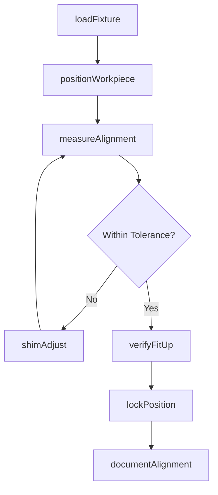
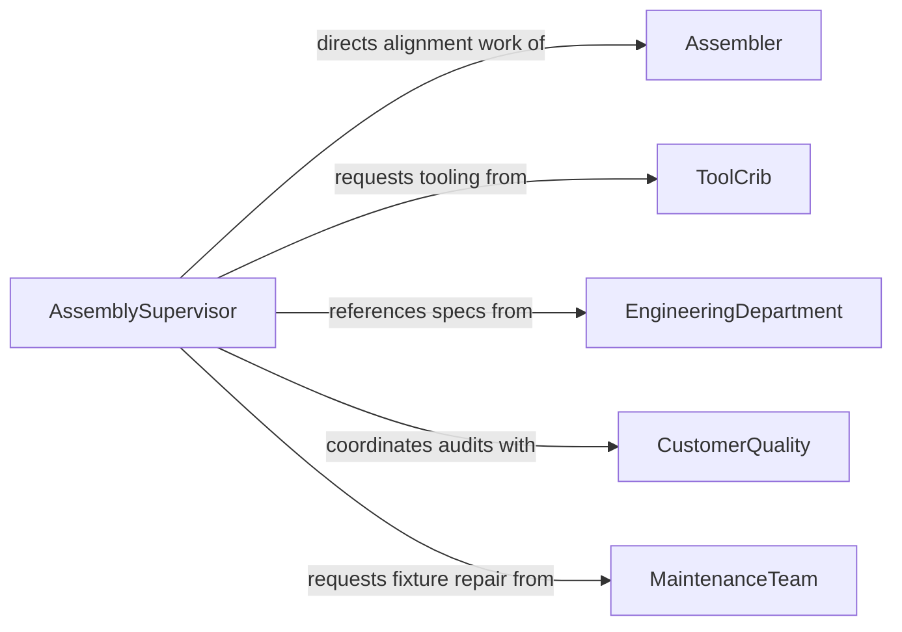

# Align Parts Workpieces Ensure Proper

> Business-as-Code definition for aligning parts or workpieces to ensure proper assembly. Models the precision positioning of components using fixtures, jigs, and measuring instruments to achieve correct fit before fastening or joining.

## Overview

Aligning parts or workpieces to ensure proper assembly involves using fixtures, jigs, gauges, and measuring instruments to position components with the precision required for correct fit and function. This activity spans manufacturing, fabrication, and maintenance contexts where mating surfaces, bolt holes, or weld joints must be brought into exact registration. Accurate alignment prevents rework, ensures structural integrity, and maintains dimensional tolerances specified in engineering drawings.

## Actors

| Actor | Description |
|-------|-------------|
| EquipmentManufacturer | Supplies fixtures, jigs, and alignment tooling |
| EngineeringDepartment | Provides assembly drawings with alignment tolerances and specifications |
| ToolCrib | Issues and maintains precision measurement instruments and fixtures |
| CustomerQuality | Audits final assembly alignment on behalf of the end customer |
| MaintenanceTeam | Repairs and calibrates alignment fixtures and tooling |

## Roles

| Role | Description |
|------|-------------|
| Assembler | Positions and aligns parts using specified tooling and techniques |
| AssemblySupervisor | Oversees alignment quality and resolves fit issues on the line |
| QualityInspector | Measures and verifies alignment against drawing tolerances |
| ToolingTechnician | Sets up and adjusts jigs, fixtures, and alignment devices |

## Entities

| Entity | Description |
|--------|-------------|
| Workpiece | A part or sub-assembly being positioned for joining |
| Fixture | A device that holds and locates workpieces during alignment |
| AlignmentTolerance | The permissible deviation from nominal position or orientation |
| AssemblyDrawing | An engineering document specifying part relationships and fit |
| MeasurementRecord | A log of alignment measurements taken during the process |
| JointConfiguration | The interface specification between two mating parts |

## Actions

| Action | Description |
|--------|-------------|
| loadFixture | Mount workpieces into the alignment fixture or jig |
| positionWorkpiece | Move and orient the part to its nominal assembly position |
| measureAlignment | Take dimensional measurements to verify position and orientation |
| shimAdjust | Insert shims or spacers to correct minor alignment deviations |
| lockPosition | Secure the workpiece in its aligned position using clamps or tack welds |
| verifyFitUp | Confirm that mating surfaces, holes, and features are in registration |
| documentAlignment | Record measurement data and alignment status for traceability |

## Events

| Event | Description |
|-------|-------------|
| fixtureLoaded | Workpieces have been mounted in the alignment fixture |
| workpiecePositioned | A part has been moved to its nominal assembly position |
| alignmentMeasured | Dimensional measurements have been taken and recorded |
| shimApplied | Shims or spacers have been inserted to correct alignment |
| positionLocked | The workpiece has been secured in its aligned position |
| fitUpVerified | Mating features have been confirmed in correct registration |
| toleranceExceeded | An alignment measurement falls outside the specified tolerance |

## Searches

| Search | Description |
|--------|-------------|
| findMeasurementRecords | Retrieve alignment measurements by assembly, part, or date |
| getFixtureStatus | Check availability and calibration status of alignment fixtures |
| getToleranceDeviations | List assemblies where alignment measurements exceed tolerance |

## Workflow



## Actor Relationships



## Usage

### Calling Actions

```typescript
import { alignPartsWorkpiecesEnsureProper } from '@headlessly/align-parts-workpieces-ensure-proper'

const alignment = alignPartsWorkpiecesEnsureProper()

// Load workpieces into the fixture
const setup = await alignment.loadFixture({
  fixtureId: 'JIG-4420-A',
  workpieces: [
    { partId: 'frame-upper-001', position: 'top' },
    { partId: 'frame-lower-001', position: 'bottom' }
  ]
})

// Measure alignment between mating surfaces
const measurement = await alignment.measureAlignment({
  assemblyId: setup.assemblyId,
  checkPoints: ['bolt-hole-pattern', 'flange-face', 'centerline-offset'],
  tolerance: { linear: 0.005, angular: 0.25 }
})

// Lock the aligned position
await alignment.lockPosition({
  assemblyId: setup.assemblyId,
  method: 'tack-weld',
  lockPoints: ['north', 'south', 'east', 'west']
})
```

### Event-Driven Automation

```typescript
// Escalate when tolerance is exceeded
alignment.toleranceExceeded(async ({ assemblyId, checkpoint, deviation }) => {
  await notify({
    to: 'assembly-supervisor',
    message: `Tolerance exceeded on ${assemblyId} at ${checkpoint}: ${deviation.actual} vs ${deviation.allowed}`
  })
})

// Advance workflow when fit-up is verified
alignment.fitUpVerified(async ({ assemblyId }) => {
  await advanceWorkOrder({
    assemblyId,
    nextOperation: 'final-fastening'
  })
})
```
