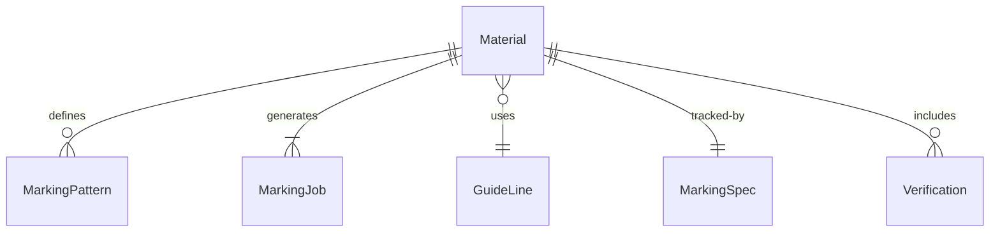
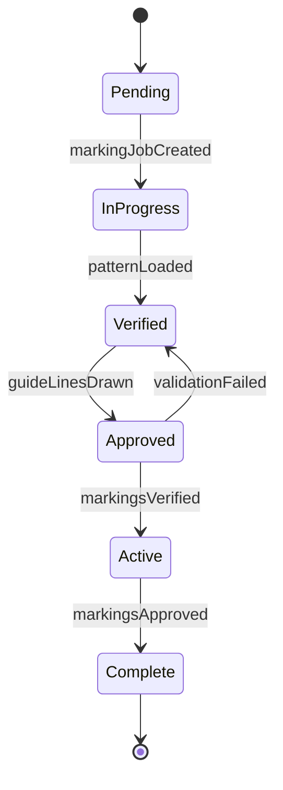
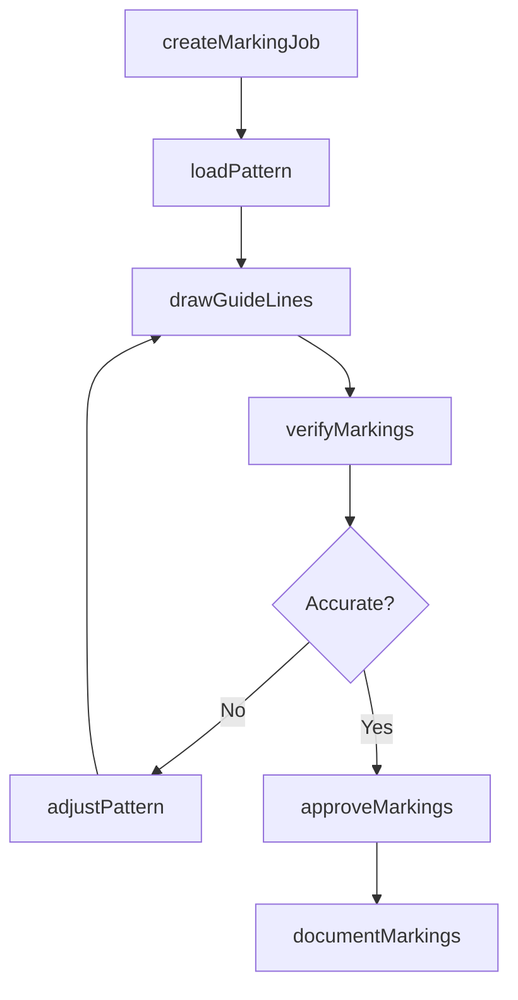
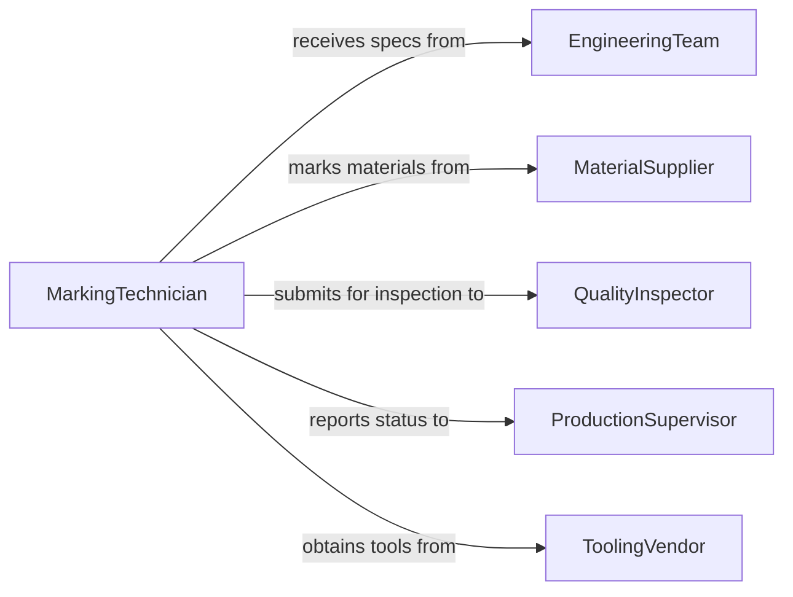

# Draw Guide Lines Markings Materials

> Business-as-Code definition for creating layout markings and guide lines on materials and workpieces. Models marking procedures, pattern application, and verification tracking.

## Overview

Drawing guide lines and markings on materials provides reference points for cutting, assembly, or quality verification. This definition exposes actions for marking procedures, events for workflow automation, and searches for tracking marking accuracy and pattern usage.

## Actors

| Actor | Description |
|-------|-------------|
| EngineeringTeam | Provides technical drawings and marking specifications |
| MaterialSupplier | Delivers raw materials requiring marking |
| QualityInspector | Verifies marking accuracy and compliance |
| ProductionSupervisor | Schedules marking operations for workflow |
| ToolingVendor | Supplies marking tools and consumables |
| CustomerRepresentative | Approves custom marking requirements |

## Roles

| Role | Description |
|------|-------------|
| MarkingTechnician | Applies markings to materials and workpieces |
| LayoutSpecialist | Plans marking procedures and sequences |
| PatternMaker | Creates templates and marking patterns |
| MarkingCoordinator | Manages marking schedules and resources |

## Entities

| Entity | Description |
|--------|-------------|
| Material | Raw stock or workpiece requiring marking |
| MarkingPattern | Template or reference for guide line placement |
| MarkingJob | A scheduled task to apply markings to materials |
| GuideLine | Individual reference line or marking on material |
| MarkingSpec | Technical requirements for marking accuracy |
| Verification | Inspection record confirming marking accuracy |

## Actions

| Action | Description |
|--------|-------------|
| createMarkingJob | Schedule materials for marking operation |
| loadPattern | Apply marking template or reference drawing |
| drawGuideLines | Apply physical markings to material surface |
| verifyMarkings | Inspect marking accuracy and placement |
| approveMarkings | Formally accept marking quality |
| documentMarkings | Record marking details for traceability |
| adjustPattern | Modify marking template for corrections |

## Events

| Event | Description |
|-------|-------------|
| markingJobCreated | New marking work order has been scheduled |
| patternLoaded | Template or reference has been applied |
| guideLinesDrawn | Physical markings completed on material |
| markingsVerified | Marking accuracy confirmed by inspection |
| markingsApproved | Marking quality formally accepted |
| markingErrorDetected | Marking found outside acceptable tolerance |
| patternAdjusted | Template or reference modified |

## Searches

| Search | Description |
|--------|-------------|
| findMarkingJobs | List marking work orders by status or material |
| getPatterns | Retrieve marking templates by part number or type |
| getVerifications | Find inspection records for marking accuracy |
| getErrors | Identify materials with marking discrepancies |


## Entity Relationships



## State Diagram


## Workflow



## Actor Relationships



## Usage

### Calling Actions

```typescript
import { drawGuideLinesMarkingsMaterials } from '@headlessly/draw-guide-lines-markings-materials'

const marking = drawGuideLinesMarkingsMaterials()

// Create marking job for steel plate
const job = await marking.createMarkingJob({
  materialId: 'PLATE-5024',
  partNumber: 'BRK-401-L',
  quantity: 12,
  scheduledDate: '2026-02-16'
})

// Load marking pattern from engineering drawing
await marking.loadPattern({
  jobId: job.id,
  patternId: 'BRK-401-L-REV-C',
  referenceDrawing: 'DWG-8845-03',
  scale: 1.0
})

// Apply guide lines to material
await marking.drawGuideLines({
  jobId: job.id,
  lines: [
    { type: 'cut', start: { x: 25, y: 50 }, end: { x: 475, y: 50 } },
    { type: 'bend', start: { x: 250, y: 25 }, end: { x: 250, y: 475 } },
    { type: 'drill', center: { x: 100, y: 100 }, diameter: 12.5 }
  ],
  method: 'Scribe',
  tool: 'Carbide Scriber'
})

// Verify marking accuracy
const verification = await marking.verifyMarkings({
  jobId: job.id,
  measurements: [
    { line: 'cut-1', deviation: 0.2, tolerance: 0.5 },
    { line: 'bend-1', deviation: 0.1, tolerance: 0.5 },
    { line: 'drill-1', deviation: 0.05, tolerance: 0.25 }
  ]
})
```

### Event-Driven Automation

```typescript
// Alert on marking error
marking.markingErrorDetected(async ({ materialId, deviation, tolerance }) => {
  if (deviation > tolerance * 0.8) {
    await notify({
      to: 'quality-team',
      priority: 'high',
      message: `Material ${materialId} marking error: ${deviation}mm deviation, tolerance ${tolerance}mm`
    })
  }
})

// Track pattern usage for improvement
marking.patternAdjusted(async ({ patternId, reason, adjustments }) => {
  await analytics.track({
    event: 'Pattern Adjustment',
    patternId,
    reason,
    adjustments,
    timestamp: new Date()
  })
})
```
