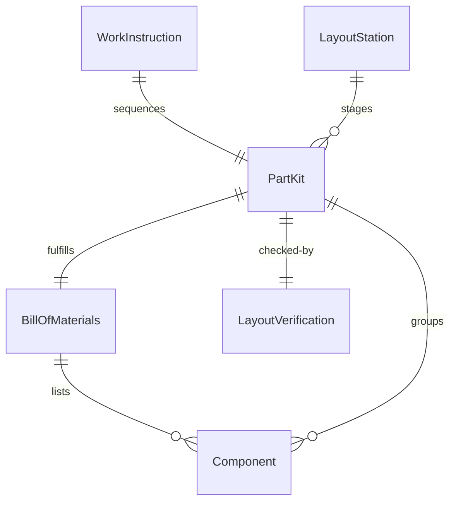
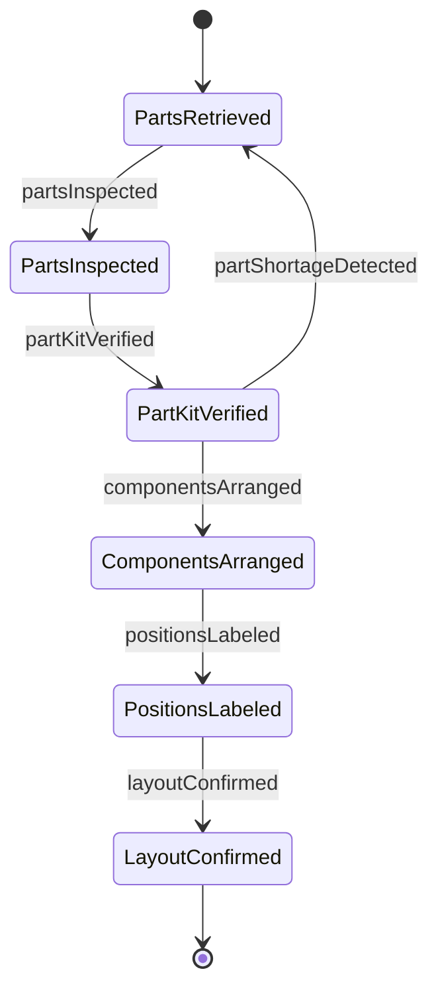
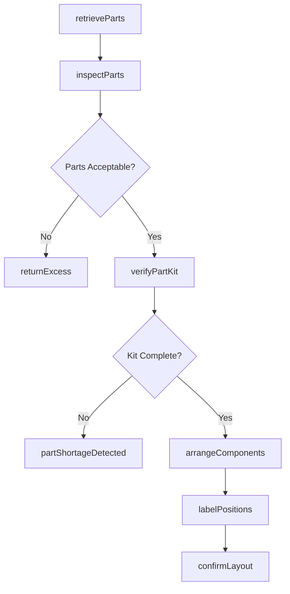
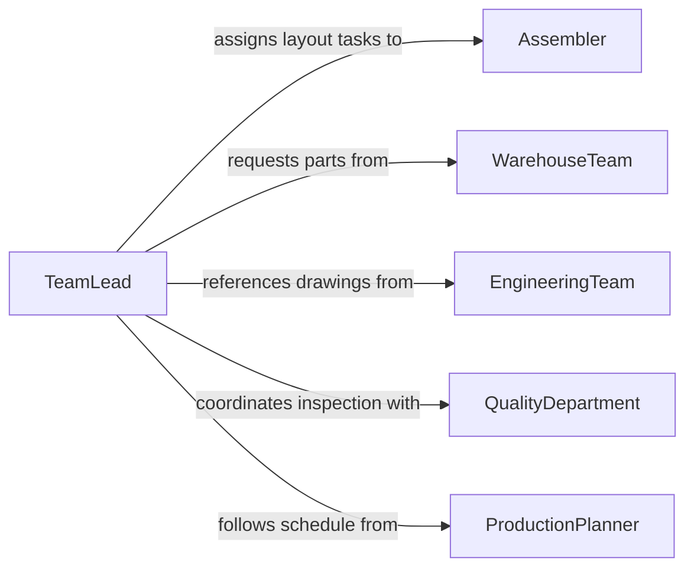

# Lay Out Parts Prepare Assembly

> Business-as-Code definition for laying out parts in preparation for assembly. Models the process of organizing, staging, and arranging components in the correct sequence and orientation before assembly operations begin.

## Overview

Laying out parts to prepare for assembly involves retrieving components from storage, verifying quantities against a bill of materials, and arranging them in the correct order and orientation at the assembly workstation. This activity ensures that assemblers have immediate access to all required parts, reducing downtime and preventing assembly errors. Proper part layout is essential in manufacturing, construction, and maintenance operations where multiple components must come together in a specific sequence.

## Actors

| Actor | Description |
|-------|-------------|
| PartsSupplier | Delivers components and sub-assemblies to the facility |
| WarehouseTeam | Stores, picks, and stages parts for production lines |
| EngineeringTeam | Provides assembly drawings, BOMs, and sequencing instructions |
| QualityDepartment | Inspects incoming parts for defects before layout |
| ProductionPlanner | Schedules assembly jobs and determines part requirements |

## Roles

| Role | Description |
|------|-------------|
| Assembler | Lays out and assembles parts according to work instructions |
| TeamLead | Oversees layout accuracy and manages workstation readiness |
| MaterialHandler | Transports kitted parts from warehouse to assembly stations |
| QualityInspector | Verifies part condition and correct identification during layout |

## Entities

| Entity | Description |
|--------|-------------|
| PartKit | A grouped set of components required for a single assembly job |
| BillOfMaterials | A list specifying all parts, quantities, and sequence for assembly |
| WorkInstruction | Step-by-step directions for part placement and assembly order |
| LayoutStation | A designated work area where parts are arranged before assembly |
| Component | An individual part or sub-assembly included in the layout |
| LayoutVerification | A checklist confirming all parts are present and correctly positioned |

## Actions

| Action | Description |
|--------|-------------|
| retrieveParts | Pull required components from inventory based on the BOM |
| verifyPartKit | Confirm all parts in a kit match the bill of materials |
| arrangeComponents | Position parts at the workstation in assembly sequence order |
| labelPositions | Mark or tag layout positions to guide the assembler |
| inspectParts | Check components for damage or defects before layout |
| confirmLayout | Sign off that all parts are present, oriented, and ready for assembly |
| returnExcess | Send unused or surplus parts back to inventory |

## Events

| Event | Description |
|-------|-------------|
| partsRetrieved | Required components have been pulled from inventory |
| partKitVerified | All parts in the kit match the bill of materials |
| componentsArranged | Parts have been positioned in assembly sequence at the workstation |
| positionsLabeled | Layout positions have been marked for assembler reference |
| partsInspected | Components have been checked for defects and approved |
| layoutConfirmed | The complete layout has been verified and signed off |
| partShortageDetected | A required component is missing or insufficient in quantity |

## Searches

| Search | Description |
|--------|-------------|
| findPartKits | Retrieve kits by assembly job, product, or status |
| getLayoutStatus | Check layout readiness for specific workstations or shifts |
| getPartShortages | List missing or backordered components across active jobs |
| findComponents | Search parts by part number, description, or location |


## Entity Relationships



## State Diagram


## Workflow



## Actor Relationships



## Usage

### Calling Actions

```typescript
import { layOutPartsPrepareAssembly } from '@headlessly/lay-out-parts-prepare-assembly'

const layout = layOutPartsPrepareAssembly()

// Retrieve parts for an assembly job
const kit = await layout.retrieveParts({
  jobId: 'ASM-2026-00451',
  bomId: 'BOM-HX200-REV3',
  workstationId: 'station-12'
})

// Verify the kit is complete
const verification = await layout.verifyPartKit({
  kitId: kit.id,
  bomId: 'BOM-HX200-REV3'
})

// Arrange components in assembly order
await layout.arrangeComponents({
  kitId: kit.id,
  layoutStationId: 'station-12',
  sequence: ['frame', 'bearings', 'shaft', 'seals', 'housing']
})

// Confirm the layout is ready
await layout.confirmLayout({
  kitId: kit.id,
  verifiedBy: 'team-lead-martinez'
})
```

### Event-Driven Automation

```typescript
// Alert production when a part shortage is detected
layout.partShortageDetected(async ({ jobId, missingParts }) => {
  await notify({
    to: 'production-planning',
    message: `Part shortage on job ${jobId}: ${missingParts.map(p => p.partNumber).join(', ')}`
  })
})

// Trigger assembly start when layout is confirmed
layout.layoutConfirmed(async ({ kitId, layoutStationId }) => {
  await startAssemblyJob({
    kitId,
    workstationId: layoutStationId,
    status: 'ready'
  })
})
```
