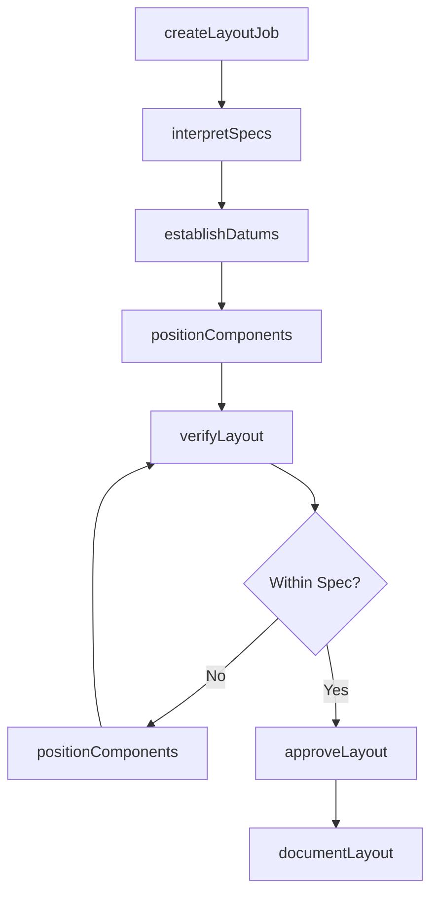
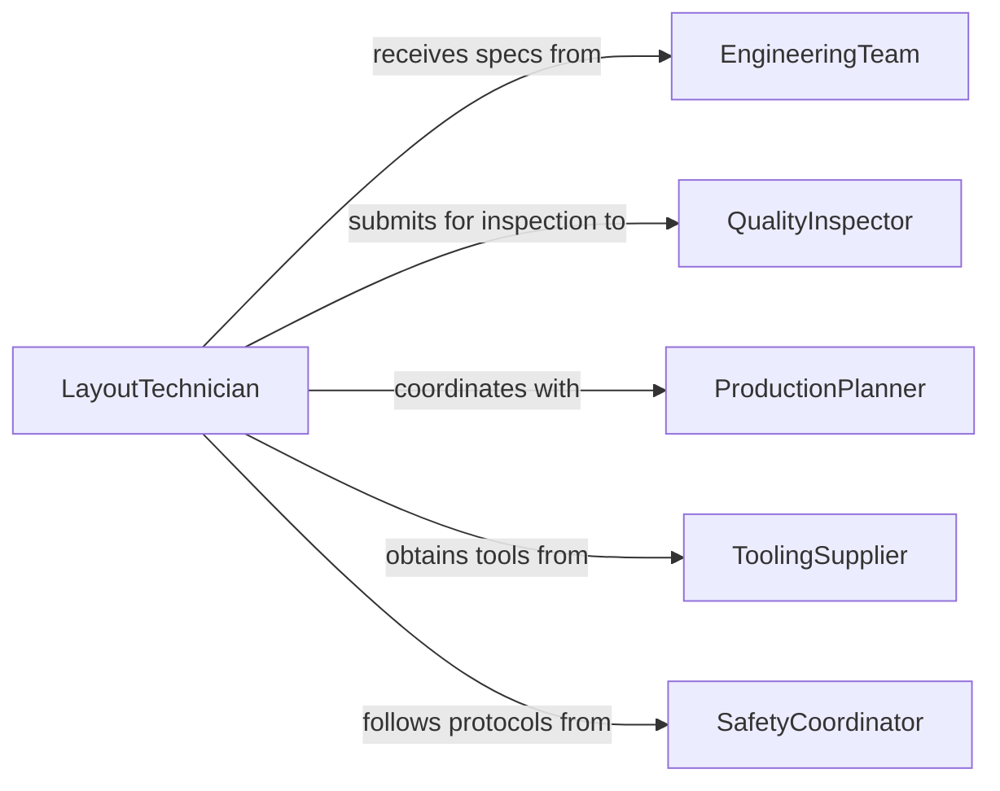

# Lay Out Work According Specifications

> Business-as-Code definition for work layout planning based on technical specifications. Models layout procedures, specification interpretation, and setup verification.

## Overview

Laying out work according to specifications involves interpreting technical drawings, establishing reference points, and arranging materials and components for production operations. This definition exposes actions for layout procedures, events for workflow automation, and searches for tracking layout compliance and efficiency.

## Actors

| Actor | Description |
|-------|-------------|
| EngineeringTeam | Provides technical specifications and drawings |
| QualityInspector | Verifies layout meets specification requirements |
| ProductionPlanner | Schedules layout operations for workflow |
| ToolingSupplier | Provides measurement and layout tools |
| SafetyCoordinator | Ensures layout follows safety protocols |
| CustomerRepresentative | Approves layout for custom requirements |

## Roles

| Role | Description |
|------|-------------|
| LayoutTechnician | Executes work layout per specifications |
| SetupEngineer | Plans layout procedures and sequences |
| MeasurementSpecialist | Verifies dimensional accuracy of layout |
| LayoutCoordinator | Manages layout schedules and resources |

## Entities

| Entity | Description |
|--------|-------------|
| Specification | Technical requirements for work layout |
| LayoutJob | A scheduled task to arrange work per specs |
| ReferencePoint | Established datum or baseline for layout |
| Component | Material or part positioned during layout |
| LayoutPlan | Documented procedure for work arrangement |
| Verification | Inspection record confirming layout accuracy |

## Actions

| Action | Description |
|--------|-------------|
| createLayoutJob | Schedule work layout operation |
| interpretSpecs | Parse technical requirements and constraints |
| establishDatums | Set reference points for layout measurements |
| positionComponents | Arrange materials per specification requirements |
| verifyLayout | Inspect layout accuracy and compliance |
| approveLayout | Formally accept layout for production |
| documentLayout | Record layout details and deviations |

## Events

| Event | Description |
|-------|-------------|
| layoutJobCreated | New layout work order has been scheduled |
| specsInterpreted | Technical requirements parsed and understood |
| datumsEstablished | Reference points set for layout operations |
| componentsPositioned | Materials arranged per specifications |
| layoutVerified | Layout accuracy confirmed by inspection |
| layoutApproved | Layout quality formally accepted |
| deviationDetected | Layout found outside specification limits |

## Searches

| Search | Description |
|--------|-------------|
| findLayoutJobs | List layout work orders by status or specification |
| getLayoutPlans | Retrieve documented layout procedures |
| getVerifications | Find inspection records for layout accuracy |
| getDeviations | Identify layouts with specification discrepancies |

## Workflow



## Actor Relationships



## Usage

### Calling Actions

```typescript
import { layOutWorkAccordingSpecifications } from '@headlessly/lay-out-work-according-specifications'

const layout = layOutWorkAccordingSpecifications()

// Create layout job for assembly fixture
const job = await layout.createLayoutJob({
  specificationId: 'SPEC-8845-A',
  workOrder: 'WO-45012',
  partNumber: 'ASM-302-R',
  scheduledDate: '2026-02-17'
})

// Interpret technical specifications
await layout.interpretSpecs({
  jobId: job.id,
  drawing: 'DWG-8845-02-REV-D',
  tolerances: {
    positional: 0.25,
    angular: 0.5,
    dimensional: 0.1
  }
})

// Establish reference datums
await layout.establishDatums({
  jobId: job.id,
  datums: [
    { id: 'A', type: 'Plane', surface: 'Bottom Face' },
    { id: 'B', type: 'Plane', surface: 'Left Edge' },
    { id: 'C', type: 'Point', location: { x: 0, y: 0, z: 0 } }
  ]
})

// Position components per specification
await layout.positionComponents({
  jobId: job.id,
  components: [
    { id: 'COMP-01', position: { x: 125.0, y: 250.0, z: 50.0 }, rotation: 0 },
    { id: 'COMP-02', position: { x: 375.0, y: 250.0, z: 50.0 }, rotation: 90 }
  ]
})

// Verify layout accuracy
const verification = await layout.verifyLayout({
  jobId: job.id,
  measurements: [
    { component: 'COMP-01', dimension: 'X', actual: 125.05, nominal: 125.0, tolerance: 0.25 },
    { component: 'COMP-02', dimension: 'Angle', actual: 90.2, nominal: 90.0, tolerance: 0.5 }
  ]
})
```

### Event-Driven Automation

```typescript
// Alert on specification deviation
layout.deviationDetected(async ({ jobId, component, deviation, tolerance }) => {
  if (Math.abs(deviation) > tolerance * 0.9) {
    await notify({
      to: 'engineering-team',
      priority: 'high',
      message: `Layout deviation on ${component}: ${deviation}mm, tolerance ${tolerance}mm`
    })
  }
})

// Track layout efficiency metrics
layout.layoutApproved(async ({ jobId, startTime, endTime, complexity }) => {
  const duration = (endTime - startTime) / 1000 / 60
  await analytics.track({
    event: 'Layout Completed',
    jobId,
    duration,
    complexity,
    timestamp: new Date()
  })
})
```
